.. _sioux_falls:

Sioux Falls
===========

.. toctree::
   :maxdepth: 2

Sioux Falls has long been used as the standard example in transportation
network algorithm studies, and who are we to break that tradition?

Here we present an image-based example on a realistic modelling workflow
for the beginner modeler out there. All the data used here can be downloaded
at the :ref:`tutorial_sample_data` page.

As to not upset those who think that Sioux Falls is not a realistic example (you
would be right to think so), the example data is also available for the Chicago
regional model, which has nearly 40,000 links and almost 1,800 zones.

Got a bigger instance we could use as an example?  Send it over!

Creating a project
-------------------

IF all you have to start your project are the layers and matrices (or the demand
model) from your original model, then we can import it into AequilibraE. Just
Make sure that you followed the layer preparation instructions on
:ref:`network_preparation`.

The project creation resource lives under the project menu.

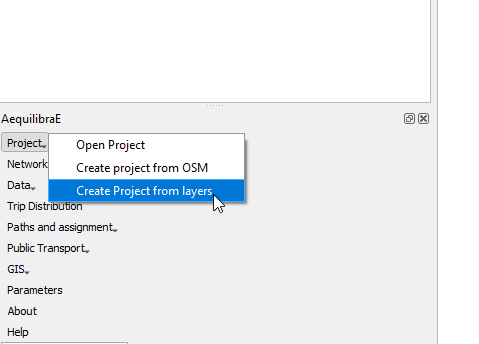

The first 7 fields for links are mandatory, and one needs to associate the
corresponding layer fields to the network fields.

The other fields that will be listed on the left side come from the parameters
file (see the manual for that portion for more details), but the user can add
more fields from the layer, as all of them are listed on the left side of the
screen

.. image:: images/project_from_layers_links.png
    :width: 614
    :align: center
    :alt: project_from_layers_links

In the case of the nodes layer, only two fields are mandatory.

.. image:: images/project_from_layers_nodes.png
    :width: 614
    :align: center
    :alt: project_from_layers_nodes

After filling all fields, it is just a matter of saving it!

Opening the project
-------------------

Before we do anything else, we need to open the project.

.. image:: images/opening_project.png
    :width: 560
    :align: center
    :alt: Opening the project

Individual path computation
---------------------------

The first thing we can do with this project is to compute a few arbitrary paths
to see if the network is connected and if paths make sense.

.. image:: images/path_computation_menu.png
    :width: 444
    :align: center
    :alt: path_computation_menu

Before computing a path, we go to the configuration screen

.. image:: images/configure_path_computation.png
    :width: 257
    :align: center
    :alt: configure_path_computation

For the case of Sioux Falls, we need to configure the graph to accept paths
going through centroids (all nodes are centroids), but that is generally not the
case. For zones with a single connector per zone it is slightly faster to also
deselect this option, but use this carefully.

.. image:: images/path_computation_configuration.png
    :width: 282
    :align: center
    :alt: path_computation_configuration

If we select that paths need to be in a separate layer, then every time you
compute a path, a new layer with a copy of the links in that path will be
created and formatted in a noticeable way. You can also select to have links
selected in the layer, but only one path can be shown at at time if you do so.

.. image:: images/paths_generated.png
    :width: 1696
    :align: center
    :alt: paths_generated

Skimming
--------

We can also skim the network to look into general connectivity of the network

.. image:: images/skimming_menu.png
    :width: 507
    :align: center
    :alt: skimming_menu

To perform skimming, we can select to compute a matrix from all nodes to all nodes,
or from centroids to centroids, as well as to not allow flows through centroids.

The main controls, however, are the mode to skim, the field we should minimize
when computing shortest paths and the fields we should skim when computing those
paths.

.. image:: images/performing_skimming.png
    :width: 675
    :align: center
    :alt: performing_skimming

With the results computed (AEM or OMX), one can display them on the screen.

.. image:: images/display_data.png
    :width: 485
    :align: center
    :alt: display_data

On the matrix display screen, one can control how many decimal places are shown
and whether decimal separators are shown. One can also browse through all the
skims in this file by selecting the skim of choice in the drop down menu in
the bottom left of the screen.

.. image:: images/viewing_matrix.png
    :width: 1146
    :align: center
    :alt: viewing_matrix

Desire Lines
------------
One can also generate the desire lines and Delaunay lines for the demand matrix
provided.

.. image:: images/desire_lines_menu.png
    :width: 448
    :align: center
    :alt: desire_lines_menu

After selecting a matrix, the user can choose to un-check the *use all matrices*
box and select which matrices they want to use (the list of matrices will only
show if the option is un-checked).

Make sure to select a *zone/node layer* and *node id* that is compatible with
your matrix.

The user also needs to choose if they want Delaunay lines

.. image:: images/delaunay_results.png
    :width: 797
    :align: center
    :alt: delaunay_results

or desire lines

.. image:: images/desire_lines_map.png
    :width: 749
    :align: center
    :alt: desire_lines_map

.. _plotting_flows:

Plotting the flows
------------------

The tool for plotting link flows you just saw above can be found under the GIS
menu

.. image:: images/select_stacked_bandwidth.png
    :width: 520
    :align: center
    :alt: select_stacked_bandwidth

.. image:: images/add_band.png
    :width: 760
    :align: center
    :alt: add_band

.. image:: images/create_bands.png
    :width: 737
    :align: center
    :alt: create_bands

If you have selected the *Expert mode* in the previous screen, you can also
control the overall look of these bands (thickness and separation between AB and
BA flows) in the project properties.

.. image:: images/project_properties.png
    :width: 421
    :align: center
    :alt: project_properties

.. image:: images/edit_variables.png
    :width: 886
    :align: center
    :alt: edit_variables

And have our map!! ( You need to refresh or pan the map for it to redraw after
changing the project variables)

.. image:: images/bandwidth_maps.png
    :width: 1142
    :align: center
    :alt: bandwidth_maps

Traffic assignment with skimming
--------------------------------

Having verified that the network seems to be in order, one can proceed to
perform traffic assignment, since we have a demand matrix:

.. image:: images/traffic_assignment.png
    :width: 877
    :align: center
    :alt: Calling assignment

.. image:: images/project_overview.png
    :width: 877
    :align: center
    :alt: Project overview

.. image:: images/traffic_open_matrix.png
    :width: 877
    :align: center
    :alt: Calling assignment

Matrices are provided in both OMX and AEM formats, so you are not required to
install openmatrix.

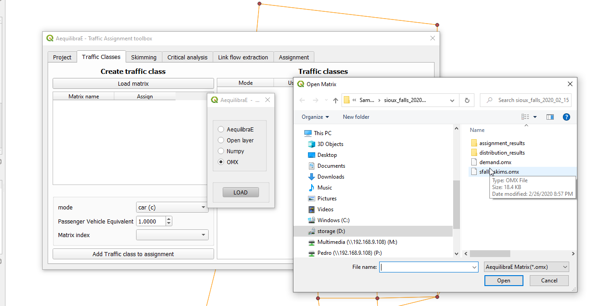

For this example, we only add one traffic class for mode **c** (car)

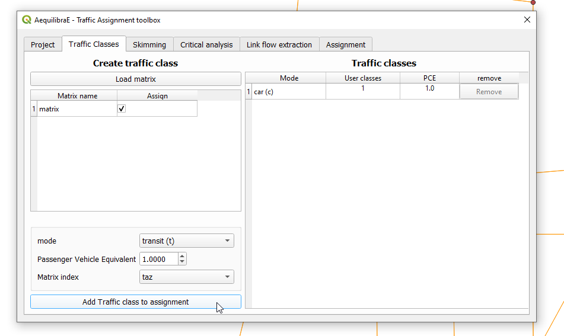

To select skims, we need to choose which fields/modes we will skim

.. image:: images/skim_field_selection.png
    :width: 877
    :align: center
    :alt: Skim selection

And if we want the skim for the last iteration (like we would for time) or if we
want it averaged out for all iterations (properly averaged, that is).

.. image:: images/skim_blended_versus_final.png
    :width: 877
    :align: center
    :alt: Skim iterations

The final step is to setup the assignment itself.

Here we select the fields for:

* link capacity
* link free flow travel time
* BPR's *alpha*
* BPR's *beta*

We also confirm the Relative gap and maximum number of iterations we want, the
assignment algorithm and the output folder. In this case, we again choose to not
block flows through centroids for the reason discussed above.

.. image:: images/setup_assignment.png
    :width: 898
    :align: center
    :alt: Setup assignment

In order to plot the flows as shown above, first we need to add the link flows
CSV to the QGIS workspace

.. image:: images/add_layer.png
    :width: 173
    :align: center
    :alt: add_layer

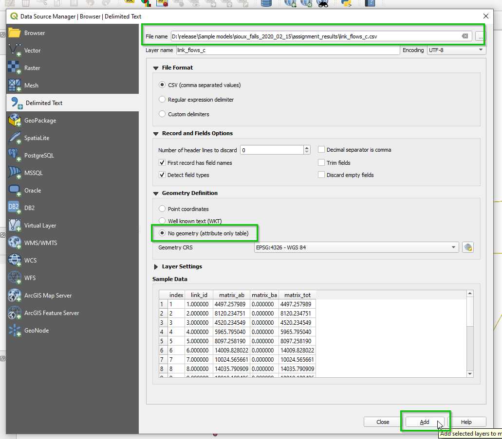

Then we join it with the link layer by accessing the link layer's properties

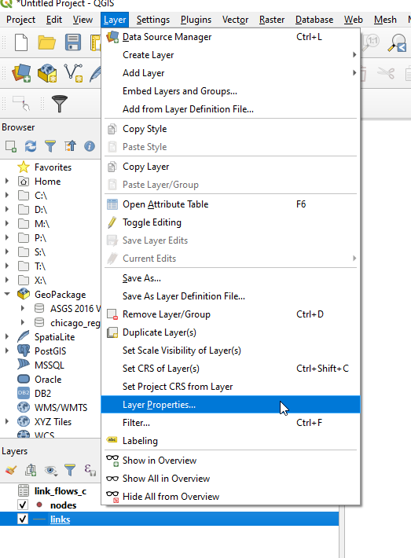

.. image:: images/link_join.png
    :width: 1449
    :align: center
    :alt: link_join

Now we can revisit the instructions above for :ref:`plotting_flows`

Gravity model calibration
-------------------------
Now that we have the demand model and a fully converged skim, we can calibrate a
synthetic gravity model.

We click on Trip distribution in the AequilibraE menu and select the Calibrate
Gravity model option

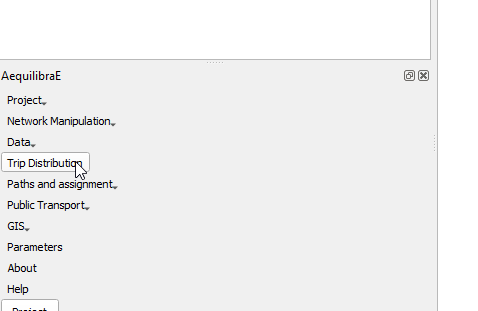

.. image:: images/select_calibrate_gravity.png
    :width: 241
    :align: center
    :alt: select_calibrate_gravity

The first thing to do is to load all matrices we will need (skim and demand).

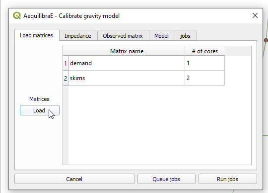

Select which matrix/matrix core is to be used as the impedance matrix

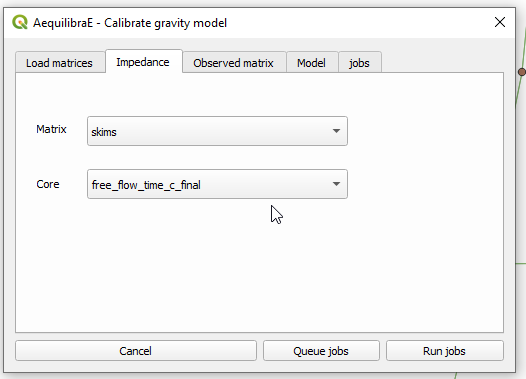

Which one is the *observed* matrix

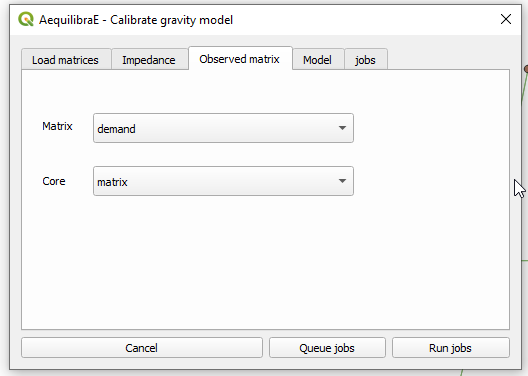

We then select which deterrence function we want to use and choose a file output
for the model

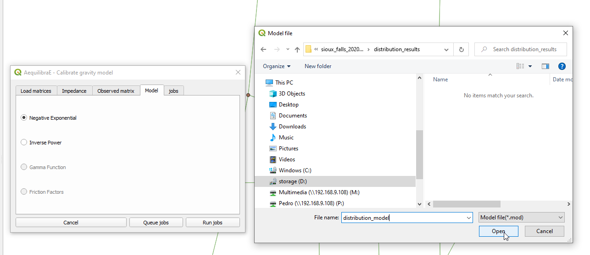

We can then run the procedure

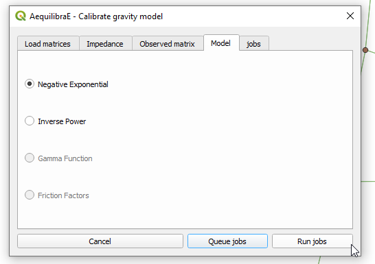

Inspect the procedure output

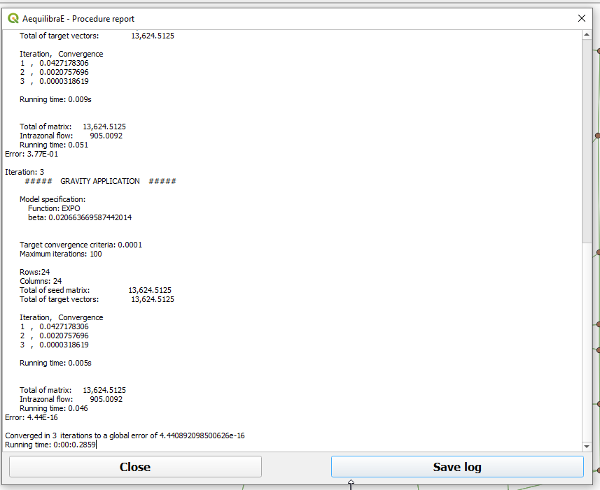

The resulting file is of type *.mod, but that is just a YAML (text file).

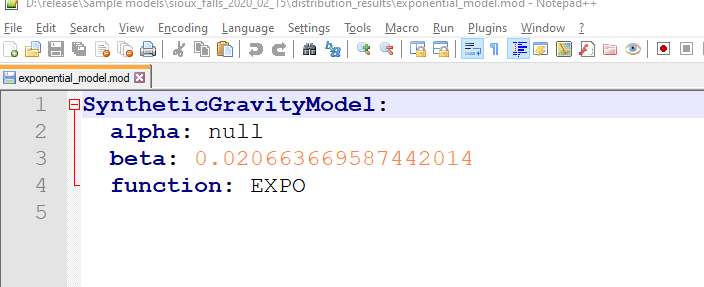

Forecast
--------

If one has future matrix vectors (there are some provided with the example
dataset), they can either apply the Iterative Proportional Fitting (IPF)
procedure available, or apply a gravity model just calibrated. Here we present
the latter.

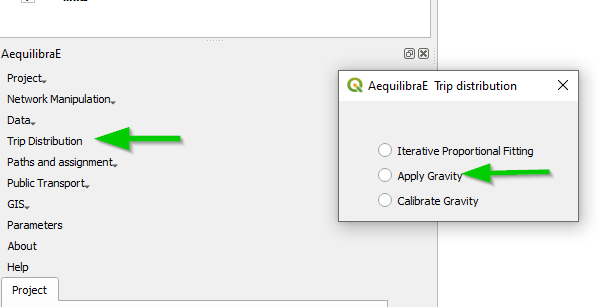

With the menu open, one loads the dataset(s) with the production/origin and
attraction/destination vectors

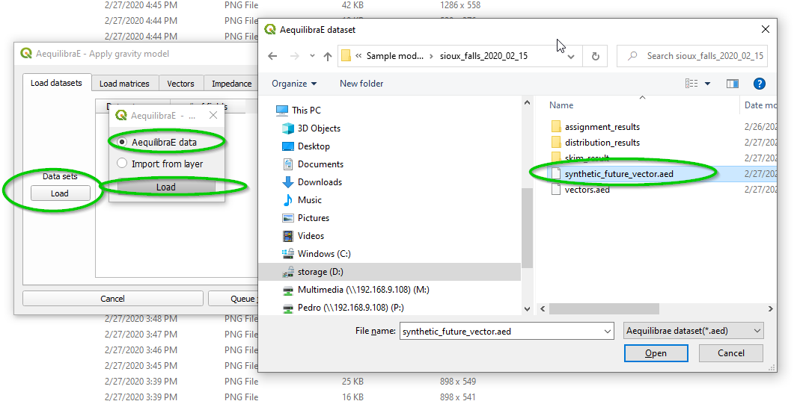

We also load the impedance/skim matrix to be used

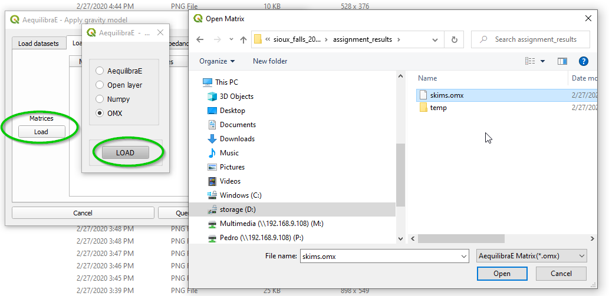

We select the production/attraction (origin/destination) vectors

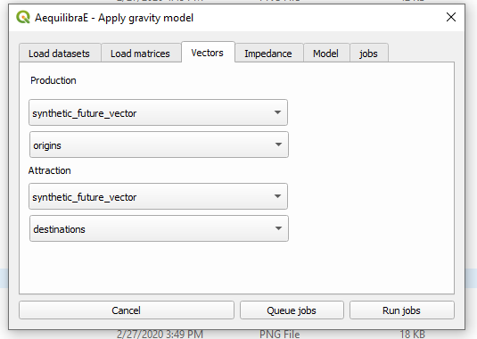

And the impedance matrix to be used

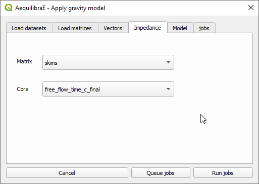

The last input is the gravity model itself, which can be done by loading a
model that has been previously calibrated, or by selecting the deterrence
function from the drop-down menu and typing the corresponding parameter values.

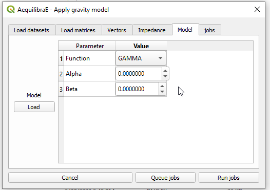

To run the procedure, simply queue the job (and select the output while with the
screen that will open) and press *Run jobs*.

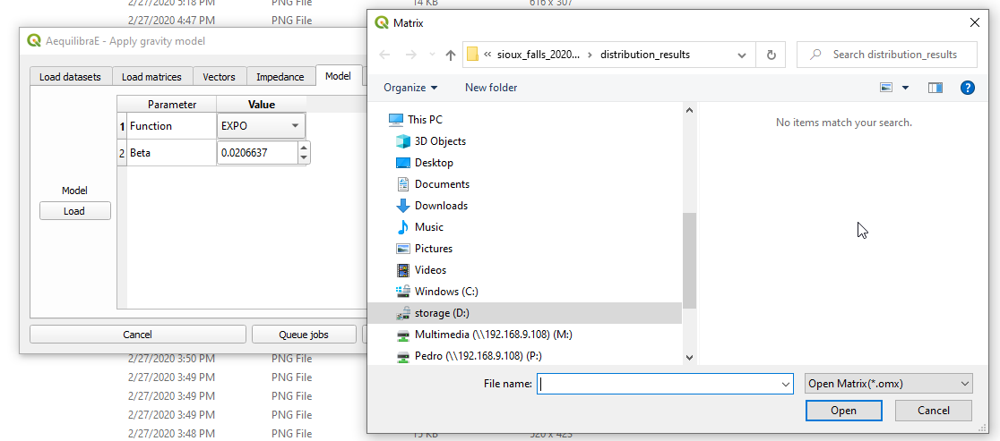

The result of this matrix can also be assigned, which is what we will generate
the outputs being used in the scenario comparison.

Scenario Comparison
-------------------

After joining the two assignment results (the original one and the one resulting
from the forecast we just did) to the links layer, one can compare scenarios.

When joining the assignment results, make sure to name them in a way you will
understand.

The scenario comparison tool is under the GIS menu

.. image:: images/scenario_comparison_menu.png
    :width: 438
    :align: center
    :alt: scenario_comparison_menu

The scenario configuration requires the user to set AB/BA flows for the two
sets of link flows being compared, as well as the space between AB/BA flows,
and band width.

The user can also select to show a composite flow comparison, where common
flows are also shown on top of the positive and negative differences, which
gives a proper sense of how significative the differences are when compared to
the base flows.

As it was the case for stacked bandwidth formatting, expert mode sets project
variables as levers to change the map formatting.

.. image:: images/scenario_comparison_configuration.png
    :width: 473
    :align: center
    :alt: scenario_comparison_configuration

And this is what it looks like

.. image:: images/scenario_comparison_map.png
    :width: 778
    :align: center
    :alt: scenario_comparison_map

