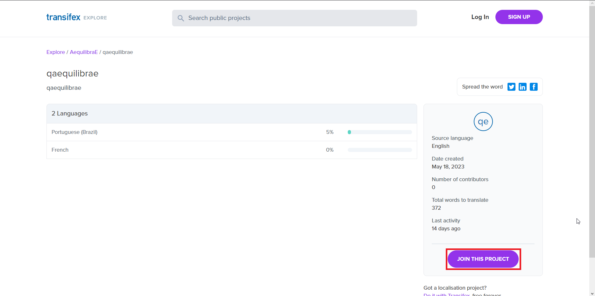
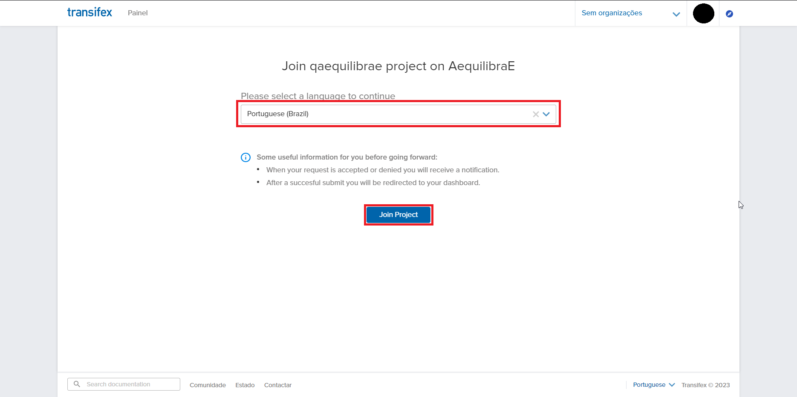
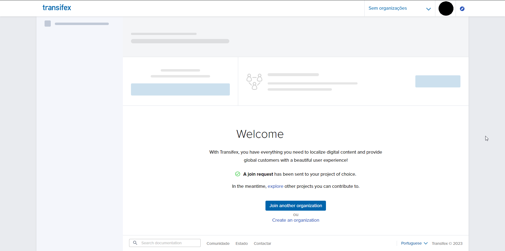
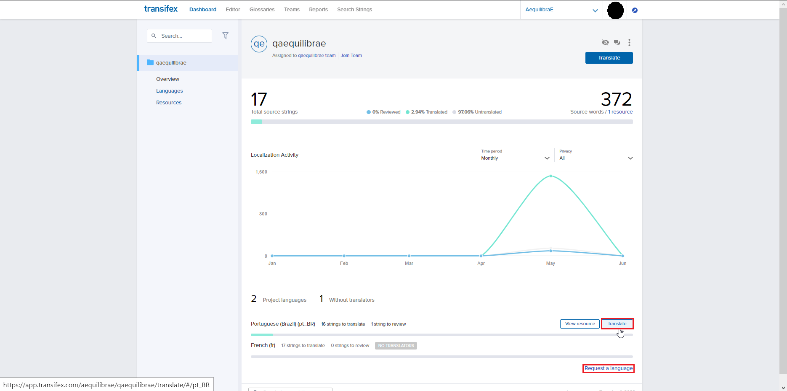
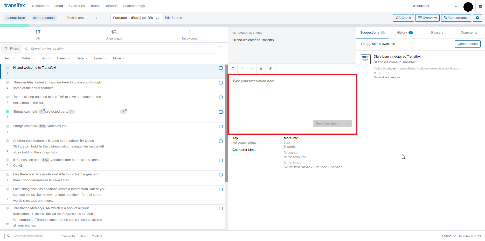
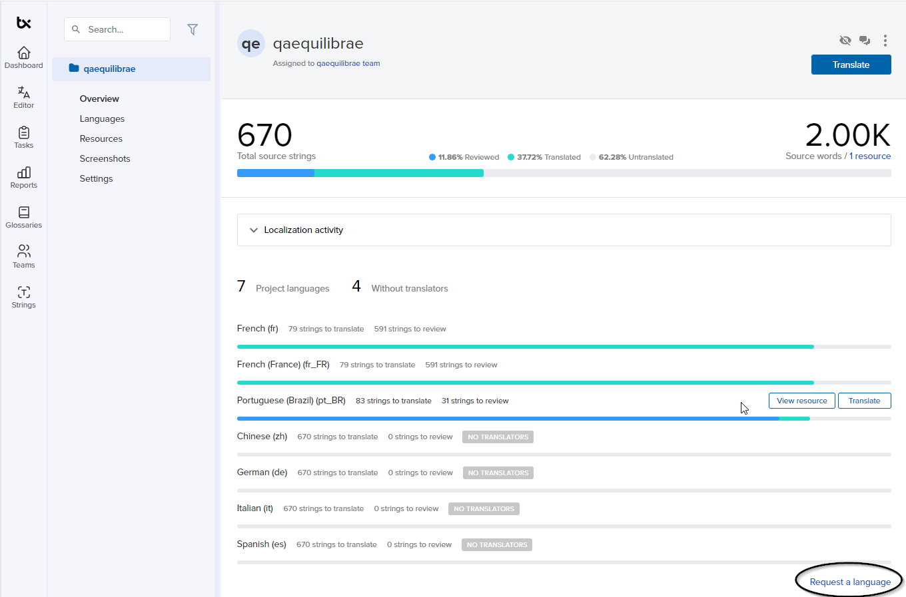
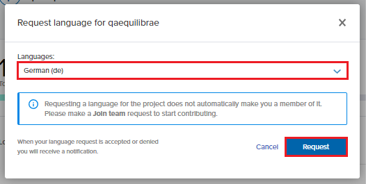

.. _plugin_i18n:

Plugin internationalization (i18n)
==================================

In this section, we briefly explain how you can set up your Transifex account and start contributing to QAquilibraE
translation.

Creating account
~~~~~~~~~~~~~~~~

To translate QAequilibraE's QGIS plug-in, we use Transifex, a web-based platform that
hosts translations. Before joining our project, you must create an account. Direct yourself
to `Transifex login page <https://app.transifex.com/signin/?next=/home/>`_ and follow the
instructions. The process is straightforward and does not take a lot of time.

After creating your account, direct yourself to `team's page 
<https://explore.transifex.com/aequilibrae/qaequilibrae/>`_ and request your
access to the project. Approving your request might take a couple of days (we are a small team of
developers!), so don't worry.



You'll be redirected to this page to enter your translation languages of preference.



As soon as you have your request approved, you can log in once more in Transifex and begin translating.




Translating into your language
~~~~~~~~~~~~~~~~~~~~~~~~~~~~~~

Your project screen should look like the one in the figure below. If you feel comfortable translating into any of these idioms, just drag your cursor to the right side of each translatable idiom and click on the **Translate** button. 



You'll be redirected to a new page.



You can check the translation status in the left column (*Text*), where the green buttons indicate
that there is an existing translation for that string. You can insert their
translation in the box and save it for all strings If your string happens to appear multiple times,
Transifex will give you translation suggestions, that can match whatever you want to translate.
This can spare you some time.

When you finish your work, direct yourself to the **Unreviewed** field, to check
all strings you have translated. Here's your opportunity to look out for typos or incorrect translations.

For more information, we strongly encourage you to check Transifex official documentation in their
website.

Suggesting a new translation language
~~~~~~~~~~~~~~~~~~~~~~~~~~~~~~~~~~~~~

If your language is unavailable and you want to contribute, you can request it directly to
the AequilibraE Team! In your project screen, look for the **Request a language** button on the page.



Select your language and create a request. As soon as possible, we'll approve the creation of the
language, and you can start translating!



Translation tips!
~~~~~~~~~~~~~~~~~

Last but not least, here are some recommendations for translation, many of them borrowed / adapted from 
`QGIS documentation <https://docs.qgis.org/3.34/en/docs/documentation_guidelines/do_translations.html#summary-rules-for-translation>`_.

#. Be aware to use exactly the same (number of) special characters of the source text such as `````, ``````, 
   ``*``, ``**``, ``::``, ``{}``. These contribute to the cosmetics of the information provided.

#. Do not begin nor end the text hold by special characters or tags with a space

#. Do not end the translated strings with a new paragraph, otherwise the text will not be translated during the HTML
   generation.

#. Prefer using ``format`` over ``f``-strings.