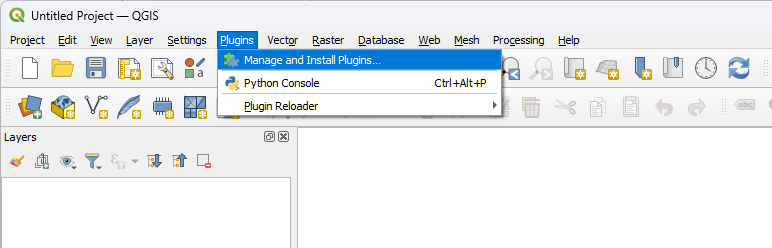
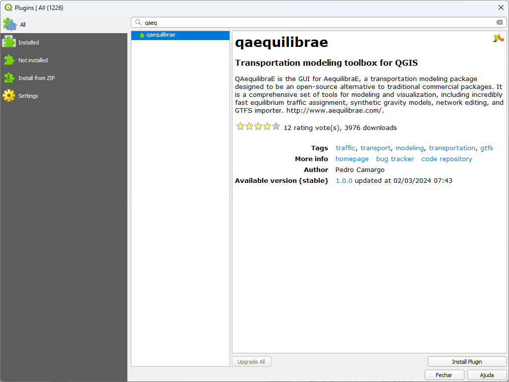
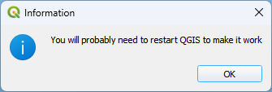
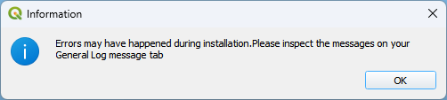
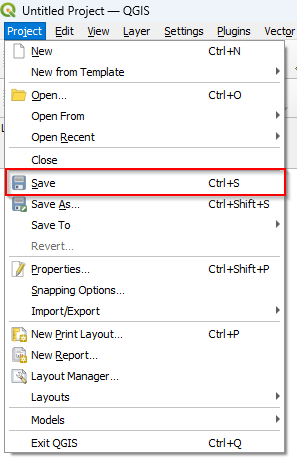

.. _getting_started:

Getting Started
===============

In this section we describe how you can install AequilibraE's QGIS plug-in.

.. note::

    The recommendations on this page are as current as of April 2024.

Installation
------------

AequilibraE is available from the QGIS plugin repository, and we recommend you
download it using the instructions below.

.. index:: installation

Step-by-step installation
~~~~~~~~~~~~~~~~~~~~~~~~~~

The steps for installing AequilibraE are the same as for any QGIS plugin.
Go to the Plugins panel and click on **Manage and Install Plugins**.

In the tab *All*, search for QAequilibraE.

After selecting the plug-in installation, you will be faced with the question of whether you
want to download its dependencies, which are required for using most of the
features. This is necessary because AequilibraE's algorithms rely on compiled
extensions, but it is against the QGIS's community guidelines to upload binaries
to the repository.

.. image:: ../images/getting_started_3.png
    :align: center
    :alt: Third step

If you select to download the packages, QGIS will freeze for a few seconds before
showing the image below.

Otherwise, a message warning about installation problems will be shown, and your
plugin will be non-functional.

Saving as QGIS Project
----------------------

Since version 1.0.1, our users can save their on-going projects directly through the QGIS saving menu! 
This feature allows you to save both your AequilibraE project and temporary layers. The temporary layers
are stored in **qgis_layer.sqlite**, a database automatically created to store these layers. All you have 
to do is go to the Project panel and select **Save** or **Save as**, indicate where you want to store 
your project file, and press save!

In the interest of data integrity, if you have open AequilibraE layers into your QGIS Project and close 
the AequilibraE project, these layers are removed from your open QGIS project.

When reopening the QGIS project containing an AequilibraE model, you will notice that the project 
stored is automatically reopened by QAequilibraE.

.. .. _quicktour_video:

.. Quick Tour
.. ----------

.. After installing AequilibraE plug-in, you might enjoy this quick tour on QGIS interface.
.. Latest versions of AequilibraE for QGIS have brought substantial changes over to the
.. software operation and interface, which might cause some confusion to old users. For a brief overview
.. of the new interface, we have prepared a little video tour.

.. .. raw:: html

..     <iframe width="560" height="315" src="https://www.youtube.com/embed/oZEcjiBRaok"
..      frameborder="0" allow="accelerometer; autoplay; encrypted-media; gyroscope;
..      picture-in-picture" allowfullscreen></iframe>
