.. _installation:

Installation
============

AequilibraE is available from the QGIS plugin repository, and we recommend you
download it using the instructions below.

.. index:: installation

Step--by-step installation
--------------------------

The steps for installing AequilibraE are the same as for any QGIS plugin

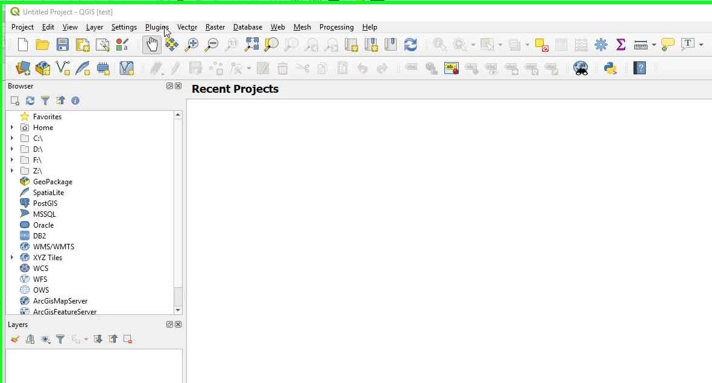

.. image:: images/install_2.png
    :scale: 100 %
    :align: center
    :alt: Second step

.. image:: images/install_3.png
    :scale: 100 %
    :align: center
    :alt: Third step

.. note::
   The latest version of the AequilibraE plugin is released as experimental, and
   stable versions older than 0.5 are substantially less capable than the latest
   version, therefore we recommend you using at least version 0.6, even if that
   means using an experimental one, which you can select by checking the box
   for experimental plugins within the QGIS plugin manager.

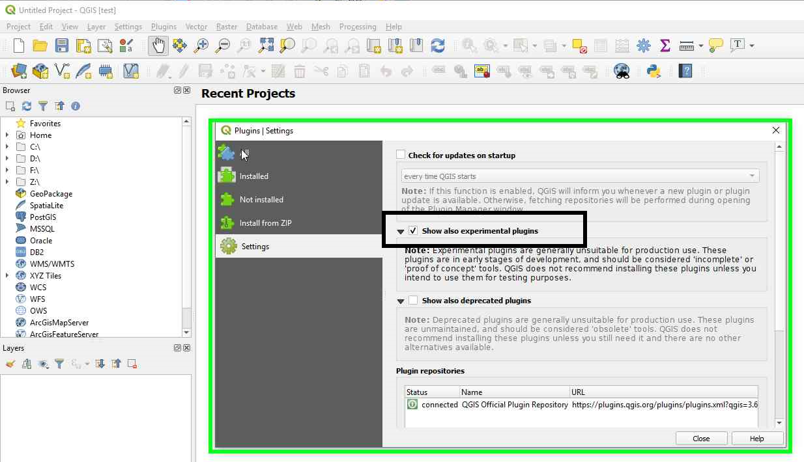

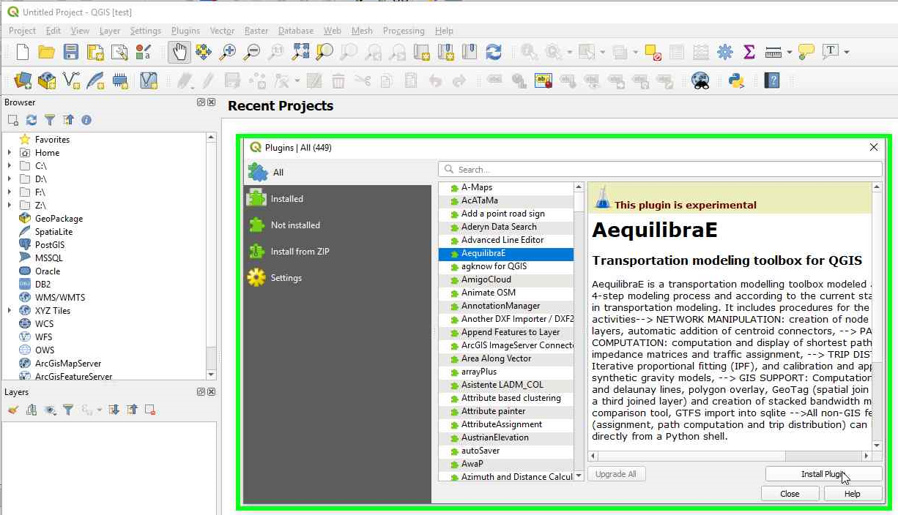

If you get the message below when you try to run one of AequilibraE's tools, it
is because you are missing some files.

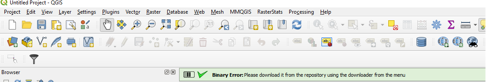

The problem is that many of AequilibraE's algorithms rely on compiled
extensions, but it is against the QGIS's community guidelines to upload binaries
to the repository.

In order to comply with that rule without losing functionality, we ask you to
download such binaries after installing the QGIS, which can be done in the
AequilibraE menu, but it does require restarting QGIS

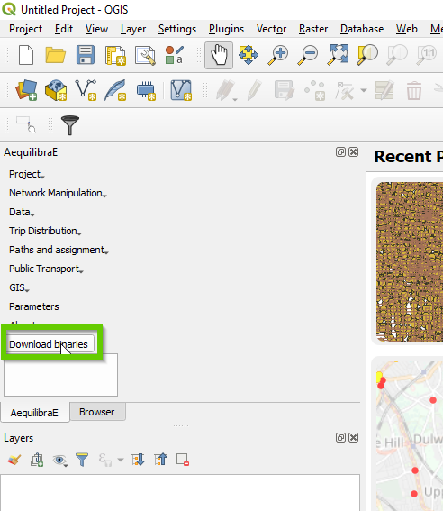

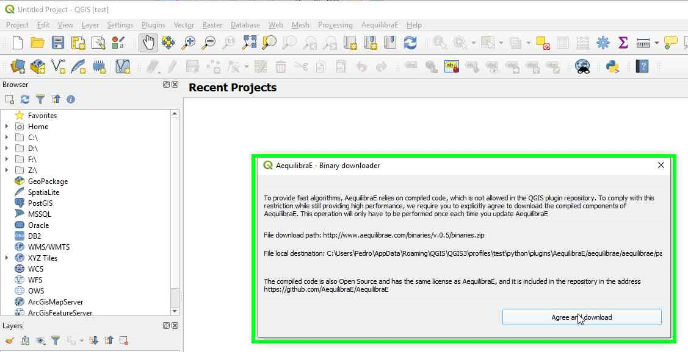

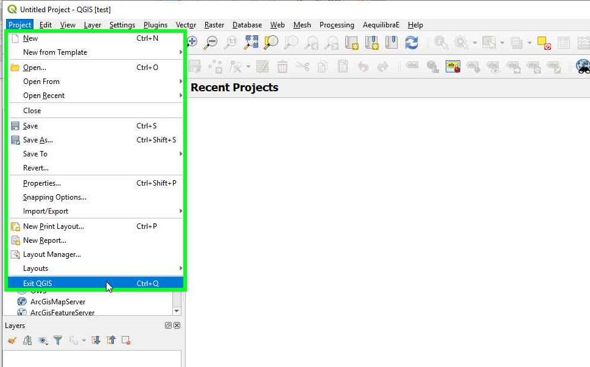

Now it is just a matter of re-starting QGIS and starting to use AequilibraE.

For those who want to be able to use matrices in the OpenMatrix (*.omx) format,
then you still need to install the openmatrix package.  If you are in Linux or
Mac, then a simple

::

    pip install openmatrix

should suffice.

However, if you are a Windows user, things are a little more convoluted. The
best way of doing it is to run QGIS as an administrator and click on *install*
*extra packages* from the AequilibraE menu, as shown below.

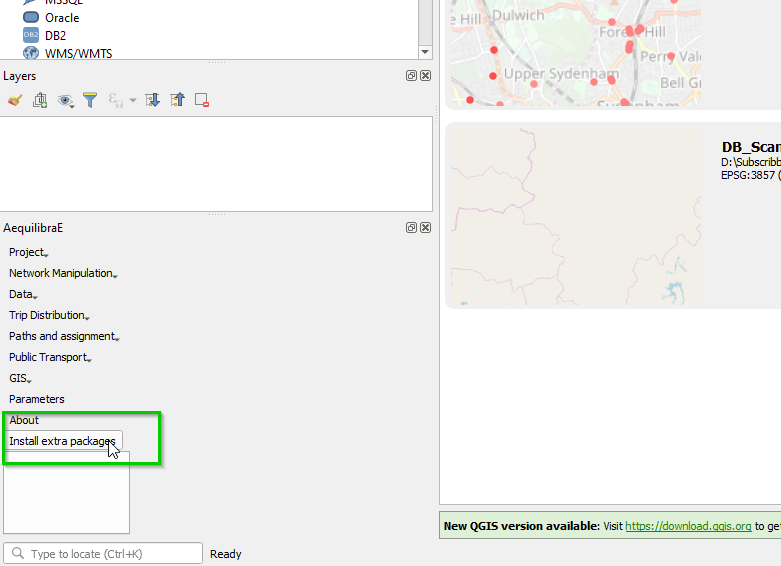

You will be asked to confirm your actions before AequilibraE attempts to install
openmatrix with the screen shown below.

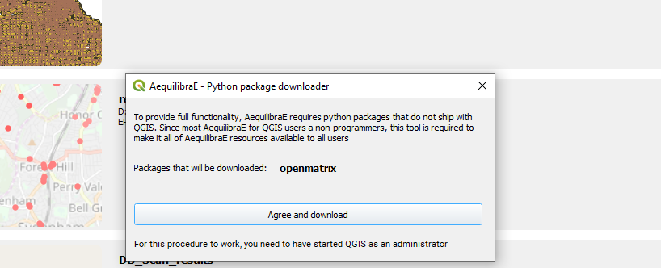

If you have correctly installed it, the logging screen will clearly state that
the process was successful, as shown below

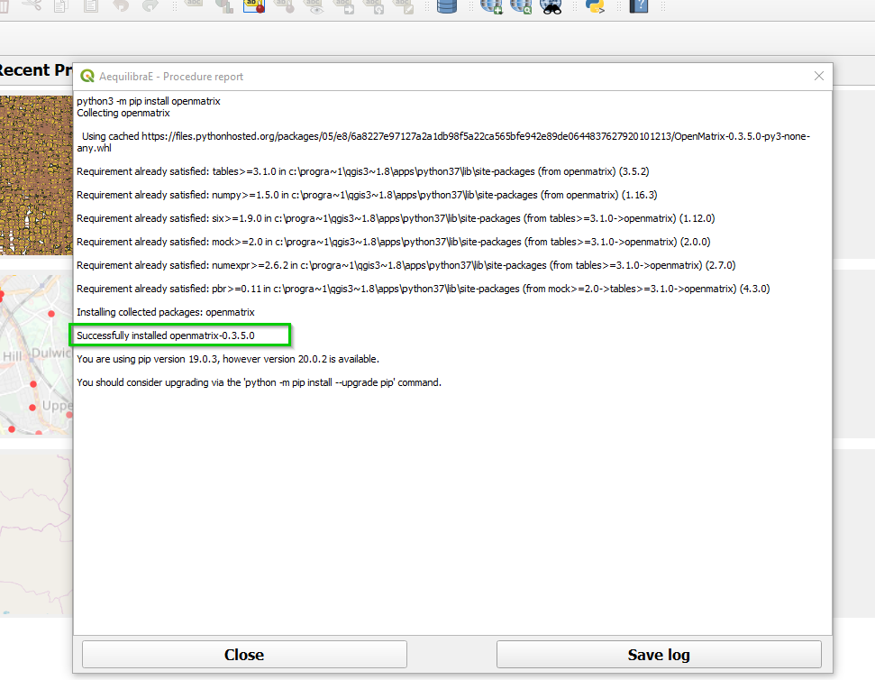

And it would report failure in case something has gone wrong.

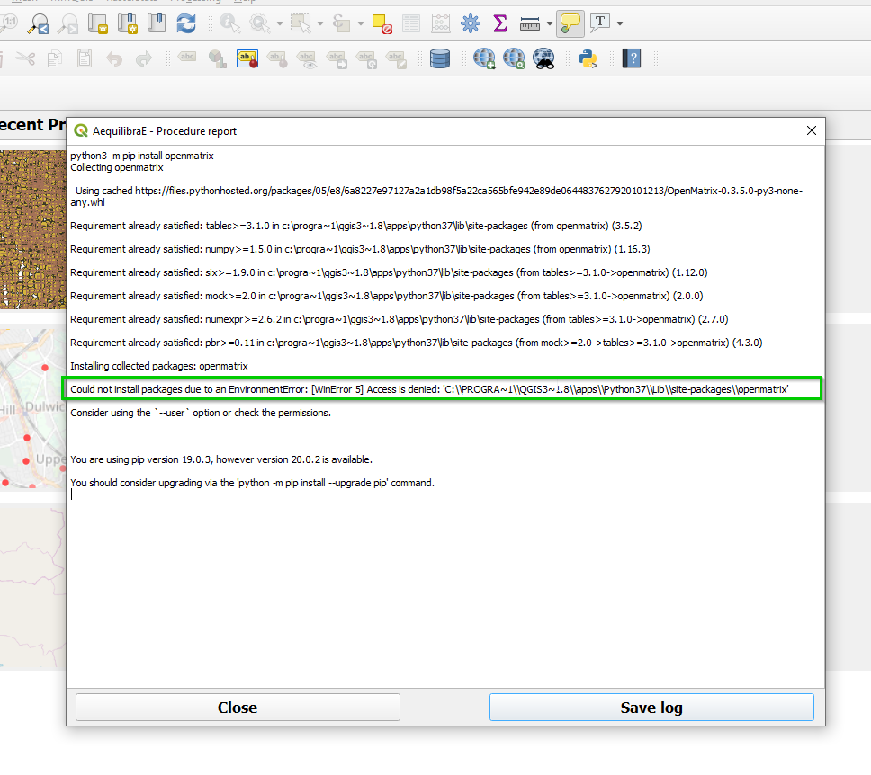

A more detailed discussion on how this process works has been presented in the
form of a blog post on
`XL-Optim <https://www.xl-optim.com/displaying-omx-matrix-in-qgis/>`_.
