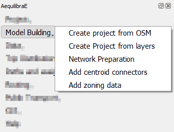
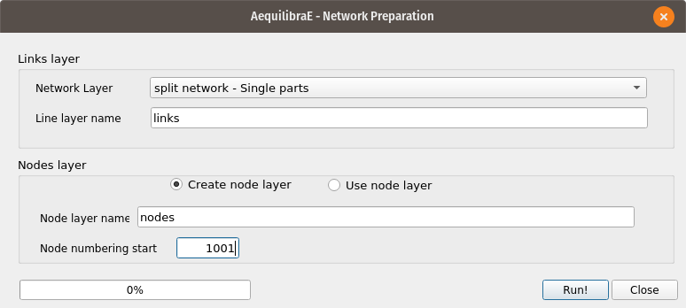

.. _model_building:

Model building
==============

On the Model building tab, it is possible to effectively build an AequilibraE model, and to do so,
there are some options, such as creating project from Open Street Maps or using your existing layers.

In this tab, you can also add centroids and zones to your project.

.. _create-proj-from-osm:

Create project from OSM
-----------------------

The first feature is the capability of importing networks directly from
`Open Street Maps <https://www.openstreetmap.org/>`_ into AequilibraE's efficient
TranspoNet format. This is also time to give a HUGE shout out to
`Geoff Boeing <http://www.geoffboeing.com/>`_, creator of the widely used Python
package `OSMNx <https://github.com/gboeing/osmnx>`_. For several weeks I
worked with Geoff in refactoring the entire OSMNx code base so I could include
it as a submodule or dependency for AequilibraE, but its deep integration with
`GeoPandas <https://geopandas.org/en/stable/index.html>`_ and all the packages it depends on (Pandas,
Shapely, Fiona, RTree, etc.), means that we would have to rebuild OSMNx from the
ground up in order to use it with AequilibraE within QGIS, since its Windows
distribution does not include all those dependencies.

For this reason, I have ported some of Geoff's code into AequilibraE
(modifications were quite heavy, however), and was ultimately able to bring this
feature to life.

.. note::
   Importing networks from OSM is a rather slow process, so we recommend that
   you carefully choose the area you are downloading it for. We have also
   inserted small pauses between successive downloads to not put too much
   pressure on the OSM servers. So be patient!!

Importing networks from OSM can be done by choosing an area for download,
defined as the current map canvas on QGIS...

.. image:: ../images/model_from_canvas_area.png
    :width: 999
    :align: center
    :alt: Download OSM networks for visible area

... or for a named place.

.. image:: ../images/model_from_place.png
    :width: 1057
    :align: center
    :alt: Download OSM networks for named place

Project from layers
-------------------

The AequilibraE project can also be bootstrapped from existing line and node
layers obtained from any other source, as long as they contain the following
required field for the conversion:

* Link ID
* a_node
* b_node
* Link direction
* Length
* Speed
* Allowed modes
* Link Type

These requirements often create quite a bit of manual work, as most networks
available do not have complete (or reliable) information. Manually editing the
networks might be necessary, which is common practice in transport modelling.

Before creating a project from the layer, you can understand how to prepare the
layers for this task on the page
:ref:`Preparing a network <network_preparation_page>`.

After all field preparation is done, one can import those layers into an
AequilibraE project using a dedicated tool in the **Model building** menu in
AequilibraE.

Accessing **Model building > Create Project from Layers**, the user is
presented with the following screen.

.. image:: ../images/project_from_layers_links.png
    :width: 614
    :align: center
    :alt: project_from_layers_links

The first 7 fields for links are mandatory, and one needs to associate the
corresponding layer fields to the network fields.

The other fields that will be listed on the left side come from the parameters
file (see the manual for that portion for more details), but the user can add
more fields from the layer, as all of them are listed on the left side of the
screen

In the case of the nodes layer, only two fields are mandatory.

.. image:: ../images/project_from_layers_nodes.png
    :width: 614
    :align: center
    :alt: project_from_layers_nodes

After filling all fields, it is just a matter of saving it!

After running this tool a sqlite file (spatialite enabled) will be created and
you can edit the network (create, move or delete links and nodes) and both
layers (including node *ID* and *A_Node*/*B_Node* fields) will remain
consistent with each other.

.. _network_preparation:

Network preparation
-------------------

When preparing your project network, you might face there are two distinct situations:

1. **User has only the network links**

This is the case when one exports only links from a transportation package or
downloads a link layer from Open Street Maps or a government open data portal
and want to use such network for path computation. This tool then does the
following:

* Duplicates the pre-existing network in order to edit it without risk of data corruption
* Creates nodes at the extremities of all links in the network (no duplicate nodes at the same latitude/longitude)
* Adds the fields *A_Node* and *B_Node* to the new link layer, and populate them with the *IDs* generated for the nodes layer

2. **User has the network links and nodes but no database field linking them**

In case one has both the complete sets of nodes and links and nodes for a
certain network (commercial packages would allow you to export them separately),
you can use this tool to associate those links and nodes (if that information
was not exported from the package). In that case, the steps would be the
following:

* Duplicates the pre-existing network in order to edit it without risk of data corruption
* Checks if the nodes provided cover both extremities of all links from the layer provided. Node IDs are also checked for uniqueness
* Adds the fields *A_Node* and *B_Node* to the new link layer, and populate them with the *IDs* chosen among the fields from the nodes layer

The *GUI* for these two processes can be accessed in the AequilibraE menu **Model
Building > Network Preparation**, and it looks like this:

In this case we chose to add nodes with IDs starting in 1,001, as we will
reserve all nodes from 1 to 1,000 for centroids, external stations and other
special uses (we are not planning to use all that range and that is not
necessary, but the numbering gets quite neat that way).

.. _adding_centroids:

Adding centroids
----------------

Starting in version 0.6 of AequilibraE, centroid connectors can now only be
added to
`AequilibraE projects <https://aequilibrae.com/python/latest/modeling_with_aequilibrae/project.html>`_,
and no longer generates new layers during the process.

Before we describe what this tool can do for you, however, let's just remember
that there is a virtually unlimited number of things that can go awfully wrong
when we edit networks with automated procedures, and we highly recommend that
you **BACKUP YOUR DATA** prior to running this procedure and that you inspect
the results of this tool **CAREFULLY**.

The *GUI* for this procedure is fairly straightforward, as shown below.

.. image:: ../images/add_connectors_to_project.png
    :width: 600
    :align: center
    :alt: Adding connectors

One would notice that nowhere in the *GUI* one can indicate which modes they
want to see the network connected for or how to control how many connectors per
mode will be created. Although it could be implemented, such a solution would
be convoluted and there is probably no good reason to do so.

Instead, we have chosen to develop the procedure with the following criteria:

* All modes will be connected to links where those modes are allowed.
* When considering number of connectors per centroid, there is no guarantee that
  each and every mode will have that number of connectors. If a particular mode
  is only available rather far from the centroid, it is likely that a single
  connector to that mode will be created for that centroid
* When considering the maximum length of connectors, the *GUI* returns to the
  user the list of centroids/modes that could not be connected.

Notice that in order to add centroids and their connectors to the network,
we need to create the set of centroids we want to add to the network in a
separate layer and to have a field that contains unique centroid IDs. These IDs
also cannot exist in the set of node IDs that are already part of the map.

.. _add-zoning-data:

Add zoning data
---------------

It is possible to import to AequilibraE project your own zoning system in case
you already have one. Currently, AequilibraE only supports one projection system,
which is the EPSG:4326 (WGS84), so make sure your zone layer is in this projection.

To add your zones to the active project, go to **Model building > Add zoning data**, 
select the zoning layer you want to add to the project, select weather you
want to migrate the data and the respective layer field in the zoning layer, and
finally click on process.

.. image:: ../images/add-zone-layer.png
    :width: 450
    :align: center
    :alt: adding zone layer
