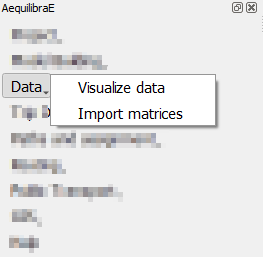
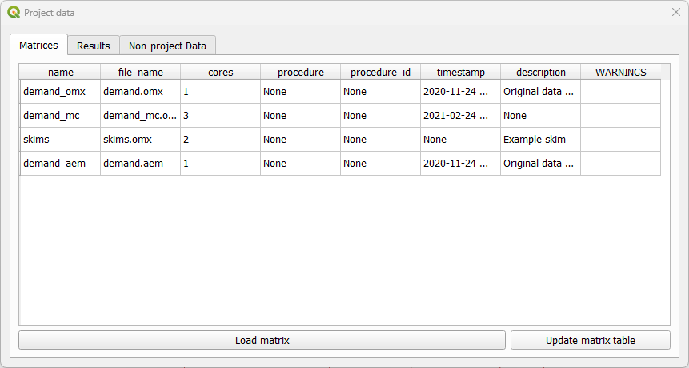
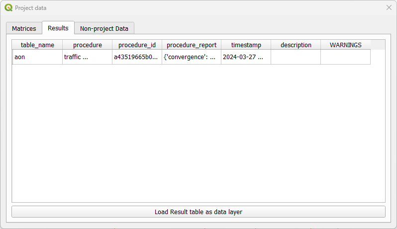
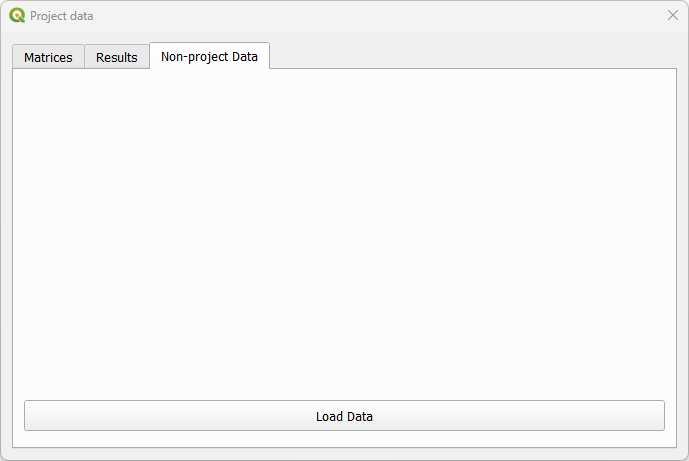
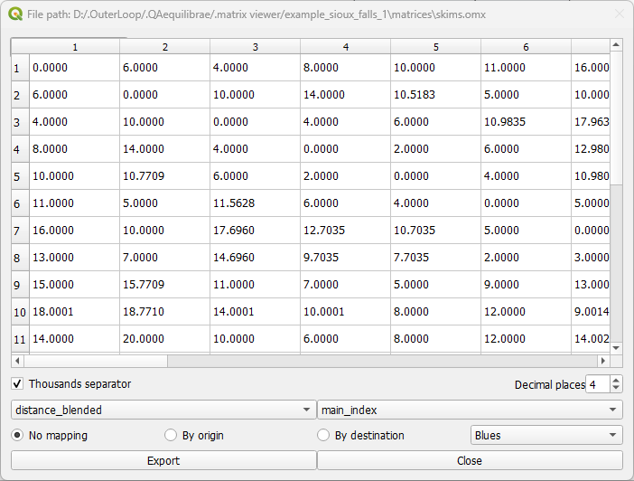
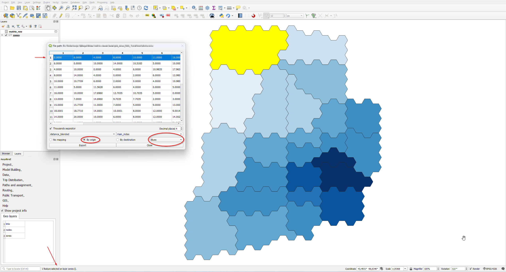
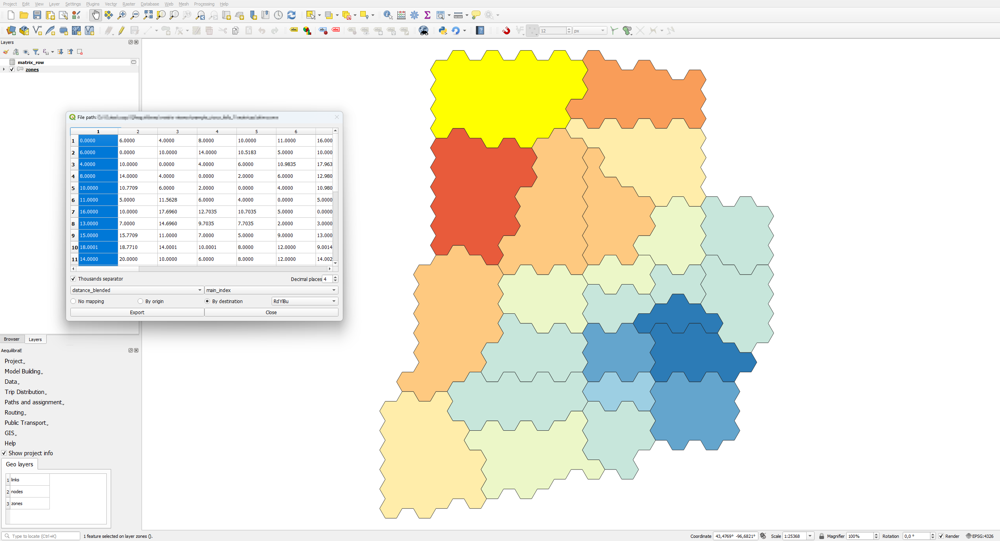
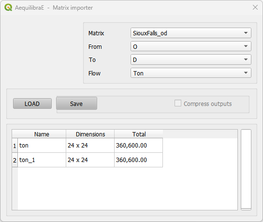

Data
====

In the data tab the user can check and load the non-geographic data available in the project.

.. _data_visualize_data:

Visualize data
--------------

When clicking **Data > Visualize data**, a new window with three different tabs opens. The tab *matrices* shows 
the matrices available for the current project (see figure below).

As for the tab *results* it displays the results of procedures that took place, such as the creation of Delaunay 
Lines, and that are saved in a **results_database.sqlite**.

The tab *non-project data* allows you to open and visualize matrices and datasets in the following extensions: 
\*.omx, \*.aem, and \*.aed. **This is the only tab available if no AequilibraE project is open**. Suppose you 
want to check a skim matrix from a previous project. When clicking the **Load data** button, you can point 
AequilibraE the location of the file and its visualization is displayed.

.. _fig_nonproject_data:

Check the figure below to see how the visualization window looks like! General configurations for data displaying
such as the number of decimal places and the usage of thousand separator are available. In case your file has more 
than one view, you can select the desired view using the dropdown buttons at the bottom of the page. In our figure,
they are represented by the dropdowns containing *distance_blended* and *main_index*. To save your current matrix 
into \*.csv format, just click in the *export* button in the lower left corner of the window.

.. _fig_data_visualize_matrices:

Additionally, since version 1.0.2, we can visualize how the skim matrices look like in the map! Using the buttons
*By origin* and *By destination*, it is possible to select the traffic zone by its origin or destination. If one
select *By origin*, then click on the desired row, and notice that is going to be highlighted. The *zones* layer 
(if it exists) is going to be loaded and the corresponding zones are going to receive a different color shade, according
to the color palette selected in the dropdown menu.

The step-by-step when selecting *By destination*, is identical to the one before. Select the desired column 
(destination), notice that it will be highlighted, and the *zones* layer is going to present a color shade
according to the color palette selected.

.. _importing_matrices:

Importing matrices to project
-----------------------------

It is also possible for the user to import matrices from an open layer to a project. This can be done by clicking 
**Data > Import Matrices** and properly indicating the fields in the new window. First click *Load*
and then *Save*. A new window will open and you can point to the project matrices folder. To take a look in the
matrix you just imported, you can upload the matrix table and display it as shown in the last topic.

