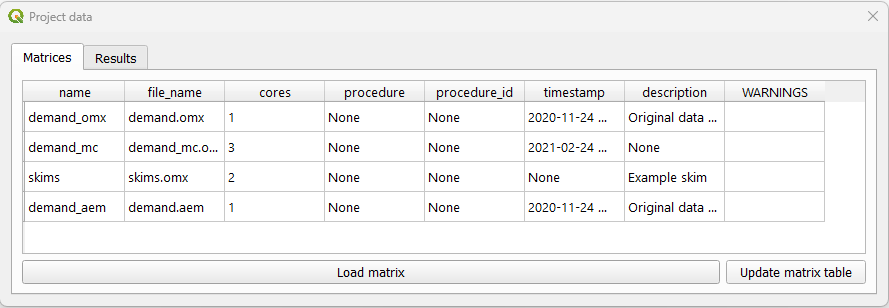
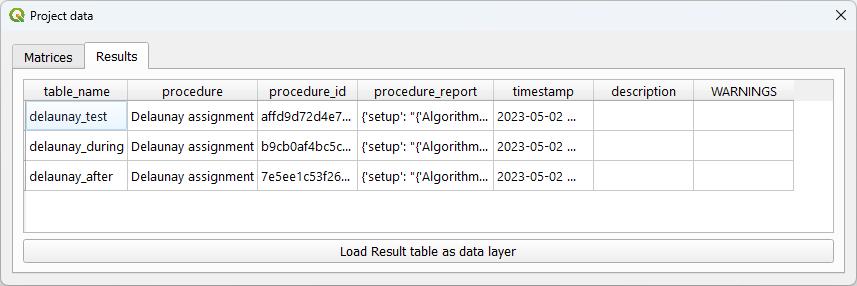

Data
====

In the data tab the user can check and load the non-geographic data available in the project.

Displayig AequilibraE's files
-----------------------------

When clicking **AequilibraE > Data > Display project data**, a new window with two different tabs
opens. The tab *matrices* shows the matrices available for the current project (see figure below).

As for the tab *results* it displays the results of procedures that took place, such as the
creation of Delaunay Lines, and that are saved in a **results_database.sqlite**.

.. _importing_matrices:

Importing matrices to project
-----------------------------

It is also possible for the user to import matrices from an open layer to a project. This can be done by clicking 
**AequilibraE > Data > Import Matrices** and proparly indicating the fields in the new window. First click *Load*
and then *Save*. A new window will open and you can point to the project matrices folder. To take a look in the
matrix you just imported, you can upload the matrix table and display it as shown in the last topic.

.. image:: ../images/data-matrix_importer.png
    :align: center
    :alt: project data results
