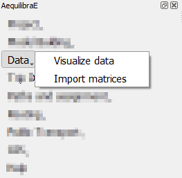
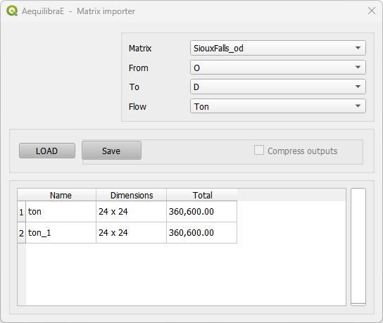

Data
====

In the data tab the user can check and load the non-geographic data available in the project.

.. _importing_matrices:

Importing matrices to project
-----------------------------

It is also possible for the user to import matrices from an open layer to a project. This can be done by clicking 
**Data > Import Matrices** and properly indicating the fields in the new window. First click *Load*
and then *Save*. A new window will open and you can point to the project matrices folder. To take a look in the
matrix you just imported, you can upload the matrix table and display it as shown in the last topic.

