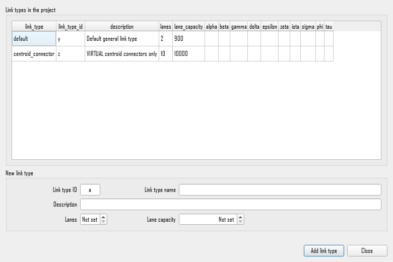
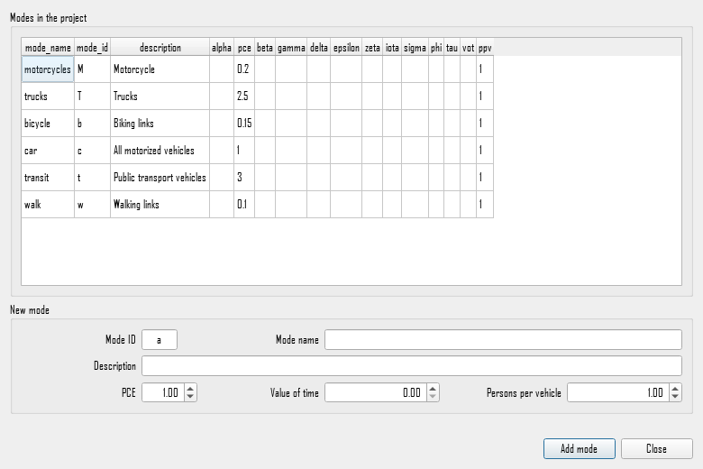
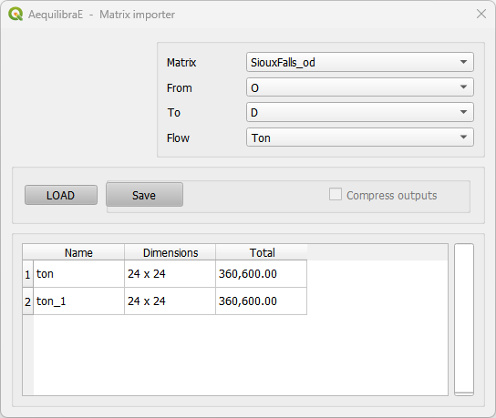

.. _data_menu:

Data
====

Open **AequilibraE > Data** from the menubar or dock panel.
Matrix import creates OMX files without requiring an open project.
Mode and link-type creation require an open project.
For matrix calculations, exports, and table conversion, use the :doc:`Processing provider <../processing_provider>`.

.. _add_link_type:

Add link type
-------------

The project must contain a link type before a link can use it.
Open **Data > Add link type** with a project open.
The table lists existing types so you can check which IDs and names are available.

Enter a one-letter link type ID and a name containing letters and underscores.
The dialog suggests the first available ID.
Connectors use the ID when selecting eligible :ref:`link types <adding_centroids>`; network links store the type name.

Description, lanes, lane capacity, and speed are optional.
Numeric fields remain empty while they show *Not set*.
Older projects may omit some of these fields; the dialog offers only fields present in the project.

The dialog stays open after each addition so you can add several types.
New types are immediately available when :ref:`digitizing links <editing_networks>`.

.. _add_mode:

Add mode
--------

The project must contain a mode before a link can use it.
Open **Data > Add mode** with a project open.
Enter a one-letter mode ID and a descriptive name containing letters and underscores.
The dialog suggests the first available ID.
Links use this ID in their ``modes`` field.

Description, PCE (passenger-car equivalent), value of time, and persons per vehicle are optional.
These values provide defaults for traffic assignment and can be edited later in the modes table.
Persons per vehicle can be zero for non-travel uses.

.. _importing_matrices:

Import matrices
---------------

Open **Data > Import matrices** to import matrix values from a QGIS layer.
Select the origin ID, destination ID, and numeric value fields, then click *Load*.
Click *Save* and select an output OMX file.
This operation creates a file without registering it in a project's matrix table.

To use the file in project procedures, save it in that project's ``matrices`` folder.
Open **Mapping > Visualize data** with the project open.
In the *Matrices* tab, click *Update matrix table* to register the file.
You can then select the matrix in project procedures or load it for inspection.
For a standalone file, use the *Non-project data* tab described under :ref:`Visualize data <mapping_visualize_data>`.

