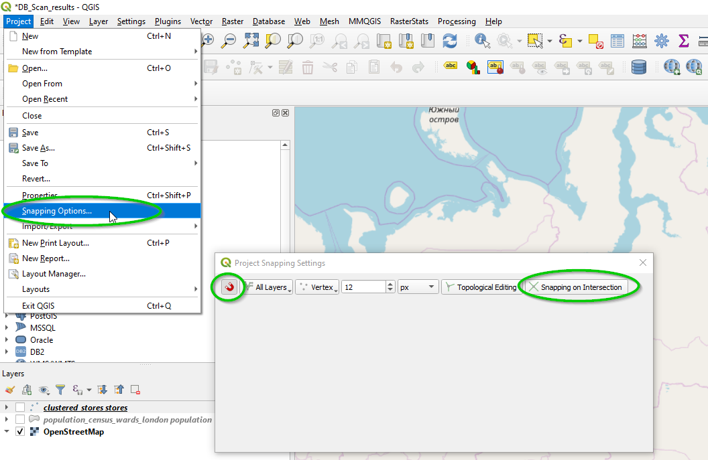
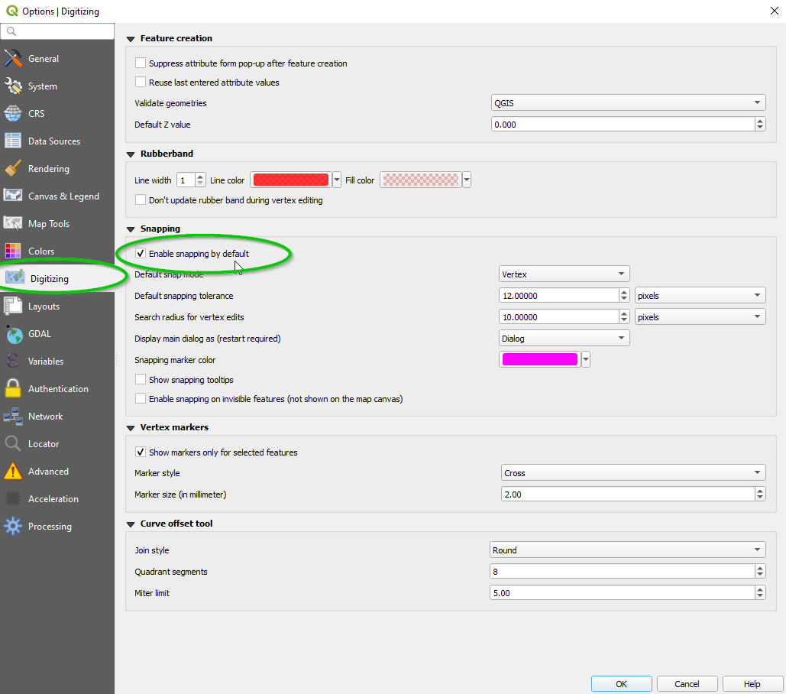
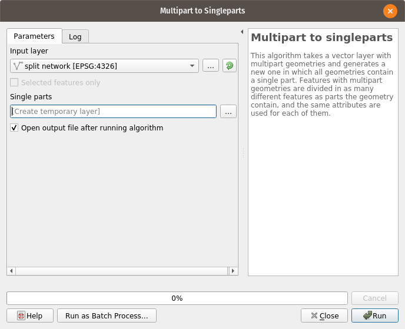
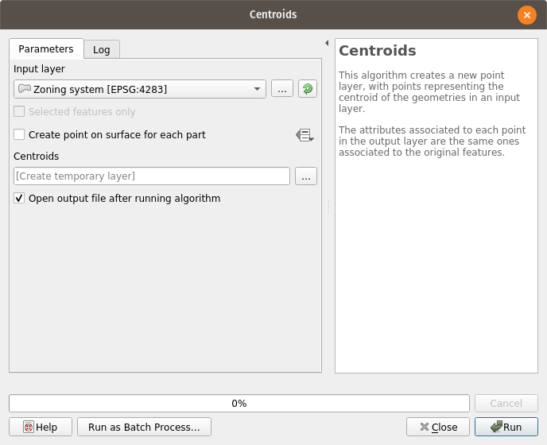

:orphan:

.. _editing_networks:

Editing networks
================

.. toctree::
   :maxdepth: 1

.. Bla bla bla that we will talk about centroids, snapping to vertex and GIS tricks

Editing an AequilibraE network is editing any other node and link layer in QGIS.
Before doing so, however, take a look at the discussion of the network triggers
behind the AequilibraE network, particularly the section on
`network consistency behavior
<https://www.aequilibrae.com/latest/python/modeling_with_aequilibrae/project_database/network.html#network-consistency-behaviour>`_.

Snapping to node
----------------

When editing a transportation network, especially an AequilibraE network,
**snap-to-vertex** prevents the user from creating nodes that are infinitesimally
close, yet disjoint. When loading layers from the QAequilibraE panel,
vertex snapping is turned on against every AequilibraE
layer loaded in your QGIS project, so link endpoints land exactly on the existing
nodes. Layers that do not belong to the model, such as basemaps, are left out, so
you do not snap to them by accident.

Your own snapping configuration is saved when the first AequilibraE layer starts
being edited and restored once the last one leaves edit mode, so nothing changes
outside of an editing session.

The snapping tolerance - how close you have to get to an existing vertex before the
cursor snaps to it - is the one already configured for the QGIS project, which you can
change under **Project > Snapping Options**

To change the tolerance used by default in all future projects, one can access the
menu **Settings > Options** and select the *Digitizing* menu from the side options,
as shown below

You can still override any of it from the QGIS snapping toolbar while editing, just
keep in mind that toggling another AequilibraE layer for edit re-applies the defaults
described above.

For more resources, you can just make a quick
`online search <https://duckduckgo.com/?q=QGIS+snapping+to+vertex&atb=v179-1&ia=web>`_
or even go directly to a one of many existing
`tutorials <https://www.giscourse.com/editing-vector-layers-in-qgis/>`_.

Digitizing links
----------------

The attribute form of the links layer is configured when the layer is loaded from the
QAequilibraE panel, so a new link only asks for what the model cannot work out on its own.

* **link_id** and **ogc_fid** are filled with the next values available.
* **a_node** and **b_node** are hidden. The database works both out from the endpoints of
  the link as soon as it is saved, so there is nothing there to fill in.
* **modes** and **link_type** are drop-downs built from the *modes* and *link_types*
  tables of your project, so a value the model does not know about cannot be typed in by
  accident. **link_type** starts on *default* and cannot be left empty, since a link
  without a link type is refused by the database.
* Both drop-downs then offer whatever you chose last, which saves picking them again for
  every link of a run. QGIS remembers those for as long as the layer stays loaded, so the
  first link after reopening the project starts from the defaults above.

Nodes created while digitizing are numbered from 10,000 up, leaving the lower numbers free
for you to assign to centroids. Nodes that already exist are never renumbered, and a model
already numbering past 10,000 simply carries on from where it was.

Digitizing zones
----------------

A new zone comes with its **zone_id** and **ogc_fid** already filled in, each following the
largest currently in use, so a model numbering its zones by hand carries on from where it
left off. Both remain editable, since a zone numbering that follows the study area rather
than the order zones were drawn in is entirely normal.

Breaking links at nodes
-----------------------

A link drawn across nodes it snapped to along the way is saved as one link per stretch
between them, so the network is connected at each of those nodes rather than having a
single link running over the top of them. The attributes you entered are copied to every
stretch, and each one gets its own link id.

Only nodes that already exist break the link, which is why it pays to snap. Crossing
another link where no node exists is a topology problem this cannot see: the crossed link
is never touched, and neither is anything else already in the model.

The behavior can be turned off under **Options > Break links at nodes while digitizing**
in the QAequilibraE panel, and the choice is remembered across QGIS sessions. See
:ref:`the Options menu <break_links_option>`.

Topological Editing
-------------------

From the QGIS manual:

 | The option **Enable topological editing** is for editing and maintaining
 | common boundaries in features mosaics. QGIS ‘detects’ shared boundary by
 | the features, so you only have to move a common vertex/segment once,
 | and QGIS will take care of updating the neighboring features.

So if you are editing zoning layers, I highly recommend you go to the
`QGIS manual <https://www.qgis.org/en/docs/index.html>`_ and read about it!

GIS tricks
----------

There are some basic tools in QGIS that might come in handy when you are
working with AequilibraE, so we have described a few of them here.

.. _multipart_to_singlepart:

Multipart Vs. Singlepart geometries
~~~~~~~~~~~~~~~~~~~~~~~~~~~~~~~~~~~

In GIS, geometries can be SinglePart or MultiPart, where the first is what one
would consider a *regular* geometry, while the latter is not always intuitive.

Examples of MultiPart geometries are countries that contain islands, so a
geometry of the country should be formed of disjoint areas, or streets that are
interrupted by the existence of a park. These elements, however, do not have
place in traditional transport modeling, and we present a procedure to eliminate
the occurrence below.

One can transform all MultiPart features into SinglePart ones using a QGIS
standard tool, which can be accessed on  **Vector > Geometry Tools >**
**Multipart to Singleparts**.

Running it looks like this:

Just notice that, after this process to a network, you will **HAVE** to run
through all the steps described in :ref:`preparing a network <network_preparation>`.

Centroids from area layers
~~~~~~~~~~~~~~~~~~~~~~~~~~

In order to add centroids to a network, one must first curate a layer of
centroids and number them appropriately, as discussed in 
:ref:`adding centroids <adding_centroids>`.

QGIS has straightforward tools to extract centroids from areas, which can be
accessed through the menu **Vector > Geometry Tools > Centroids**, as shown below

One should always remember to visually inspect the results of the automatic
process, in this case looking for those centroids that were placed in awkward
places and move them to more appropriate positions.

One might need to convert the zoning system to a SingleParts layer before
following the instructions above, which can be done following the description
provided in :ref:`multipart to singlepart <multipart_to_singlepart>`.

.. Video tutorial
.. --------------

.. .. raw:: html

..     <iframe width="560" height="315" src="https://www.youtube.com/embed/lAxY7E9g1Q8"
..      frameborder="0" allow="accelerometer; autoplay; encrypted-media; gyroscope;
..      picture-in-picture" allowfullscreen></iframe>
