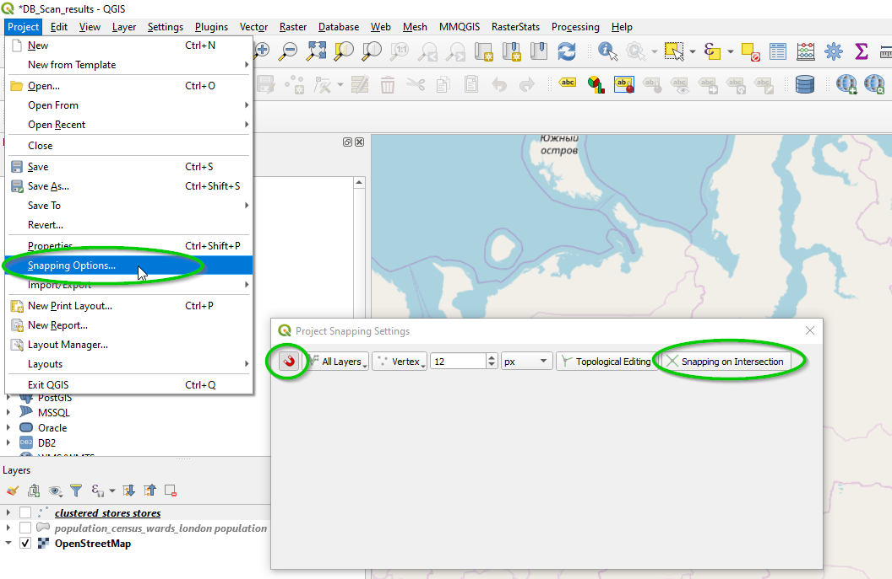
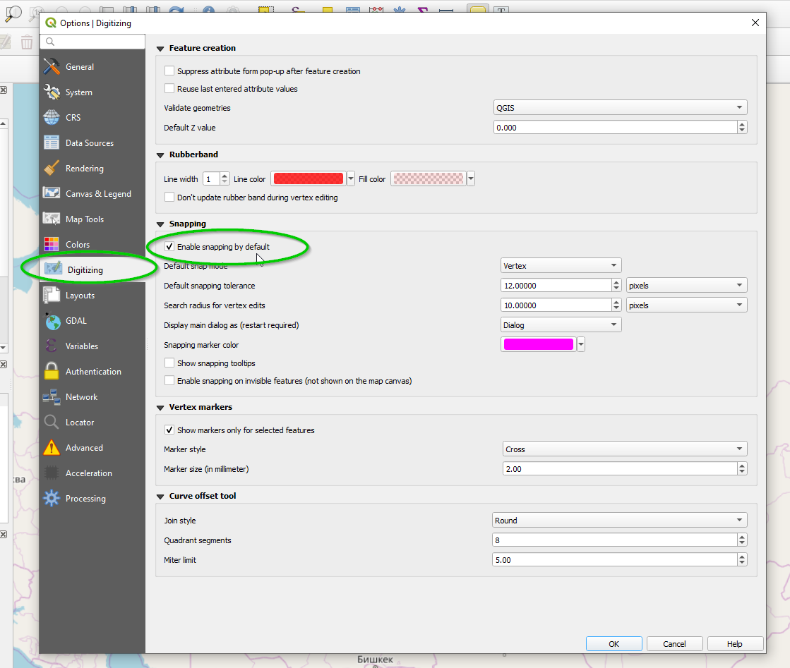
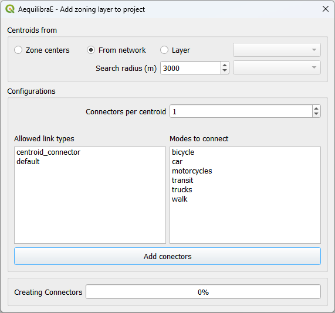
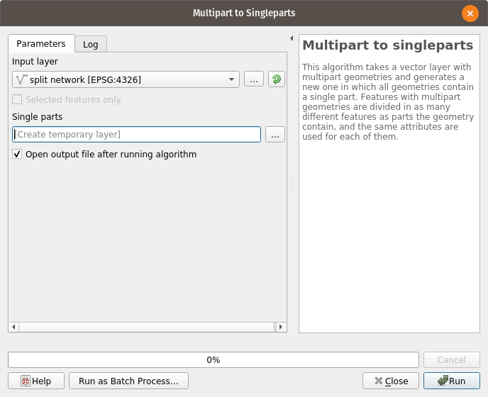
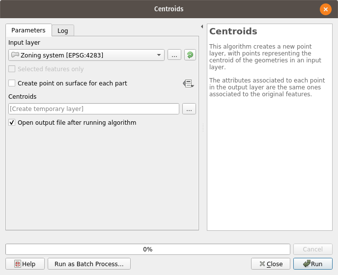

.. _editing_networks:

Editing networks
================

.. toctree::
   :maxdepth: 1

.. Bla bla bla that we will talk about centroids, snapping to vertex and GIS tricks

Editing an AequilibraE network is editing any other node and link layer in QGIS.
Before doing so, however, take a look at the discussion of the network triggers
behind the AequilibraE network, particularly the section on
`network consistency behavior
<https://aequilibrae.com/python/latest/modeling_with_aequilibrae/project_database/network.html#network-consistency-behaviour>`_.

Snapping to node
----------------

Before editing any transportation network, especially an AequilibraE network,
one should enable the option to **snap-to-vertex** inside QGIS. This option will
prevent the user from creating nodes that are infinitesimally close, yet
disjoint. To enable this function, one can access the option
**Project > Snapping Options**, click the little horseshoe, and then the
*Snapping on Intersection* button, as depicted below

To make this option default for all future projects, one can access the menu
**Settings > Options** and select the *Digitizing* menu from the side options.
After that it is just a matter of enabling snapping by default, as shown below

In both cases you can tune how close you can (or have to) get to an existing
vertex before the cursor snaps to it, but that is a purely preference issue.

For more resources, you can just make a quick
`online search <https://duckduckgo.com/?q=QGIS+snapping+to+vertex&atb=v179-1&ia=web>`_
or even go directly to a one of many existing
`tutorials <https://www.giscourse.com/editing-vector-layers-in-qgis/>`_.

Topological Editing
-------------------

From the QGIS manual:

 | The option **Enable topological editing** is for editing and maintaining
 | common boundaries in features mosaics. QGIS ‘detects’ shared boundary by
 | the features, so you only have to move a common vertex/segment once,
 | and QGIS will take care of updating the neighboring features.

So if you are editing zoning layers, I highly recommend you go to the
`QGIS manual <https://www.qgis.org/en/docs/index.html>`_ and read about it!

.. _adding_centroids:

Adding centroids
----------------

Starting in version 0.6 of AequilibraE, centroid connectors can now only be
added to
`AequilibraE projects <https://aequilibrae.com/python/latest/modeling_with_aequilibrae/project.html>`_,
and no longer generates new layers during the process.

Before we describe what this tool can do for you, however, let's just remember
that there is a virtually unlimited number of things that can go awfully wrong
when we edit networks with automated procedures, and we highly recommend that
you **BACKUP YOUR DATA** prior to running this procedure and that you inspect
the results of this tool **CAREFULLY**.

The *GUI* for this procedure is fairly straightforward, as shown below.

One would notice that nowhere in the *GUI* one can indicate which modes they
want to see the network connected for or how to control how many connectors per
mode will be created. Although it could be implemented, such a solution would
be convoluted and there is probably no good reason to do so.

Instead, we have chosen to develop the procedure with the following criteria:

* All modes will be connected to links where those modes are allowed.
* When considering number of connectors per centroid, there is no guarantee that
  each and every mode will have that number of connectors. If a particular mode
  is only available rather far from the centroid, it is likely that a single
  connector to that mode will be created for that centroid
* When considering the maximum length of connectors, the *GUI* returns to the
  user the list of centroids/modes that could not be connected.

Notice that in order to add centroids and their connectors to the network,
we need to create the set of centroids we want to add to the network in a
separate layer and to have a field that contains unique centroid IDs. These IDs
also cannot exist in the set of node IDs that are already part of the map.

GIS tricks
----------

There are some basic tools in QGIS that might come in handy when you are
working with AequilibraE, so we have described a few of them here.

.. _multipart_to_singlepart:

Multipart Vs. Singlepart geometries
~~~~~~~~~~~~~~~~~~~~~~~~~~~~~~~~~~~

In GIS, geometries can be SinglePart or MultiPart, where the first is what one
would consider a *regular* geometry, while the latter is not always intuitive.

Examples of MultiPart geometries are countries that contain islands, so a
geometry of the country should be formed of disjoint areas, or streets that are
interrupted by the existence of a park. These elements, however, do not have
place in traditional transport modeling, and we present a procedure to eliminate
the occurrence below.

One can transform all MultiPart features into SinglePart ones using a QGIS
standard tool, which can be accessed on  **Vector > Geometry Tools >**
**Multipart to Singleparts**.

Running it looks like this:

Just notice that, after this process to a network, you will **HAVE** to run
through all the steps described in :ref:`preparing a network <network_preparation>`.

Centroids from area layers
~~~~~~~~~~~~~~~~~~~~~~~~~~

In order to add centroids to a network, one must first curate a layer of
centroids and number them appropriately, as discussed in 
:ref:`adding centroids <adding_centroids>`.

QGIS has straightforward tools to extract centroids from areas, which can be
accessed through the menu  **Vector > Geometry Tools > Centroids**, as shown below

One should always remember to visually inspect the results of the automatic
process, in this case looking for those centroids that were placed in awkward
places and move them to more appropriate positions.

One might need to convert the zoning system to a SingleParts layer before
following the instructions above, which can be done following the description
provided in :ref:`multipart to singlepart <multipart_to_singlepart>`.

Video tutorial
--------------

.. raw:: html

    <iframe width="560" height="315" src="https://www.youtube.com/embed/lAxY7E9g1Q8"
     frameborder="0" allow="accelerometer; autoplay; encrypted-media; gyroscope;
     picture-in-picture" allowfullscreen></iframe>
