GIS Tools
=========

QAequilibraE has some tools to allow the user to visualize the data.

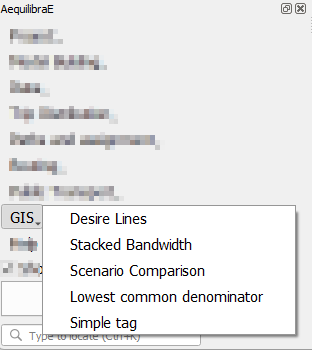

.. _siouxfalls-desire-lines:

Desire Lines
------------

QAequilibraE is capable of doing two types of desire lines. 

It is possible to use a zone or a node layer, and one can also generate the desire 
lines and Delaunay lines for the demand matrix provided.

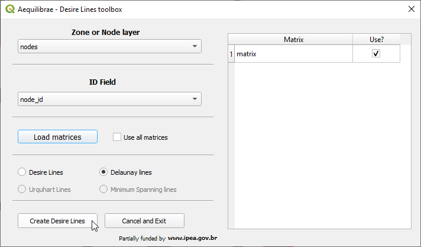

After selecting a matrix, the user can choose to un-check the *use all matrices*
box and select which matrix layers/cores they want to use (the list of matrices will only
show if the option is un-checked). Just make sure to select a *zone/node layer* 
and *node id* that is compatible with your matrix.

The user also needs to choose if they want Delaunay lines

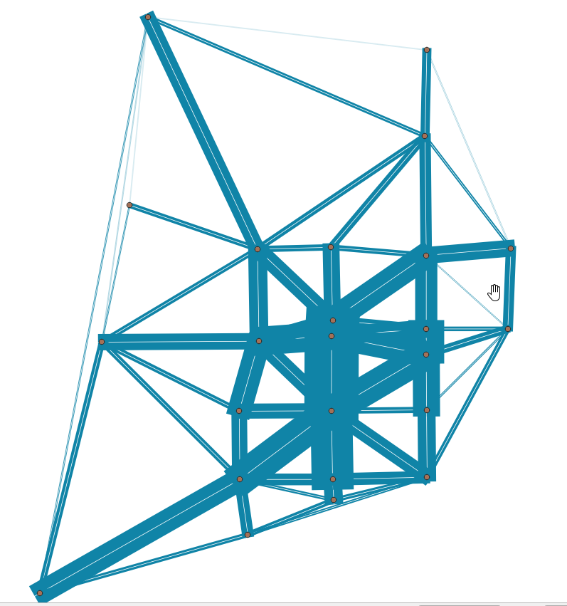

or desire lines

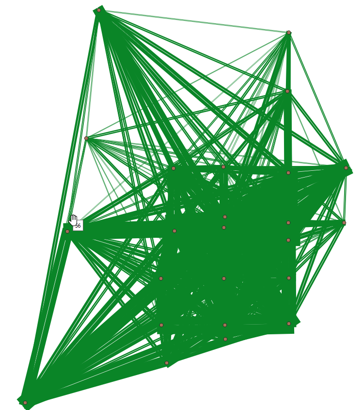

.. _siouxfalls-stacked-bandwidth:

Stacked Bandwidth
-----------------

The tool for plotting link flows you just saw above can be found under the GIS
menu.

You can select a link layer, including Delaunay Lines or desire lines. It is also possible
to choose between solid or gradient colors.

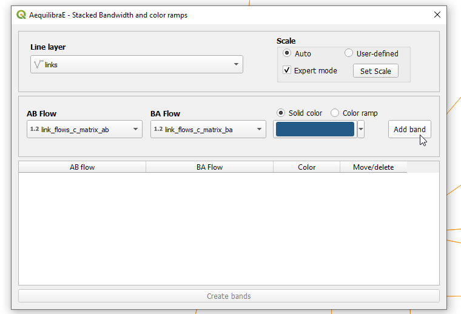

|

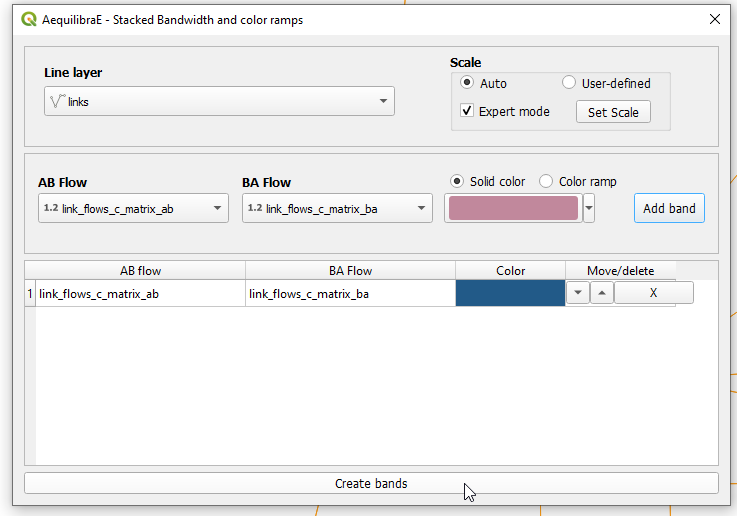

You can also control the overall look of these bands (thickness and separation between AB and
BA flows) in the project properties.

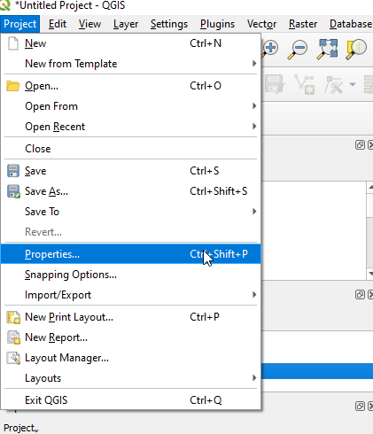

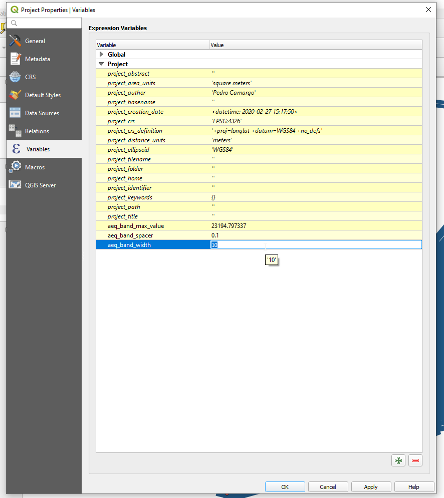

And have our map!! (You need to refresh or pan the map for it to redraw after
changing the project variables)

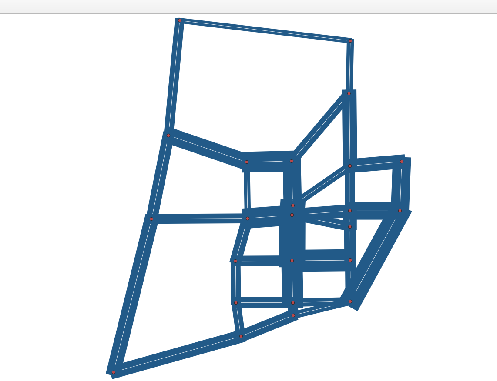

.. _siouxfalls-scenario-comparison:

Scenario Comparison
-------------------

After joining the two assignment results (the original one and the one resulting
from the forecast we just did) to the links layer, one can compare scenarios.

When joining the assignment results, make sure to name them in a way you will
understand.

The scenario configuration requires the user to set AB/BA flows for the two
sets of link flows being compared, as well as the space between AB/BA flows,
and band width.

The user can also select to show a composite flow comparison, where common
flows are also shown on top of the positive and negative differences, which
gives a proper sense of how significative the differences are when compared to
the base flows.

As it was the case for stacked bandwidth formatting, expert mode sets project
variables as levers to change the map formatting.

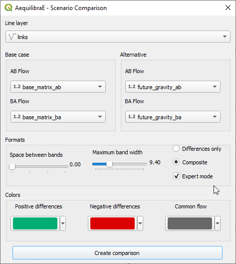

And this is what it looks like

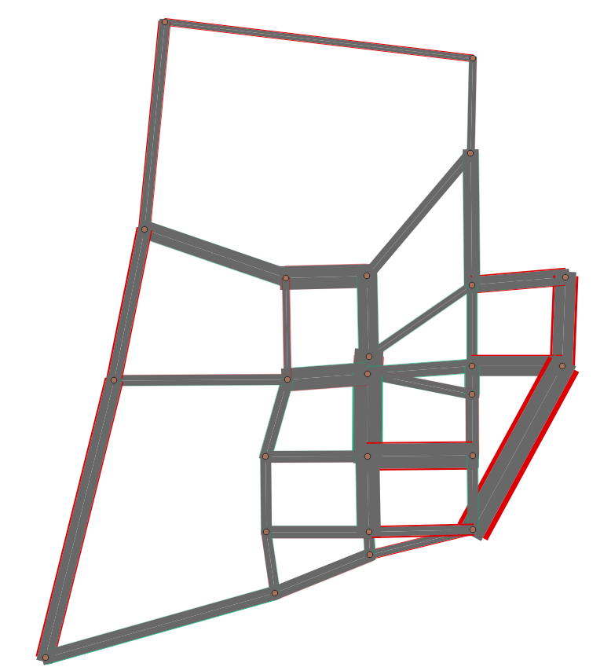

Simple tag
----------

**GIS > Simple tag** works as a spatial join tool in AequilibraE that allows you
to join useful information between layers.

Suppose you have a nodes layer with a 'name' column only with ``NULL`` values,
and a zoning layer with an analogous column 'name' but filled with actual names.
We can join the information from the zoning layer into the nodes layer using 
Simple tag.

We start selecting the layer and the field from which we want to import the
data, and then selecting the layer and the field we want to 'paste' the data.
Notice that depending on the operation one want to perform, not all methods are
available.

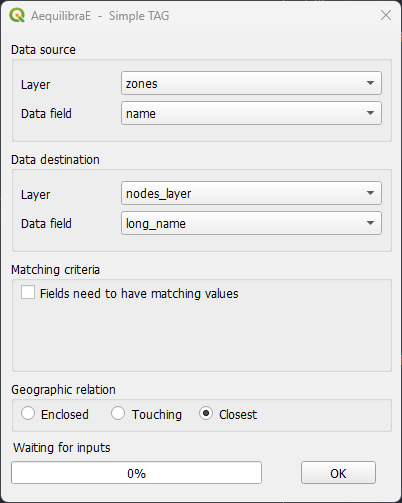

Be aware that the existence of triggers in the project database might affect the
performance of Simple tag.