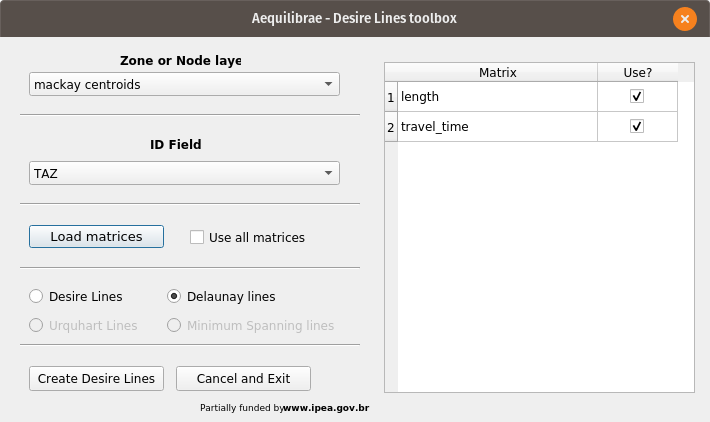
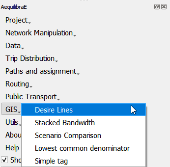
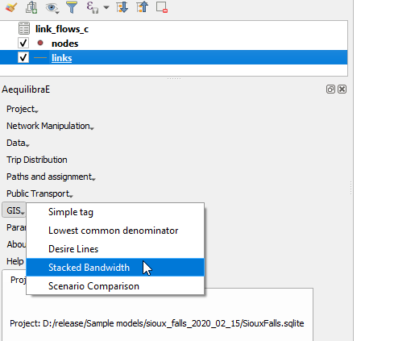
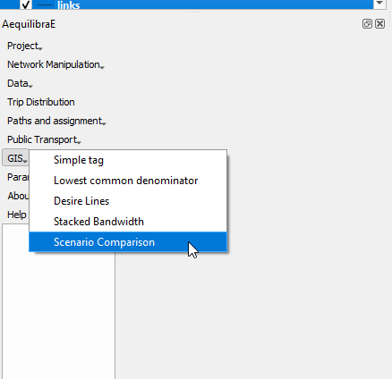

GIS Tools
=========

.. _siouxfalls-desire-lines:

Desire Lines
------------

AequilibraE is now capable of doing two types of desire lines.

If you are new to AequilibraE and are trying use this tool for the first time, we recommend you first take a look at
the section on :ref:`importing matrices into AequilibraE format <importing-omx-matrices>`. In our experience, that is where most
people find themselves stranded.

One can also generate the desire lines and Delaunay lines for the demand matrix
provided.

After selecting a matrix, the user can choose to un-check the *use all matrices*
box and select which matrices they want to use (the list of matrices will only
show if the option is un-checked).

Make sure to select a *zone/node layer* and *node id* that is compatible with
your matrix.

The user also needs to choose if they want Delaunay lines

.. image:: ../images/delaunay_results.png
    :width: 797
    :align: center
    :alt: delaunay_results

or desire lines

.. image:: ../images/desire_lines_map.png
    :width: 749
    :align: center
    :alt: desire_lines_map

.. _siouxfalls-stacked-bandwidth:

Stacked Bandwidth
-----------------

The tool for plotting link flows you just saw above can be found under the GIS
menu.

.. image:: ../images/add_band.png
    :width: 760
    :align: center
    :alt: add_band

.. image:: ../images/create_bands.png
    :width: 737
    :align: center
    :alt: create_bands

If you have selected the *Expert mode* in the previous screen, you can also
control the overall look of these bands (thickness and separation between AB and
BA flows) in the project properties.

.. image:: ../images/project_properties.png
    :width: 421
    :align: center
    :alt: project_properties

.. image:: ../images/edit_variables.png
    :width: 886
    :align: center
    :alt: edit_variables

And have our map!! (You need to refresh or pan the map for it to redraw after
changing the project variables)

.. image:: ../images/bandwidth_maps.png
    :width: 1142
    :align: center
    :alt: bandwidth_maps

.. _siouxfalls-scenario-comparison:

Scenario Comparison
-------------------

After joining the two assignment results (the original one and the one resulting
from the forecast we just did) to the links layer, one can compare scenarios.

When joining the assignment results, make sure to name them in a way you will
understand.

The scenario comparison tool is under the GIS menu

The scenario configuration requires the user to set AB/BA flows for the two
sets of link flows being compared, as well as the space between AB/BA flows,
and band width.

The user can also select to show a composite flow comparison, where common
flows are also shown on top of the positive and negative differences, which
gives a proper sense of how significative the differences are when compared to
the base flows.

As it was the case for stacked bandwidth formatting, expert mode sets project
variables as levers to change the map formatting.

.. image:: ../images/scenario_comparison_configuration.png
    :width: 473
    :align: center
    :alt: scenario_comparison_configuration

And this is what it looks like

.. image:: ../images/scenario_comparison_map.png
    :width: 778
    :align: center
    :alt: scenario_comparison_map

Lowest Common denominator
-------------------------

When using AequilibraE, one of its premisses is that the zones do not overlay each
other. Thus in case of overlaying geometries, we have to fix the geometries before
using them in AequilibraE. 

If we click **AequilibraE > GIS > Lowest common denominator** a new window opens and
we can set the layers we want to overlay the geometries to fix them.

Simple TAG
----------

**AequilibraE > GIS > Simple TAG** works as a spatial join tool in AequilibraE.
One of its usages, for example, is to determine in which *zone_id* the network
node is in.
