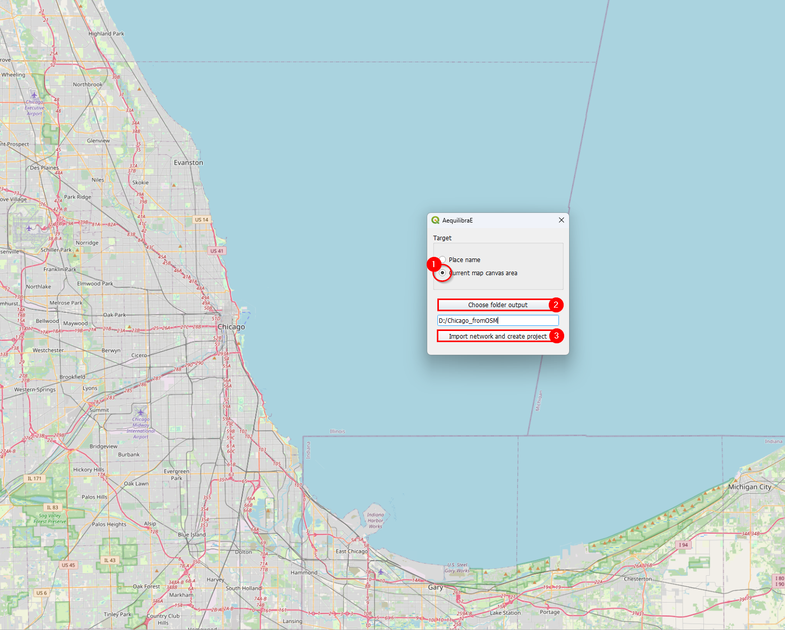
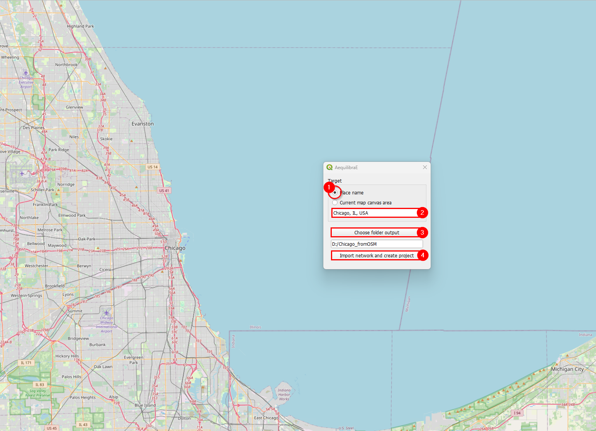
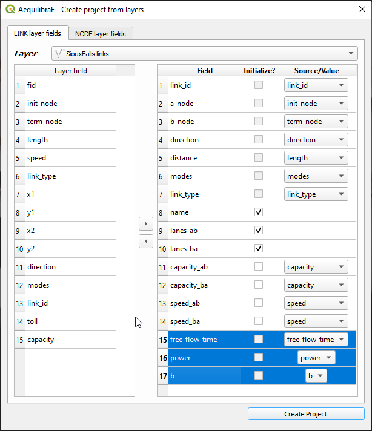
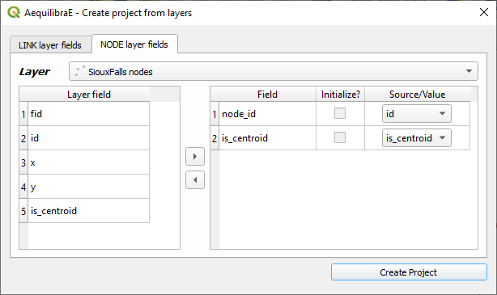
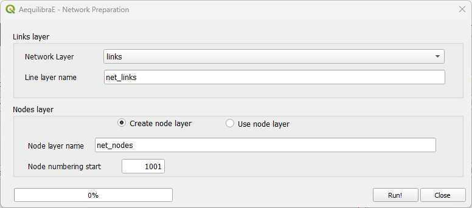
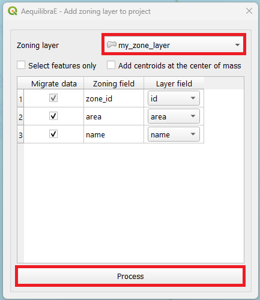
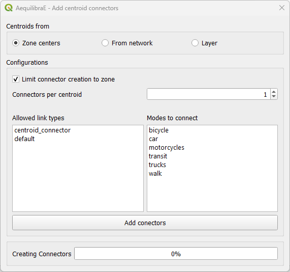

.. _model_building:

Model building
==============

Open **AequilibraE > Model building** from the QGIS menubar or the dock panel.
These tools provide interactive workflows for project creation and network editing.
The :doc:`Processing provider <../processing_provider>` provides separate algorithms for automated workflows.

Project creation opens the new project in the plugin panel.
Close the current project before creating another one.
Zoning import and centroid connectors require an open project.
Network preparation works with QGIS layers and does not require a project.

.. toctree::
   :hidden:
   :maxdepth: 1

   network_preparation

.. _create_empty_project:

Create empty project
--------------------

Open **Model building > Create empty project**.
Select the parent folder and enter a model name.
The project folder must be new or empty.
The project starts without links, nodes, or zones, and includes the default modes and link types.

This menu action opens the Processing algorithm dialog, then opens the resulting project in the plugin panel.
Use it to build a network incrementally with the Processing tools and the menu dialogs below.

.. _create_project_from_osm:

Create project from OSM
-----------------------

Open **Model building > Create project from OSM**.
Choose either the current QGIS map canvas area or a named place for the download.
Select the output location and start the import.

The import requires internet access and can take time for large areas.
When it finishes, the plugin opens the project and lists its layers in the Project tab.

.. _project_from_layers:

Create project from layers
--------------------------

Open **Model building > Create project from layers** to import existing line and node layers.
The interactive dialog provides field mappings for both layers.
The Processing alternative imports a link layer and generates nodes from its endpoints.

Prepare the input attributes before importing.
The links need direction, allowed modes, and link type values.
See :ref:`Preparing a network <network_preparation_page>` for the field conventions.

In the *LINK layer fields* tab, select the links layer and map its fields to the project fields.
The project can assign link IDs if you select *Initialize?* for ``link_id``.
Optional standard fields start with *Initialize?* selected, which leaves them empty in the project.
Clear that option to copy values from a source field instead.
Add any additional attributes that you want to retain from the input layer.

The screenshot shows an older field list.
The current dialog computes ``a_node``, ``b_node``, and ``distance`` instead of importing them.

In the *NODE layer fields* tab, select the node layer and map ``node_id`` and ``is_centroid``.

Select the output location and click *Create Project*.
The plugin opens the new project and lists its layers in the Project tab.

.. _network_preparation:

Network preparation
-------------------

Open **Model building > Network preparation** to prepare node and link layers before project import.
The tool works with two input arrangements:

* With links only, it creates nodes at the link endpoints and assigns endpoint IDs to the copied links.
* With links and nodes, it checks node coverage and unique IDs, then assigns endpoint IDs to the copied links.

The tool copies the input network before making changes.
Choose a starting node ID that leaves room for your zone and centroid IDs.

For field requirements and preparation examples, see :ref:`Preparing a network <network_preparation_page>`.

.. _add-zoning-data:

Add zoning data
---------------

Open a project, then select **Model building > Add zoning data**.
Use a polygon layer in EPSG:4326 (WGS84).
Map its zone ID field to ``zone_id`` and select any other attributes to copy.
You can import selected features only and create centroids during the import.

Click the process button to add the zones to the active project.

.. _adding_centroids:

Add centroid connectors
-----------------------

Open **Model building > Add centroid connectors** with a project open.
The dialog adds connectors to the project network.

.. warning::

    Back up the project before editing its network.
    Inspect the resulting connectors before using the network for assignment.

Select the centroid source: existing network centroids, project zones, or a point layer.
Select the modes, eligible link types, and number of connectors.
For network centroids or point layers, set the search radius.
For project zones, choose whether connections must stay within the zone.
A zone with too few eligible nodes can have fewer connectors than requested.

For explicit centroid IDs from a point layer, use the Processing *Add or renumber centroids from layer* algorithm first.
Then select existing network centroids in this dialog.
