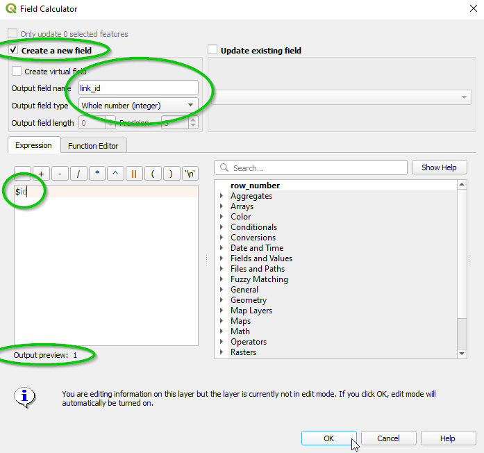

.. _network_preparation_page:

Preparing a network
===================

Open **AequilibraE > Model building > Network preparation** from the menubar or dock panel.
This interactive tool prepares node and link layers without requiring an open project.
See :ref:`Model building <model_building>` for the workflow and project creation dialogs.

Project import requirements
---------------------------

Project creation requires link direction, allowed modes, and link type values.
Both importers compute ``a_node``, ``b_node``, and ``distance`` from geometry.
These fields do not need to exist in the source link layer.

The :ref:`interactive layer importer <project_from_layers>` accepts link and node layers with field mappings.
Map ``node_id`` and ``is_centroid`` from the node layer.
You can supply unique link IDs or select *Initialize?* to generate them.

The Processing *Create project from link layer* algorithm generates nodes from link endpoints and assigns its own link IDs.
Its optional source ID mapping preserves input identifiers in ``source_id``.
Use *Add or renumber centroids from layer* afterward to assign centroid IDs from a point layer.

Link IDs
--------

For imported link IDs, use unique integers.
Small IDs reduce memory requirements in network computations.
Source field names can differ from project field names when the importer provides field mappings.

The QGIS field calculator can create a sequence of IDs:

Network articulation
--------------------

Use LineString geometries for network links.
Convert MultiLineString features to LineString features before using network preparation.
The first endpoint corresponds to ``a_node`` and the last endpoint corresponds to ``b_node``.
The network preparation dialog creates or matches nodes and adds these endpoint IDs to copied link layers.

Standalone algorithms, such as Processing *Shortest path*, operate directly on network layers.
Their link inputs need ``link_id``, ``a_node``, ``b_node``, ``direction``, ``modes``, and the selected numeric cost field.
This requirement differs from project import, which computes endpoint IDs in the project database.

.. _link_direction:

Direction
---------

Link direction uses three integer values:

* ``-1`` permits flow from B to A only.
* ``0`` permits flow in both directions.
* ``1`` permits flow from A to B only.

Distance
--------

Project imports compute link distance in meters from geometry and ignore source distance values.
For a standalone path calculation, supply a numeric cost field such as distance or travel time in the input layer.

Modes
-----

Each network mode has a one-letter ID, which can be uppercase or lowercase.
A link's ``modes`` value combines the IDs of all modes permitted on that link.
For example, ``ctbw`` permits car, truck, bicycle, and walking modes when the project defines those IDs.
The order of IDs does not matter.

New projects include default modes from the :ref:`parameters file <parameters_file>`.
Layer importers also create missing modes from the input values.
Use :ref:`Data > Add mode <add_mode>` to add a mode to an existing project.
OSM import uses mode names such as ``car`` and ``walk`` instead of one-letter IDs.

Link types
----------

Every link needs a nonempty link type name.
Use names containing letters and underscores, as required by the Processing layer importer and the link-type creation dialog.
Layer importers create missing link types.
For an existing project, use :ref:`Data > Add link type <add_link_type>`.
