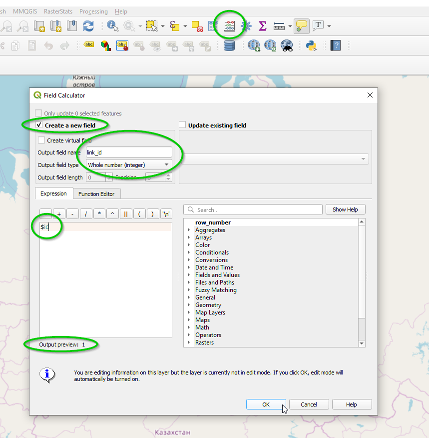

:orphan:

.. _network_preparation_page:

Preparing a network
===================

.. toctree::
   :maxdepth: 2

.. TODO: NEED TO WRITE ABOUT MORE COMPREHENSIVE NETWORK PREPARATION
.. including the addition of addition of unique link_id

Preparing a link network to be imported into an AequilibraE project consists of
ensuring that all fields necessary for network import exist and are properly
filled. These fields are:

* **link_id**
* **a_node**
* **b_node**
* **direction**
* **distance**
* **modes**
* **link_type**

Below we give some directions on how to prepare each field.

Link ID
-------

The link ID field is necessarily a field with unique values, but it would
ideally also be filled with small integers (e.g. a network with 100,000 links
does not need to have IDs in the order of 1,000,000,000,000,000), as this save
memory and computational time during some of the computations.

To create such field, one can use QGIS' field calculator as shown below. Please
note that the field **does NOT need to be named link_id**, as you will have the
opportunity to indicate your field of choice to contain link ids when it is time
to create the project.

.. warning::
  **LET'S STRESS THIS !!!!!!**

  **AequilibraE can deal with an arbitrary set of IDs for links and nodes**, but
  we vectorize a lot of operations for faster performance, which means that you
  will be using a LOT more memory you would if you use large IDs for nodes and
  links without actually needing it. You may also explode memory or the NumPy
  Numerical types. A good practice is to keep IDs as low as possible, but in
  general, if you get too close to 922,337,203,685,4775,807, you will certainly
  break things, regardless of your system's capabilities.

Network articulation
--------------------

The association of *a_nodes* and *b_nodes* to a link layer is what can be named
articulation of a network, and is one of the foundational tools in AequilibraE.
Please **make sure that all your links are LineString geometries**, otherwise the articulation
is not going to work. If all your links are MultiLineString geometries, you can save
your data as a GeoPackage and enforce it to be LineString only.

It is important to note that AequilibraE understands *a_node* as being the
topologically first point of the line, and *b_node* the last. Topology in GIS
involves a LOT of stuff, but you can look at an
`intro <https://www.gaia-gis.it/fossil/libspatialite/wiki?name=topo-intro>`_.

If you prefer a video tutorial, you can access:

.. raw:: html

    <iframe width="560" height="315" src="https://www.youtube.com/embed/oFi02QWYwn8" frameborder="0" allow="accelerometer;
    autoplay; encrypted-media; gyroscope; picture-in-picture" allowfullscreen></iframe>

Direction
---------

Links need to have directionality associated to them because **links can be**
**bi-directional** in AequilibraE, which is not the case for several of the
commercial platforms in the market. For this reason, one needs to have a field
for link direction with values in the set [-1, 0, 1], where:

* If **direction = -1**, then the link allows **BA flow only**
* If **direction = 0**, then the link allows flows in **both directions**
* If **direction = 1**, then the link allows **AB flow only**

Distance
--------

The field for distance needs to be numeric, but its value is currently
unimportant, as distance values will be overwritten with distance in meters by
SpatiaLite. Other units will be possible in the future.

Modes
-----

In AequilibraE, each mode is represented by a lower-case letter. So imagine we
will have several modes in our network, such as cars (c), trucks (t), bicycles
(b) and walking (w). In that case, a link that allows all modes will have a
modes field equal to **ctbw** (the order of modes is irrelevant), while a link
that allows bikes and pedestrians would have a modes string equal to **bw**.

The list of modes that will exist in the model, however, comes from the
parameter list built into AequilibraE under the section *Network* --> *modes*.

To find out how to access the parameters file see documentation on the
:ref:`global parameters file <parameters_file>`.

Link Type
---------

Link types can be any **string** value you would like, but cannot be empty.
