Path computation
================

From version 0.6, AequilibraE plug-in does not require the user to create the graph to perform
path computation as in previous versions. In this version, as you set up your own configurations,
the software already computes the graph for you.

.. _siouxfalls-individual-path-computation:

Shortest Path
-------------

The first thing we can do with this project is to compute a few arbitrary paths
to see if the network is connected and if paths make sense.

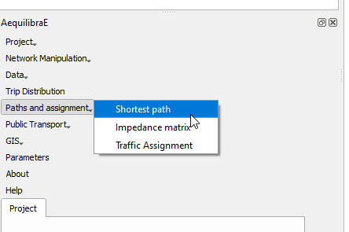

Before computing a path, we go to the configuration screen

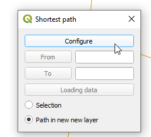

For the case of Sioux Falls, we need to configure the graph to accept paths
going through centroids (all nodes are centroids), but that is generally not the
case. For zones with a single connector per zone it is slightly faster to also
deselect this option, but use this carefully.

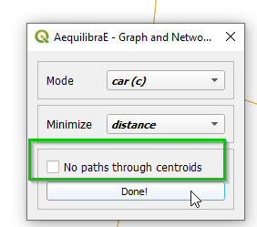

If we select that paths need to be in a separate layer, then every time you
compute a path, a new layer with a copy of the links in that path will be
created and formatted in a noticeable way. You can also select to have links
selected in the layer, but only one path can be shown at at time if you do so.

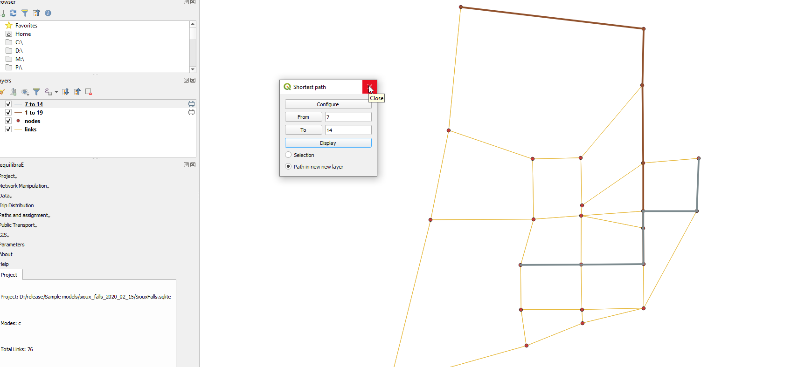

.. _siouxfalls-skimming:

Impedance Matrix (aka Skimming Matrix)
--------------------------------------

We can also skim the network to look into general connectivity of the network

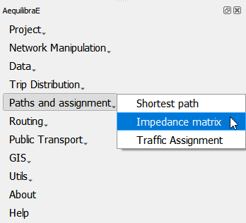

To perform skimming, we can select to compute a matrix from all nodes to all nodes,
or from centroids to centroids, as well as to not allow flows through centroids.

The main controls, however, are the mode to skim, the field we should minimize
when computing shortest paths and the fields we should skim when computing those
paths.

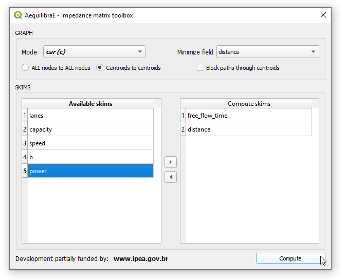

With the results computed (AEM or OMX), one can display them on the screen.

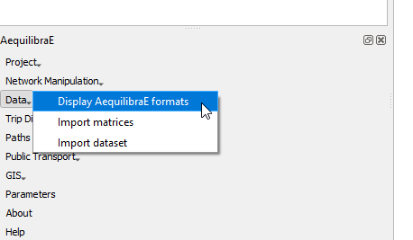

On the matrix display screen, one can control how many decimal places are shown
and whether decimal separators are shown. One can also browse through all the
skims in this file by selecting the skim of choice in the drop down menu in
the bottom left of the screen.

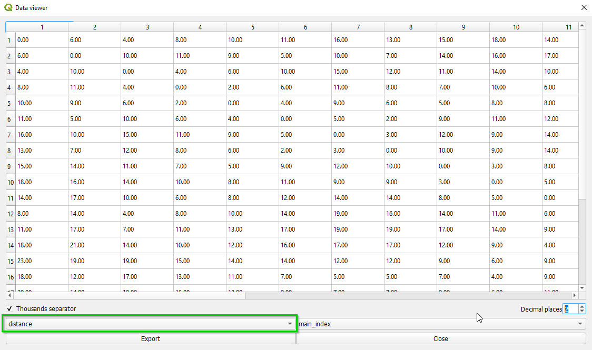

.. _siouxfalls-traffic-assignment-and-skimming:

Traffic assignment
------------------

Having verified that the network seems to be in order, one can proceed to
perform traffic assignment, since we have a demand matrix.

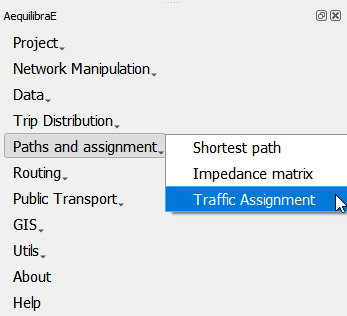

The Traffic Assignment procedure tab looks like this!

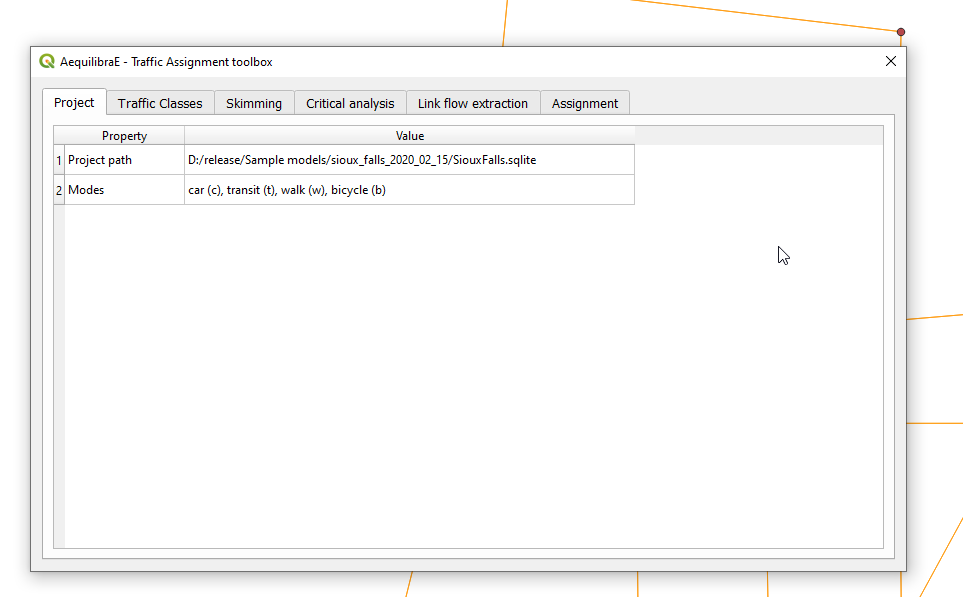

In the *Traffic Classes* tab you will create the traffic classes used in the project.
First, select one of the available matrices (in \*.AEM format), and the matrix core
that will be used for computation. For Sioux Falls example, we don't want to block
flow through centroids, but this might not always be the case. When you finish, just
press the *Add Traffic class to assignment*.

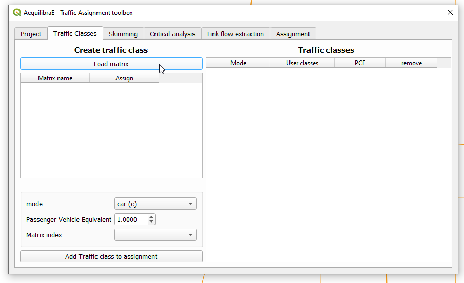

To select skims, we need to choose which fields/modes we will skim

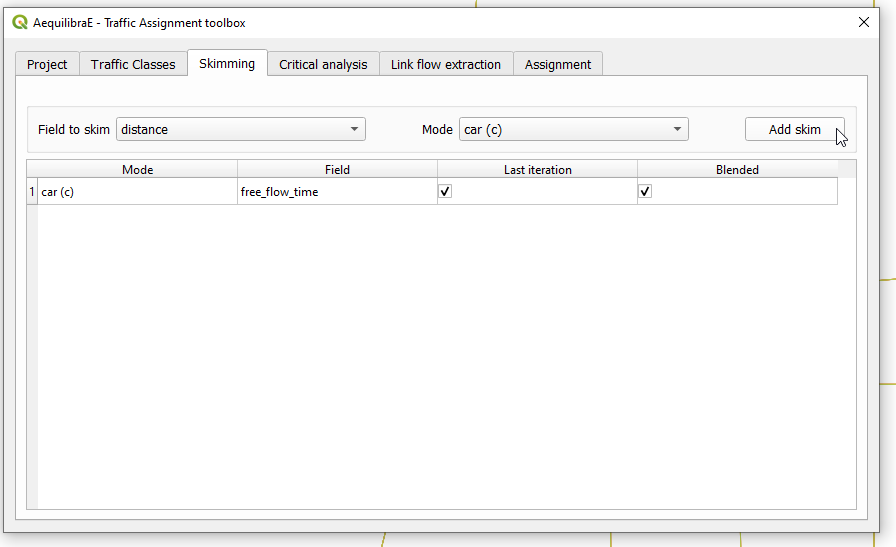

And if we want the skim for the last iteration (like we would for time) or if we
want it averaged out for all iterations (properly averaged, that is).

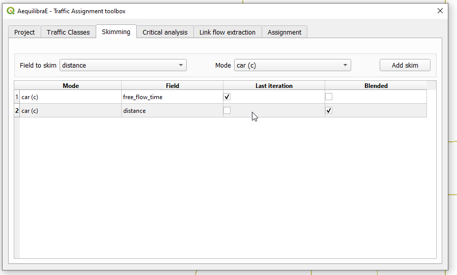

The final step is to setup the assignment itself.

Here we select the fields for:

* link capacity
* link free flow travel time
* BPR's *alpha*
* BPR's *beta*

We also confirm the Relative gap and maximum number of iterations we want, the
assignment algorithm and the output folder. In this case, we again choose to not
block flows through centroids for the reason discussed above.

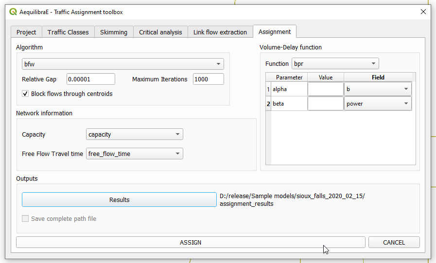

The result of the traffic allocation we just performed is stored in the results.sqlite
database within the project folder. It can be easily accessed and loaded by clicking
**Data -> Display project data**, and a project data window will open. Just click on the
*Results* tab, select the desired result, and click in the *Load Result table as data layer*
button at the bottom.

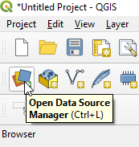

Now we can plot the flows we just obtained. You can select the *links* layer and 
right-click it to open the layer properties window. Go to *Joins*, select the
fields to join, and press ok.

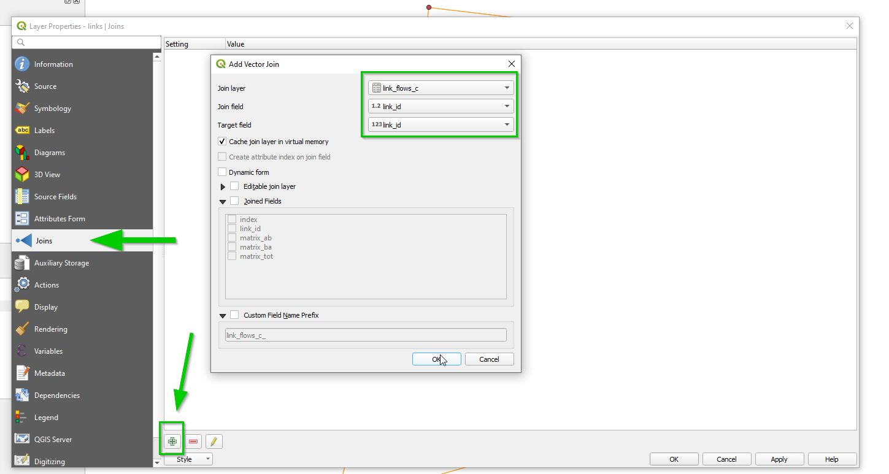

Now we can revisit the instructions above for :ref:`siouxfalls-stacked-bandwidth`

Video tutorial
~~~~~~~~~~~~~~

.. raw:: html

    <iframe width="560" height="315" src="https://www.youtube.com/embed/DRY4QpdX3qQ"
     frameborder="0" allow="accelerometer; autoplay; encrypted-media; gyroscope;
     picture-in-picture" allowfullscreen></iframe>
