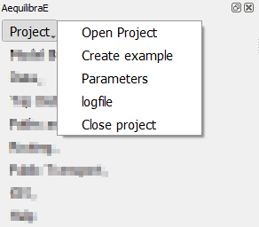
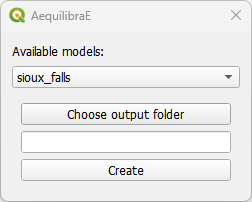

.. _aequilibrae_project:

AequilibraE Project
===================

This page is dedicated to a practical implementation of the AequilibraE project. In case you
are interested in better understanding its structure, please visit its 
`documentation <https://www.aequilibrae.com/python/latest/modeling_with_aequilibrae/project.html>`_
webpage.

Under the project tab, there are some options to choose from and the following sections
explore some of these actions.

.. _siouxfalls-open-project:

Open & Close project
--------------------

These options are pretty straightforward and are used either to open or close a
project. You just have to click **Project > Open project** to open
a project, and **Project > Close project** to close it.

Keep in mind that to open another project or to create a new one, you **must**
close the currently open project, otherwise AequilibraE is going to return an
error.

.. _create_example:

Create example
--------------

AequilibraE has three different example sets one can use as learning tool, and they were all
made available within the QGIS ecosystem.

Within **Project > Create example**, select one of the available models, the desired
location of the output folder, and just press *Create*. The window will close automatically
and you can open the project folder in the Project tab.

.. _parameters_file:

Parameters
----------

The parameters file is part of the AequilibraE package for Python, so all the
reference documentation for this section can be found in its
`documentation page <https://aequilibrae.com/python/latest/modeling_with_aequilibrae/parameter_file.html>`_.

The QGIS plugin, however, has a nice interface to view and edit the parameters
file, which can be accessed through **Project > Parameters**. This
interface, depicted below, allows one to edit and validate parameters before
submitting them as the new parameter file for all AequilibraE procedures.

.. image:: ../images/parameters_menu.png
    :width: 704
    :align: center
    :alt: parameters menu

.. _logfile:

Log file
--------

The log file contains information about which actions took place and when they happened.
For example, after you :ref:`create a project from OSM  <create-proj-from-osm>`,
if you access the log file, you are going to see something like the figure below,
containing the sequence of steps followed to import the OSM network. If you wish to
access this file later on, it is also possible to save this log file locally in your machine,
using the **save to disk** button in the lower left corner of the log file box.

.. image:: ../images/project-logfile.png
    :width: 704
    :align: center
    :alt: proj logfile

Video tutorial
--------------

If you want a summary of everything that was presented on this page, you can
head over to YouTube to see a demonstration of how to download these projects.

.. raw:: html

    <iframe width="560" height="315" src="https://www.youtube.com/embed/9PF2qHs2hUc"
     frameborder="0" allow="accelerometer; autoplay; encrypted-media; gyroscope;
     picture-in-picture" allowfullscreen></iframe>
