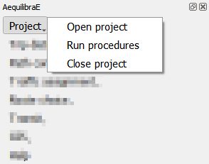
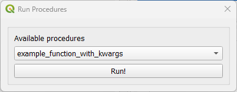
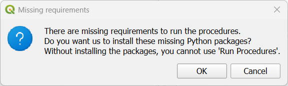
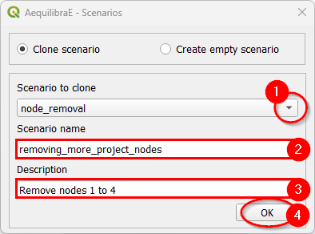
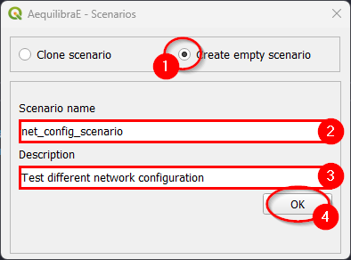
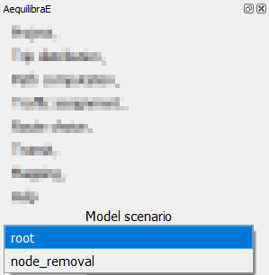
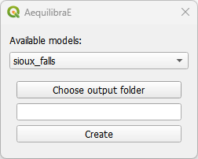
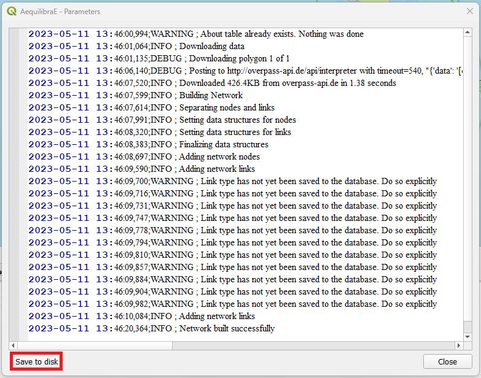
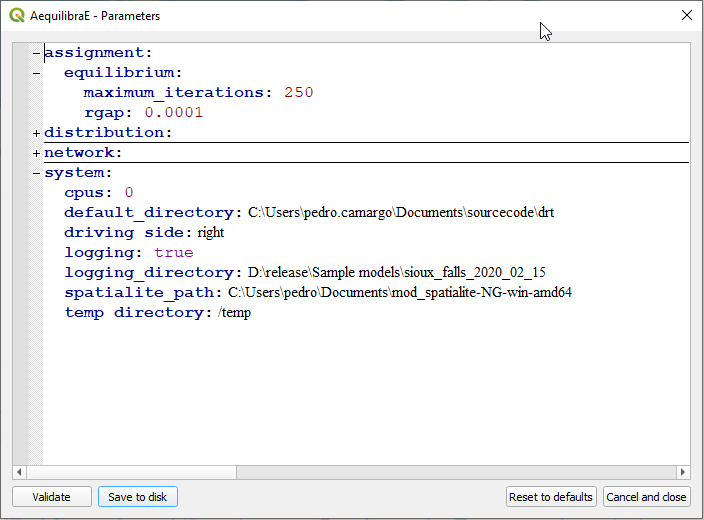

.. _aequilibrae_project:

AequilibraE Project
===================

This page is dedicated to a practical implementation of the AequilibraE project. In case you
are interested in better understanding its structure, please visit its 
`documentation <https://www.aequilibrae.com/latest/python/modeling_with_aequilibrae/project.html>`_
webpage.

The **AequilibraE > Project** menu opens projects, runs procedures, and manages scenarios.
It also provides **Create example**, **Log file**, and **Parameters**.
The dock panel provides the same actions as the menubar.
For project creation and network editing, see :ref:`Model building <model_building>`.

The :ref:`Data menu <data_menu>` provides matrix import, mode creation, and link-type creation.
The :ref:`Routing menu <routing_menu>` provides the traveling salesman dialog.
The **Mapping** menu includes the interactive Simple tag dialog.
These menu dialogs are separate from the parameterized Processing algorithms.

.. _open_and_close_project:

Open & Close project
--------------------

These options are pretty straightforward and are used either to open or close a
project. You just have to click **Project > Open project** to open
a project, and **Project > Close project** to close it.

Keep in mind that to open another project or to create a new one, you **must**
close the currently open project, otherwise AequilibraE is going to return an
error. That applies to the tools that build a model as well
(:ref:`from OSM <create_project_from_osm>`,
:ref:`from layers <project_from_layers>` or
:ref:`from an example <create_example>`), since each of them leaves the model it
created open, with its layers listed in the Project tab.

.. _add_project_geometry_layers:

Add project geometry layers to QGIS
----------------------------------

When you open a project, the *Geo layers* tab lists the geometry layers for the current
scenario. You can find this tab in the AequilibraE panel, below *Model scenario*. The list
includes *links*, *nodes*, and *zones*. Projects with transit data also list transit layers.

To add a layer to QGIS, double-click its name in the list. Opening an AequilibraE project 
makes these layers available, but does not add them to the QGIS *Layers* panel automatically. 
If the *Geo layers* tab is hidden, enlarge the panel.

When you select another scenario under *Model scenario*, the *Geo layers* tab lists the
layers for that scenario. Double-click the layer names to add them to QGIS.

.. _run_procedures:

Run procedures
--------------

The run procedures allows you to define model entry points and their default arguments, and run models
to the model itself. Usage at QAequilibraE is pretty straightforward: select one of the available
functions and click on the *Run!* button.

The procedure runs in the background, so QGIS stays responsive while the model works. A *Model Run*
window opens with a progress indicator and the log the model produces as it goes, both what it logs
and what it prints. Leave *Auto scroll* ticked to follow the latest line, or untick it to read back
through the output while the run continues. The same log is also written to the QGIS *Log Messages*
panel, under the *Model Run* tab. When the run ends, a message is pushed to the message bar, and any
value the procedure returned is written to the *Messages* tab.

To better understand the application of the run module, we encourage you to read about it at
`the AequilibraE documentation <https://www.aequilibrae.com/develop/python/run_module.html>`_.

It is possible to use one of the default functions or create your own, including function calls
to external libraries. To do so, don't forget to include a ``requirements.txt`` file with the
dependencies in your project's run folder. The next time you open 'Run procedures', a message
box asking about dependencies installation will open. If you choose to install the dependencies,
the process resembles the one when installing QAequilibraE. Wait until it's complete, and restart
the 'Run procedures' to validate the installation.

Scenarios
---------

QAequilibraE now presents a scenario system, in which you can manage multiple scenario variants
within a single project. 

When a project is created, its default scenario is 'root'. QAequilibraE allows you to clone a
scenario or create an empty scenario. To clone a scenario, you first choose the base scenario
to clone (1) and the name of the scenario (2). An useful scenario description can also be
added at the 'Description' box (3). By default, the scenario to clone is the currently active
scenario, but you can choose anyone. To clone the scenario, just click on the 'OK' button
at the bottom of the screen (4).

To create an empty scenario, choose the 'Empty scenario' option (1), and set the scenario name
(2) and description (3). To create an empty scenario, just click on the 'OK' button at the
bottom of the screen (4).

A list containing all project scenarios is presented at the bottom of the widget screen, and
it can be used to change the currently open scenario. When changing the scenario, all geometric
layers available at the "Geo layers" tab also change.

.. _create_example:

Create example
--------------

Open **Project > Create example** to create a project from one of the supplied example models.
Select the model and output location, then click *Create*.
The plugin opens the new project and lists its layers in the Project tab.

Log file
--------

Open **Project > Log file** to view the project log.
It records project operations and their times, including the steps of an OSM import.
Click *Save to disk* to save a copy of the displayed log.

.. _parameters_file:

Parameters
----------

Open **Project > Parameters** to view and edit the AequilibraE parameters file.
Check the values before saving them for subsequent procedures.
The Python documentation provides the parameter reference:
`Parameters file <https://aequilibrae.com/latest/python/modeling_with_aequilibrae/parameter_file.html>`_.

