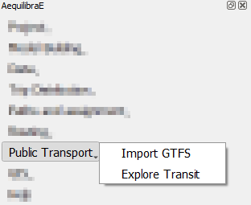
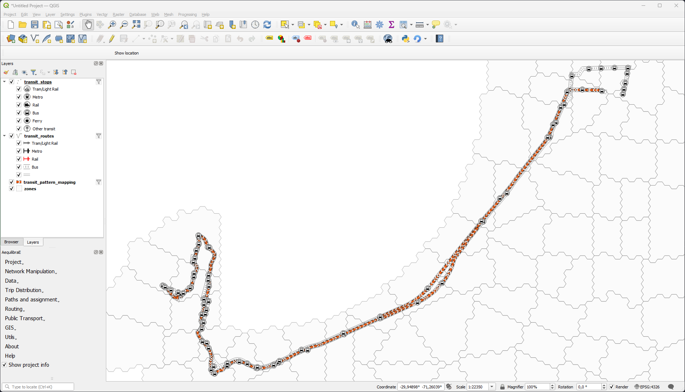
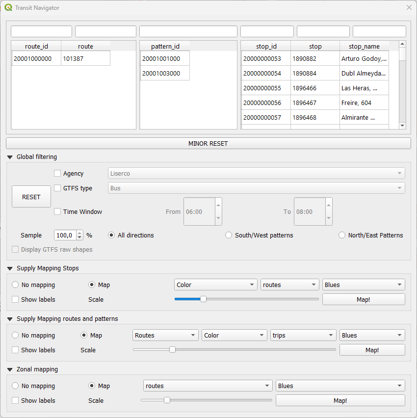
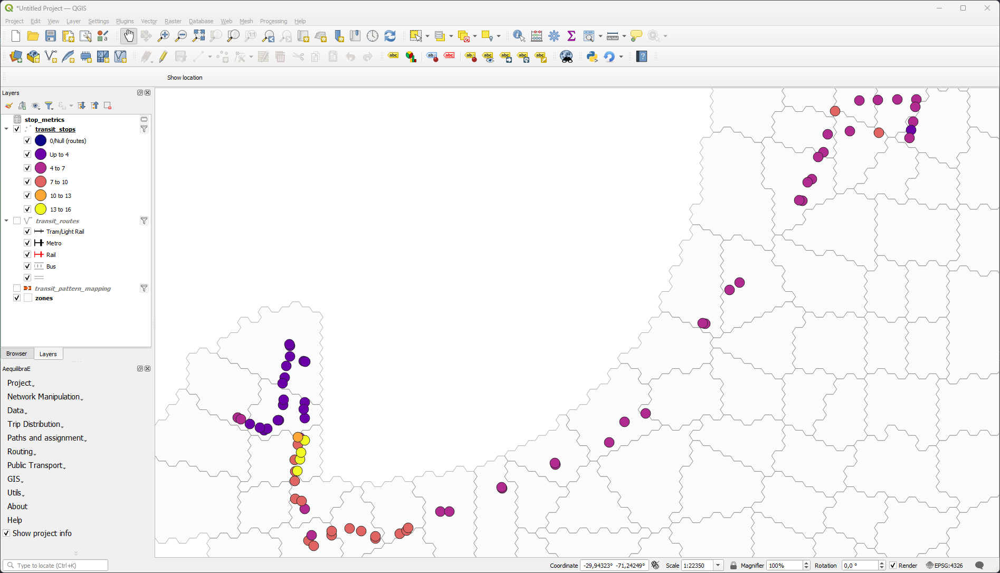
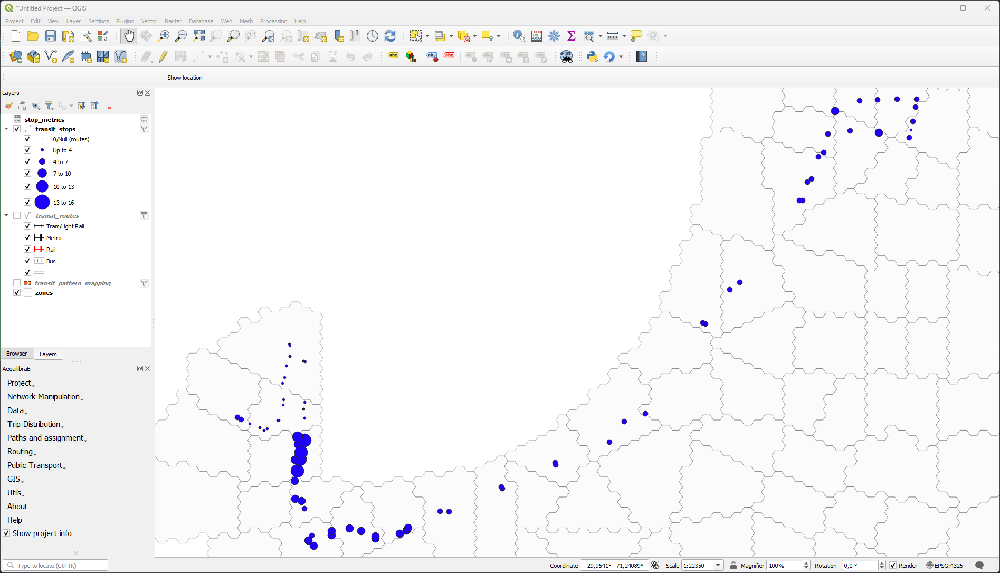

Public Transport
================

QAequilibraE is capable of importing a General Transit Feed Specification (GTFS) feed 
into its public transport database. 

More details on the **public_transport.sqlite** are discussed on a 
*per-table* basis in `AequilibraE's documentation <https://www.aequilibrae.com/python/latest/modeling_with_aequilibrae/transit_database/data_model/datamodel.html>`_, 
and we recommend understanding the role of each table before 
setting an AequilibraE model you intend to use. If you don't know much about GTFS, we strongly encourage you to take
a look at the documentation provided by `Google <https://developers.google.com/transit/gtfs>`_.

Import GTFS
-----------

To import a GTFS feed, click **Public transport > Import GTFS**. A new window with the importer
will open. If it is the first time you are creating a GTFS feed for your project, it may take a little while
to create the public transport database in the project folder. In the GTFS importer window, you can click on
*Add Feed* and point to the location in your machine where the GTFS data is.

.. image:: ../images/gtfs_1.png
    :width: 60 %
    :align: center
    :alt: gtfs importer

Once the feed is loaded, you can select the service date, the agency name, and write a description for it.
It is also possible to add and/or modify the route capacities. When you're done, just click on **Add to importer**
and you will return to the GTFS importer screen.

.. image:: ../images/gtfs_2.png
    :width: 45 %
    :alt: basic settings

.. image:: ../images/gtfs_3.png
    :width: 45 %
    :alt: route capacities

Notice that the feed information is now available at the *Feeds to import* table view. The first time you create a 
GTFS feed, the only option available is **Create new route system**, so you don't have to click on it.
Then, you can effectively import your GTFS feed to your project by clicking on **Execute Importer**. 
A window with a progress bar will open and once it is finished, you can check out the GTFS feed data you just 
imported in your project folder.

.. image:: ../images/gtfs_4.png
    :width: 60 %
    :align: center
    :alt: gtfs loaded

In case you want to add or rewrite information on your public transport database, you can click on
**Public Transport > Import GTFS**. You will notice a difference in the clickable buttons at
the bottom of the page, and it is now possible to **Overwrite routes** or **Add to Existing Routes**.
For any of these options, you follow the same steps previously presented to add feed data and load it into the
project.

.. image:: ../images/gtfs_5.png
    :width: 60 %
    :align: center
    :alt: gtfs already exists

Explore Transit
---------------

Case you have already imported a GTFS feed into your project or you want to open a feed from an AequilibraE project 
created with Python, you can click on **Public Transport > Explore Transit** to visualize the Transit 
routes. While opening the Transit Navigator, you will notice that the layers *patterns*, *routes*, *stops* and
*zones* from the GTFS file are going to be displayed in your map canva, and appear in the layers list.

The navigator window has five different tabs you can explore.

In the top, there are the three boxes one can select and
filter routes, patterns, and stops. You will notice that whenever an element is selected or filtered, this selection
is automatically displayed in the map canva. After filtering data, if you want to restore the original layers,
you can click on **Minor reset**, and your layers are restored.

In the *Global filtering* tab, it is possible to filter your GTFS by *Agency*, *GTFS type*, *Time window*, and 
*directions*. It is also possible to select a sample from the GTFS data to analyze. The fitering performed in this
tab is automatically displayed in the map canva. To restore the original layers, just click on **Reset**.

In the last three tabs, one can display useful information about stops, routes, patterns, and zones. For instance, you 
can find out *how many routes stop at a specific stop location*, *what is the total capacity of a specific route*, 
or *which zones have more stops or routes across them*. Within these tabs, it is possible to configure how one wants to 
display the information, by selecting the object color, or thickness (size). It is also possible to display labels, by
selecting the **Show labels** option. The figures below show the number of routes across the stops displaying the
information with different symbol colors and sizes. Notice that in the layers list, the variable scale for number of
routes is shown, as well as a data layer named *stops_metrics*, which contains the available metrics for the existing
stops.

|

