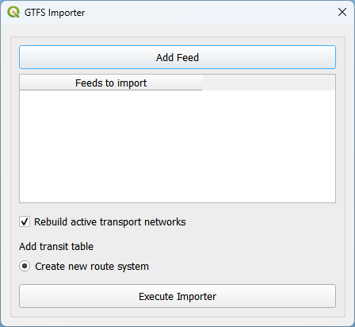
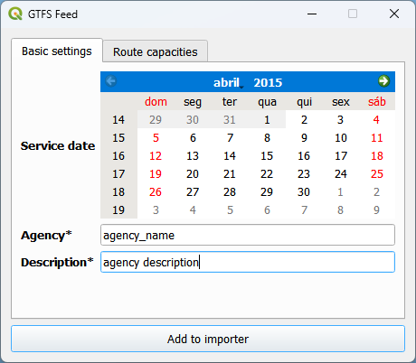
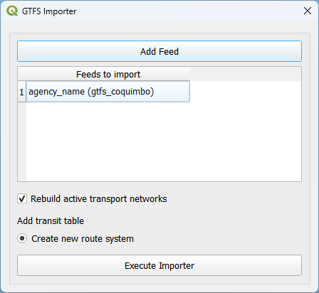
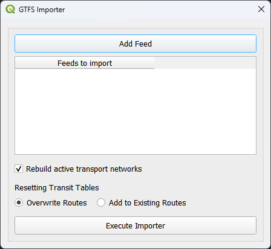

Public Transport
================

QAequilibraE is capable of importing a General Transit Feed Specification (GTFS) feed 
into its public transport database. More details on the **public_transport.sqlite** are discussed on a nearly 
*per-table* basis in `AequilibraE's documentation <https://www.aequilibrae.com/python/latest/modeling_with_aequilibrae/transit_database/data_model/datamodel.html>`_, 
and we recommend understanding the role of each table before 
setting an AequilibraE model you intend to use. If you don't know much about GTFS, we strongly encourage you to take
a look at the documentation provided by `Google <https://developers.google.com/transit/gtfs>`_.

Import GTFS
-----------

To import a GTFS feed, click **Aequilibrae > Public transport > Import GTFS**. A new window with the importer
will open. If it is the first time you are creating a GTFS feed for your project, it may take a little while
to create the public transport database in the project folder. In the GTFS importer window, you can click on
*Add Feed* and point to the location in your machine where the GTFS data is.

Once the feed is loaded, you can select the service date, the agency name, and write a description for it.
It is also possible to add and/or modify the route capacities. When you're done, just click on *Add to importer*
and you will return to the GTFS importer screen.

.. image:: ../images/gtfs_3.png
    :width: 45 %
    :alt: route capacities

Notice that the feed information is now available at the *Feeds to import* table view. The first time you create a 
GTFS feed, the only option available is *Create new route system*, so you don't have to click on it.
Then, you can effectively import your GTFS feed to your project by clicking on *Execute Importer*. 
A window with a progress bar will open and once it is finished, you can check out the GTFS feed data you just 
imported in your project folder.

Case you want to add or rewrite information on your public transport database, you can click on
**AequilibraE > Public Transport > Import GTFS**. You will notice a difference in the clickable buttons at
the bottom of the page, and it is now possible to *Overwrite routes* or *Add to Existing Routes*.
For any of these options, you follow the same steps previously presented to add feed data and load it into the
project.

