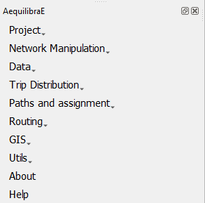

.. _modeling-init:

Modeling with AequilibraE
=========================

In this section you can find a deep dive into modeling with AequilibraE, as
a start guide to a complete view into AequilibraE's data structure. Each and 
every one of the following sub-sections are related to one AequilibraE's
main functionalities.

Most screenshots in this section are related to Sioux Falls, a standard example
in transportation network algorithm studies. Now, you can :ref:`easily create <create_example>`
your own Sioux Falls project. 

Here we present an image-based example on a realistic modelling workflow
for the beginner modeler out there. All the data used here can be downloaded
at the :ref:`tutorial_sample_data` page.

As to not upset those who think that Sioux Falls is not a realistic example (you
would be right to think so), the example data is also available for the Chicago
regional model, which has nearly 40,000 links and almost 1,800 zones.

Got a bigger instance we could use as an example? Send it over!

.. toctree::
   :hidden:
   :maxdepth: 1

   project
   networkpreparation
   editingnetworks
   data
   tripdistribution
   pathscomputation
   routing
   public_transport
   gistools
   utils