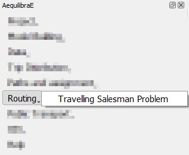
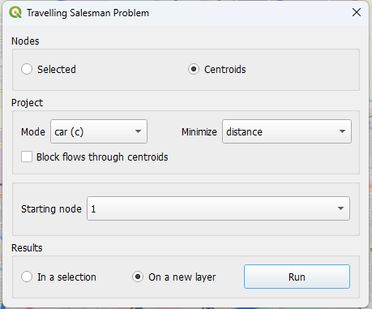
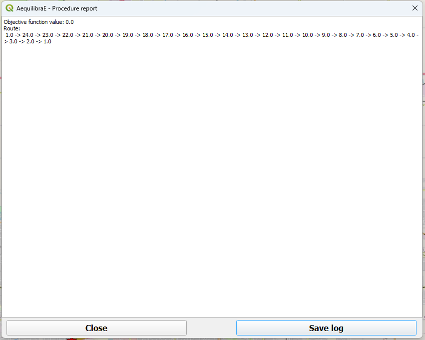
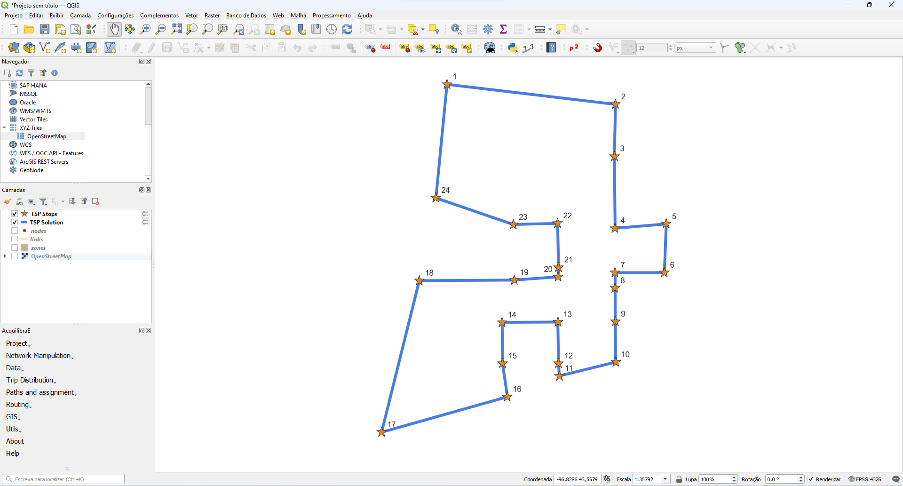

Routing
=======

AequilibraE's routing allows the user to run a Travelling Salesman Problem (TSP),
using a selected set of nodes or the centroids of a network. 

Its usage is straightforward. For Sioux Falls, for example, we would select the
centroids of the network, and minimize the distance travelled by car. It is also
possible to choose the start node of our TSP (we'll let node_id 1 to be the starting
node, but it could be any available node), and indicate we want to see the result in
a new layer.

Our prompt box would look like this:

When AequilibraE is done solving the TSP, it provides a procedure report, like the
one in the figure below. You can export the procedure report in a .txt file if you 
wish, by clicking on the lower right button in the window. Otherwise, you can just
close this window (the TSP sequence can be found in the TSP stops layer).

And as we chose to display the result in a new layer, it would look like the figure below. 
Please note that the TSP stops are labeled according their sequence.

.. note::

    TSP is a well-known optimization problem and it has already been implemented in several
    different software and programming languages. However, the main problem related to
    TSP is related to its size (hence its complexity). This means that as we increase the 
    number of stops we want to travel to, the software will take much longer to provide you
    with an answer, and in some cases, it might also crash.