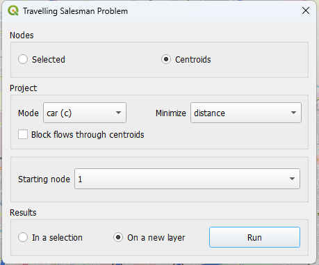
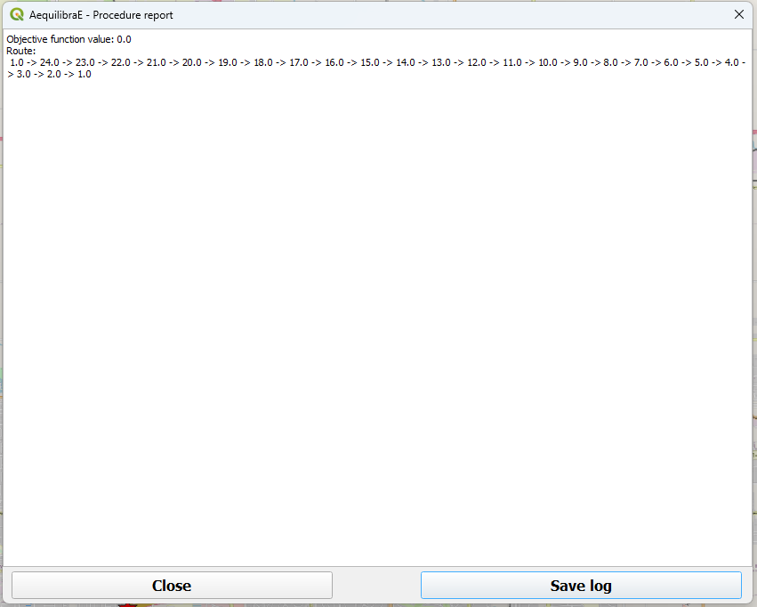
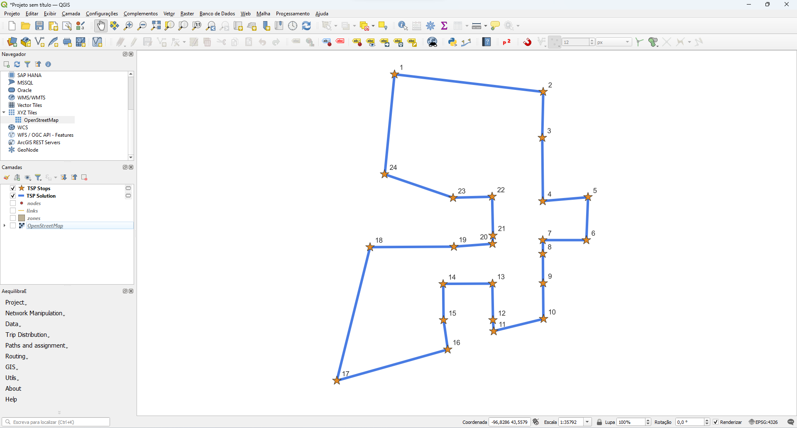

.. _routing_menu:

Routing
=======

Open **AequilibraE > Routing > Traveling salesman problem** from the menubar or dock panel.
This dialog finds a tour through selected network nodes or centroids.

Select the stops, network mode, cost field, and starting node.
For Sioux Falls, you can use the centroids, car mode, and distance, starting at node 1.
Select the option to display the result in a new layer.

The procedure report summarizes the result.
Use its export button to save the report as a text file.
The TSP stops layer also contains the stop sequence.

The output map labels stops in tour order.

Computation time increases with the number of stops.
Start with a small set when exploring this tool.
