Trip Distribution
=================

On the trip distribution menu, the user can perform Iterative Proportional Fitting (IPF)
with their available matrices and vectors, as well as calibrate and apply a Synthetic Gravity
Model.

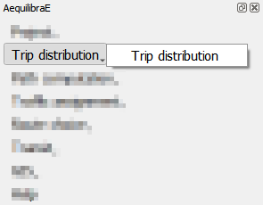

Unlike the other menus in QAequilibraE, all three procedures in trip distribution share some
configuring stepa. We'll go over each tab and, in the end, we'll run a basic workflow
using Sioux Falls example.

"*Load datasets*" is the first tab and contains a loading button and a dataset table at
the right side. Currently, QAequilibraE allows import dataset data from a ``*.csv`` or 
``*.parquet`` file or loading data from an open layer. This tab is configured for IPF and
Apply Gravity.

.. subfigure:: AB
    :subcaptions: below
    :align: center

    .. image:: ../images/trip_distribution/trip_distribution_1.png
        :alt: Load datasets
    
    .. image:: ../images/trip_distribution/trip_distribution_2.png
        :alt: Dataset file format

The second tab is "*Load matrices*", which is configured in all processes. It consists in
a table view of all matrices available in the project. 

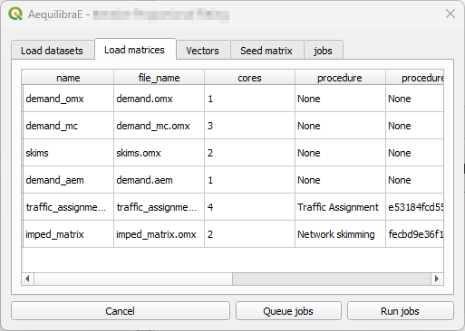

In the tab "*Vector*", we indicate the vector fields for computation. If no dataset was
loaded in the "*Load datasets*" tab, no fields are displayed here. This tab is configured for
IPF and Apply Gravity procedures.

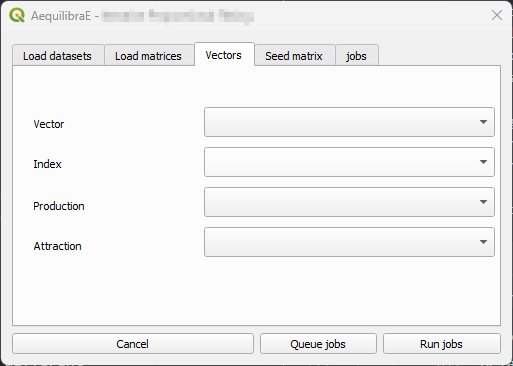

In the tab "*Impedance*" we select the matrix and matrix core that will be used for computation.
We configure this tab at the Apply Gravity procedure.

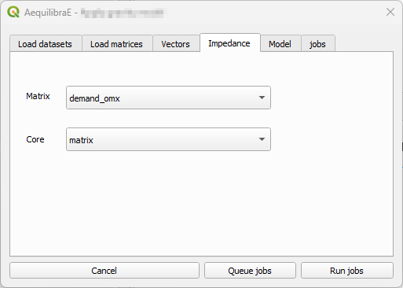

The tab "*Seed matrix*" (for IPF procedure) is analogous to the "*Observed matrix*" tab for the
Calibrate Gravity procedure, and allows the user to indicate the impedance/observed matrix.

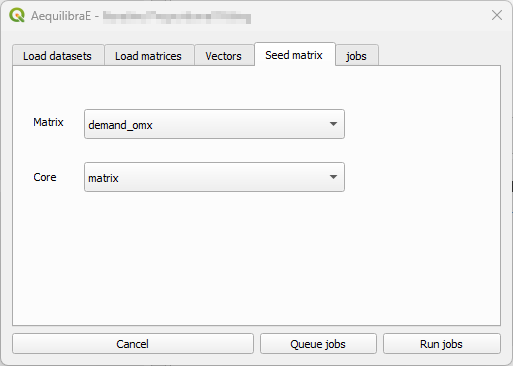

The tab "*Model*" exists for Calibrate and Apply Gravity procedures, however each procedure 
presents a different window layout. For the Calibrate Gravity, we choose the model's deterrence
function, while for the Apply Gravity, we can load the calibrated model parameters for use.

.. subfigure:: AB
    :subcaptions: below
    :align: center

    .. image:: ../images/trip_distribution/trip_distribution_7.png
        :alt: Model tab - Calibrate Gravity
    
    .. image:: ../images/trip_distribution/trip_distribution_8.png
        :alt: Model tab - Apply Gravity

Finally, the tab "*Jobs*", we can queue and/or check the jobs that are already queued and are
going to be executed, and run them!

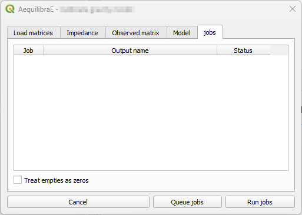

Basic workflow
~~~~~~~~~~~~~~

We present a full forecasting workflow using the Sioux Falls example. We start creating the
skim matrices, running the assignment for the base-year, and then distributing these trips into
the network. Later, we estimate a set of future demand vectors which are going to be the input
of a future year assignnment.

This workflow is based on the AequilibraE Python 
`Forecast example <https://www.aequilibrae.com/latest/python/_auto_examples/traffic_assignment/plot_forecasting.html>`_.

Before 

.. _siouxfalls-gravity-model-calibration:

Calibrate Gravity Model 
~~~~~~~~~~~~~~~~~~~~~~~
Now that we have the demand model and a fully converged skim, we can calibrate a
synthetic gravity model.

We click on Trip distribution in the AequilibraE menu and select the Calibrate
Gravity model option.

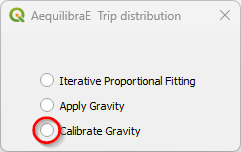

The first thing to do is to check if all matrices we need (skim and demand) are in
the project folder.

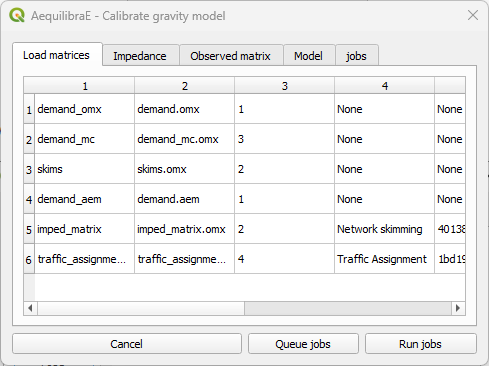

Select which matrix/matrix core is to be used as the impedance matrix.

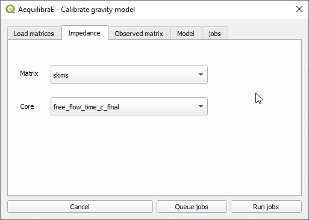

And which one corresponds to the *observed* matrix.

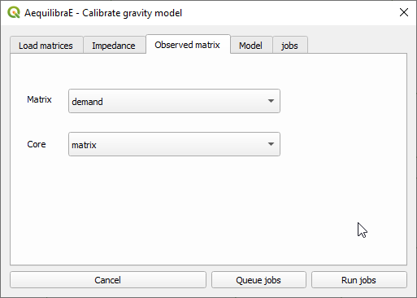

We then select which deterrence function we want to use (1) and choose a file output
for the model by clicking on *Queue jobs* (2).

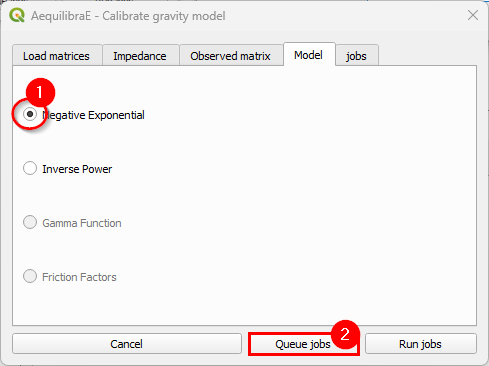

In the jobs tab, we can check all jobs we queued (1) and then run the procedure (2).

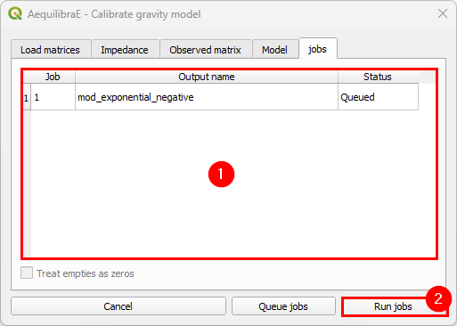

Inspect the procedure output.

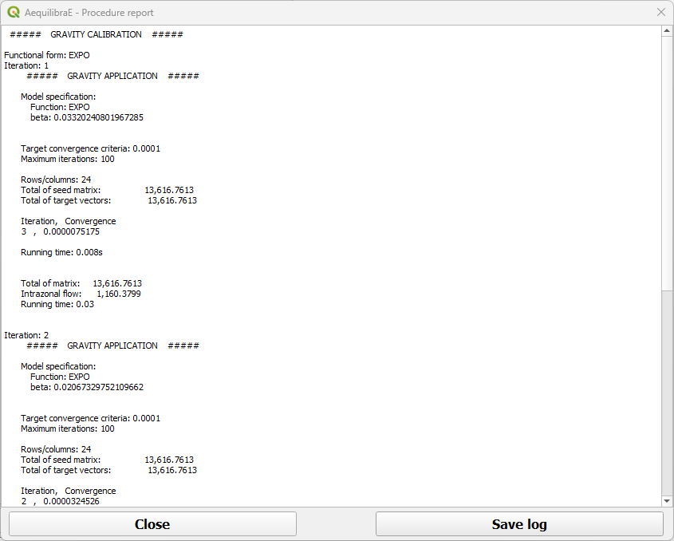

The resulting file is of type ``*.mod``, but that is just a YAML (text file).

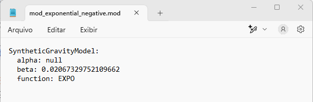

Iterative Proportional Fitting (IPF)
^^^^^^^^^^^^^^^^^^^^^^^^^^^^^^^^^^^^
It is possible to balance the production/attraction vectors using IPF. There are three different
ways to load a vector's data: loading a ``*.csv`` or ``*.parquet`` file or loading data from an 
open layer. 

Let's click on the Iterative Proportional Fitting option to open the menu.

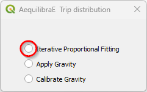

Loading the vector from a ``*.csv`` or ``*.parquet`` file is quite the same. Select your 
preferred option in the menu, and click *Load*, pointing to the location of the vector file 
in your machine.

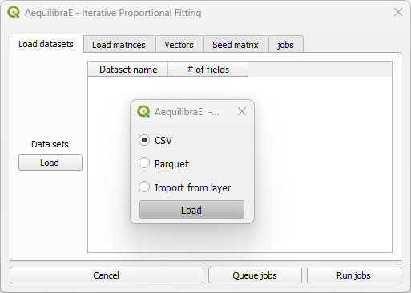

Case you are loading from an open layer, just click *Import from layer*,
point the available data layer, and the name of its index column. You can choose between *Use data*
or *Save and use*. Case you choose to save, the vector will be saved in a temporary QGIS folder.

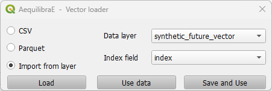

After the vector is properly loaded, it will appear in the *Load datasets* tab.

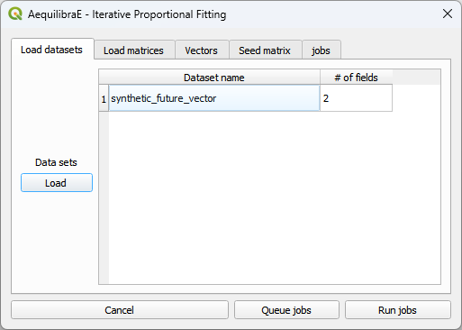

You can now select the production/attraction (origin/destination) vectors. If your data comes
from a table/layer opened in QGIS, you'll notice that the *Index* collapsible list is deactivated 
because the data index was selected when loading the data.

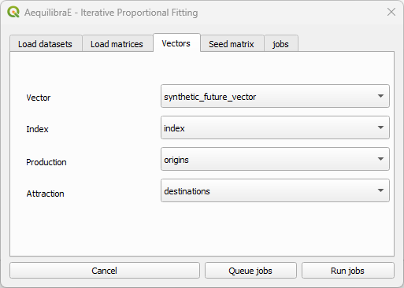

And select the impedance matrix to be used.

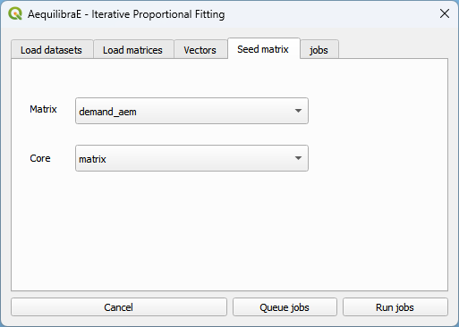

To run the procedure, simply queue the job (and select the where the output file will be saved).
Then, you will notice that a job with the output file name will appear in the jobs table with a
status *queued* (2). Finally, press *Run jobs* (3).

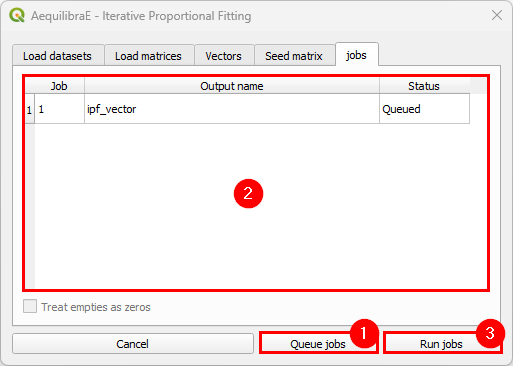

After the job is completed, a new window showing its procedure report will open.

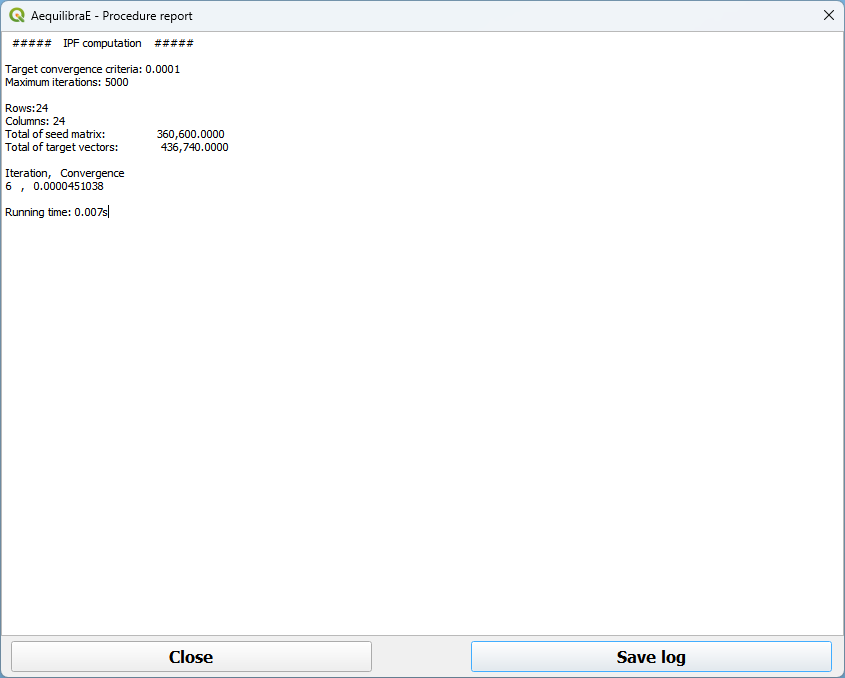

We can close it after checking the procedure report.

.. important::

    Production and Attraction vectors **must be** balanced before running IPF. 

.. _siouxfalls-forecast:

Apply Gravity Model
^^^^^^^^^^^^^^^^^^^
If one has future matrix vectors (there are some provided with the example
dataset), they can either apply the Iterative Proportional Fitting (IPF)
procedure available, or apply a gravity model just calibrated. Here we present
the latter.

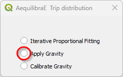

With the menu open, let's load the dataset(s) with the production/origin and
attraction/destination vectors. We can add data into the model by loading a
``*.csv`` or ``*.parquet`` file or through an open-layer, just like the IPF
procedure above.

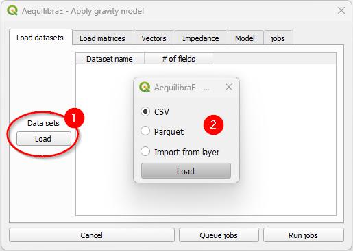

We select the production/attraction (origin/destination) vectors.

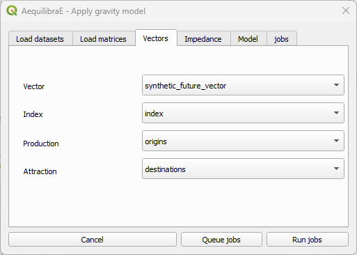

And the impedance matrix to be used. We can select one matrix core to use in computation.

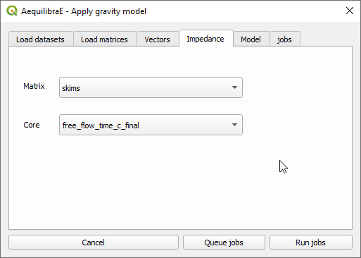

The last input is the gravity model itself, which can be done by loading a
model that has been previously calibrated, or by selecting the deterrence
function from the drop-down menu and typing the corresponding parameter values.

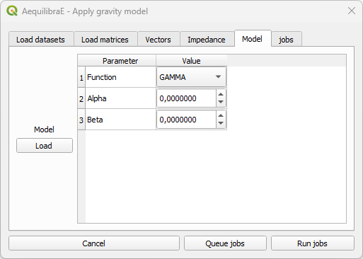

As we already have a calibrated model, we'll load its configurations. When clicking *Load*
(1) a new window opens. Point to the path where your ``*.mod`` file is stored, and once its
done, you'll notice that the parameters in the table view now correspond to the model data (2).
Queue the jobs by hitting the *Queue jobs* button (3).

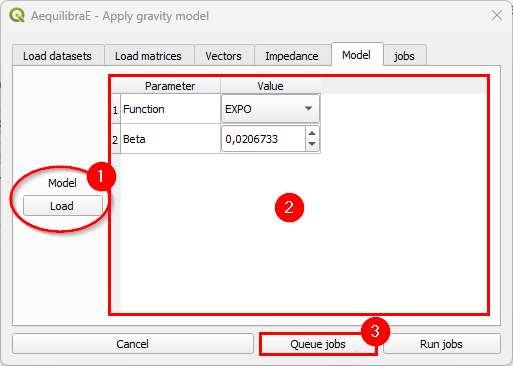

It is possible to check all jobs qeued before running the model in the tab *Jobs* (1). If all
jobs look ok, just click on the *Run jobs* button (2).

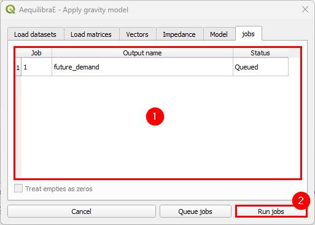

Once the process is finished, a new window with the procedure report output will open.
You can check its results and then close it.

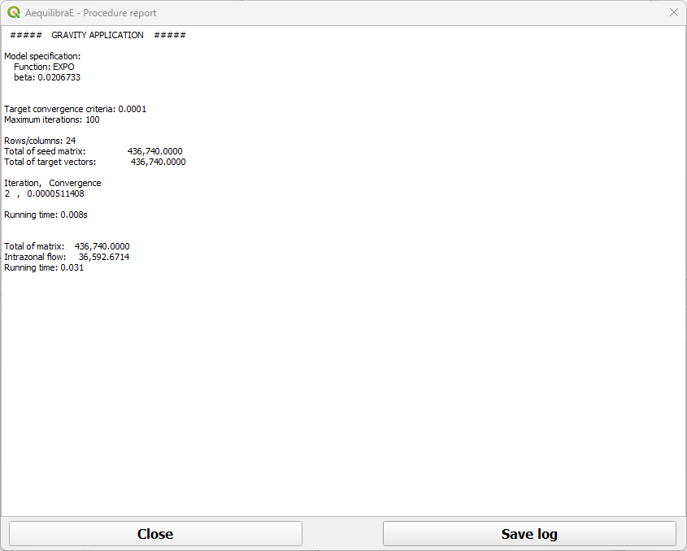

The result of this matrix can also be assigned, which is what we will generate
the outputs being used in the scenario comparison.