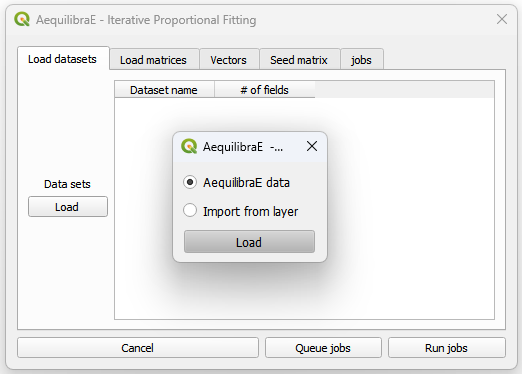
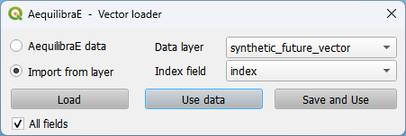
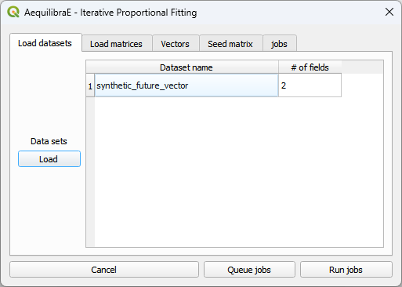
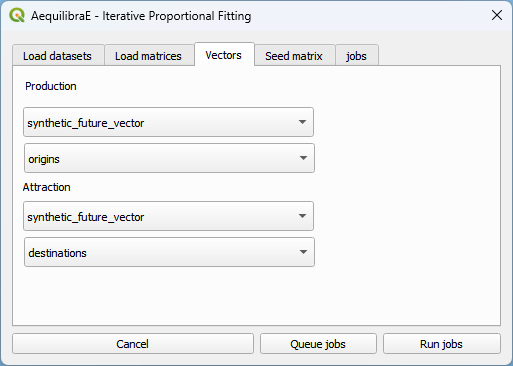
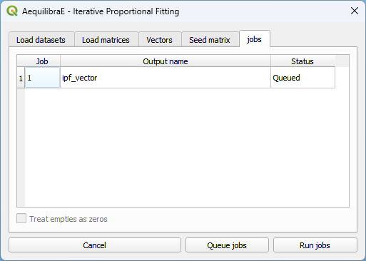
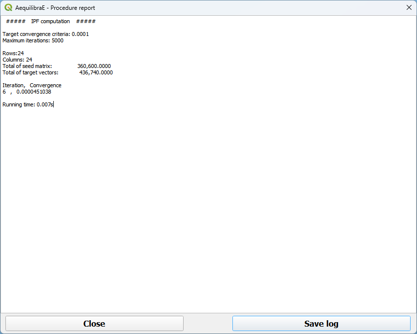

Trip Distribution
=================

On the trip distribution tab, the user can perform Iterative Proportional Fitting (IPF)
with their available matrices and vectors, as well as calibrate and apply a Synthetic Gravity
Model.

In this page each option under the **Trip Distribution > Trip Distribution** is
presented in one of the subsections below.

.. subfigure:: AB
    :align: center

    .. image:: ../images/menu_trip_distribution.png
        :alt: tab trip distribution

    .. image:: ../images/tripdistribution-menu.png
        :alt: trip distribution menu

Iterative Proportional Fitting (IPF)
------------------------------------
It is possible to balance the production/attraction vectors using IPF. There are two different
ways to load a vector's data: loading an \*.AED file or importing from an open layer. 

We click on the Iterative Proportional Fitting option to open the menu.

Loading the vector from an \*.AED file is straightforward. Just select the *AequilibraE Data* option
in the menu, and click *Load*, pointing to the location of the vector in your machine.

Otherwise, case you are loading from an open layer, just click *Import from layer*,
point the available data layer, and the name of its index column. You can choose between *Use data*
or *Save and use*. Case you choose to save, the vector will be saved in a temporary QGIS folder.

After the vector is properly loaded, it will appear in the *Load datasets* tab.

You can now select the production/attraction (origin/destination) vectors.

And the impedance matrix to be used.

.. image:: ../images/tripdistribution-ipf-5.png
    :width: 513
    :align: center
    :alt: ipf_5

To run the procedure, simply queue the job (and select the where the output file will be saved) 
and press *Run jobs*.

After the job is completed, a new window showing its procedure report will open.

.. note::

    Production and Attraction vectors **must** be balanced before running IPF. 

Synthetic Gravity Models
------------------------

.. _siouxfalls-gravity-model-calibration:

Calibrate Gravity
~~~~~~~~~~~~~~~~~
Now that we have the demand model and a fully converged skim, we can calibrate a
synthetic gravity model.

We click on Trip distribution in the AequilibraE menu and select the Calibrate
Gravity model option.

The first thing to do is to load all matrices we will need (skim and demand).

.. image:: ../images/calibrate_matrix_load_matrices.png
    :width: 513
    :align: center
    :alt: calibrate_matrix_load_matrices

Select which matrix/matrix core is to be used as the impedance matrix

.. image:: ../images/calibrate_matrix_choose_skims.png
    :width: 513
    :align: center
    :alt: calibrate_matrix_choose_skims

Which one is the *observed* matrix

.. image:: ../images/calibrate_matrix_choose_observed.png
    :width: 513
    :align: center
    :alt: calibrate_matrix_choose_observed

We then select which deterrence function we want to use and choose a file output
for the model

.. image:: ../images/calibrate_matrix_choose_output.png
    :width: 1286
    :align: center
    :alt: calibrate_matrix_choose_output

We can then run the procedure

.. image:: ../images/calibrate_matrix_run.png
    :width: 513
    :align: center
    :alt: calibrate_matrix_run

Inspect the procedure output

.. image:: ../images/calibrate_matrix_inspect_report.png
    :width: 845
    :align: center
    :alt: calibrate_matrix_inspect_report

The resulting file is of type \*.mod, but that is just a YAML (text file).

.. image:: ../images/calibrate_matrix_model_result.png
    :width: 704
    :align: center
    :alt: calibrate_matrix_model_result

.. _siouxfalls-forecast:

Apply Gravity
~~~~~~~~~~~~~
If one has future matrix vectors (there are some provided with the example
dataset), they can either apply the Iterative Proportional Fitting (IPF)
procedure available, or apply a gravity model just calibrated. Here we present
the latter.

.. image:: ../images/apply_gravity_menu.png
    :width: 616
    :align: center
    :alt: apply_gravity_menu

With the menu open, one loads the dataset(s) with the production/origin and
attraction/destination vectors

.. image:: ../images/apply_gravity_load_vectors.png
    :width: 1061
    :align: center
    :alt: apply_gravity_load_vectors

We also load the impedance/skim matrix to be used

.. image:: ../images/apply_gravity_load_skims.png
    :width: 1033
    :align: center
    :alt: apply_gravity_load_skims

We select the production/attraction (origin/destination) vectors

.. image:: ../images/apply_gravity_select_vectors.png
    :width: 535
    :align: center
    :alt: apply_gravity_select_vectors

And the impedance matrix to be used

.. image:: ../images/apply_gravity_select_impedance_matrix.png
    :width: 513
    :align: center
    :alt: apply_gravity_select_impedance_matrix

The last input is the gravity model itself, which can be done by loading a
model that has been previously calibrated, or by selecting the deterrence
function from the drop-down menu and typing the corresponding parameter values.

.. image:: ../images/apply_gravity_configure_model.png
    :width: 526
    :align: center
    :alt: apply_gravity_configure_model

To run the procedure, simply queue the job (and select the output while with the
screen that will open) and press *Run jobs*.

.. image:: ../images/apply_gravity_queue_model.png
    :width: 1116
    :align: center
    :alt: apply_gravity_queue_model

The result of this matrix can also be assigned, which is what we will generate
the outputs being used in the scenario comparison.