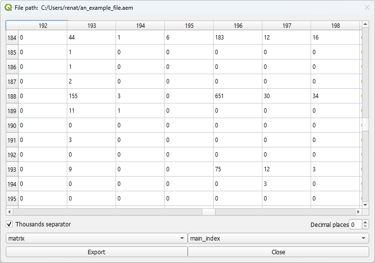
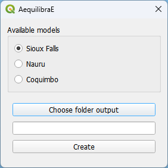

Utils
=====

On the Utils tab, the user can either display matrices and datasets in OMX or AequilibraE's native
format or create an example project to learn how to use QAequilibraE.

Display matrices and datasets
-----------------------------

Within **AequilibraE > Utils > Display matrices and datasets** one can load and
open matrices and datasets in the following extensions \*.omx, \*.aem, and \*.aed.

Suppose you want to check a \*.aem matrix you have previously saved in your computer.
When clicking the button, you can tell AequilibraE the location of the file and a new
window opens. 

Check the figure below to see how the *Display matrices and datasets* window looks like.

You can configure the number of decimal places to be displayed and if
one wishes to use the thousand separator or not. In case your file has more than one view,
you can select the desired view using the dropdown buttons at the bottom of the page.
In our figure, they are represented by the dropdowns containing *matrix* and 
*main_index*. Finally, if you click in the *export* button in the lower left corner of the 
window, you can also save the current matrix in \*.csv format. 

Create example
--------------

AequilibraE has three different example sets one can use as learning tool, and they were all
made available within the QGIS ecossystem.

Within **AequilibraE > Utils > Create example**, select one of the available models, the desired
location of the output folder, and just press *Create*. The window will close automatically
and you can open the project folder in the Project tab.

