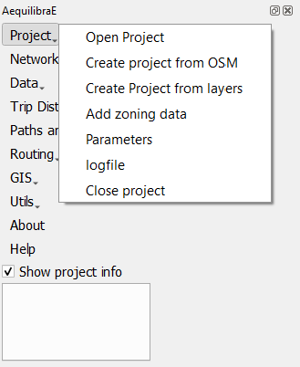
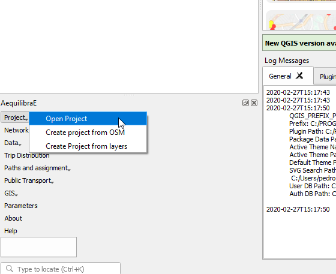
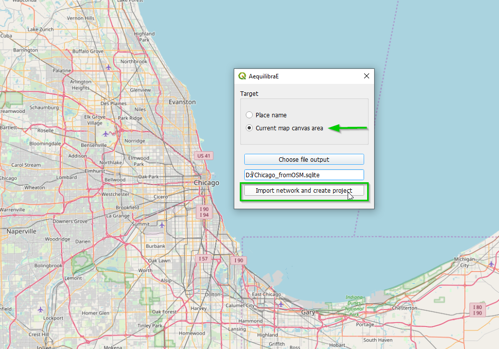
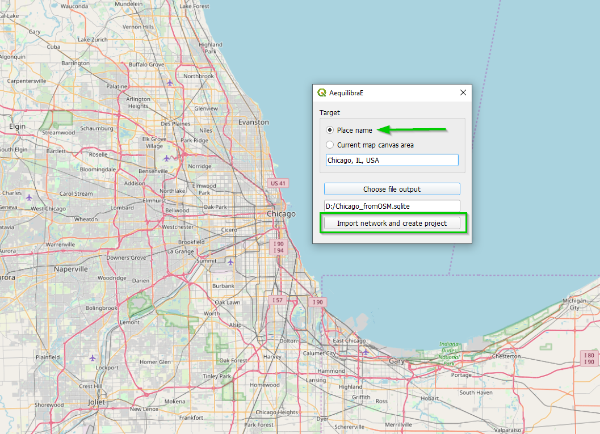
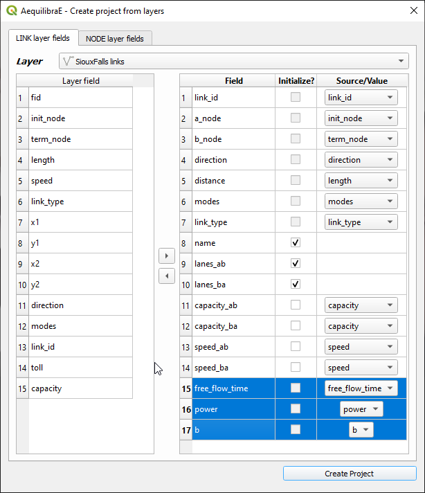
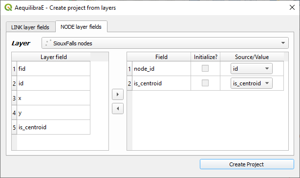
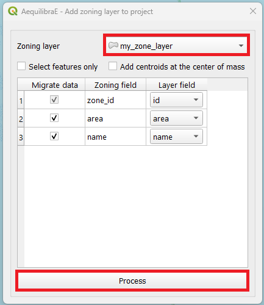
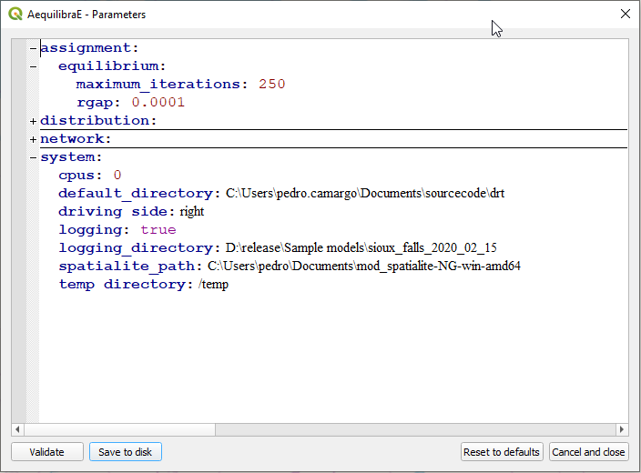
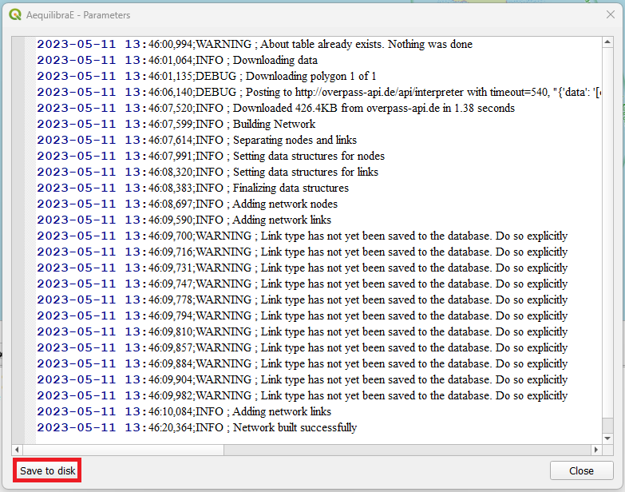

.. _aequilibrae_project:

AequilibraE Project
===================

The AequilibraE project is one of the newest portions of the
`AequilibraE API <http://www.aequilibrae.com/python/latest/>`_, and therefore not very mature.

For a better overview of the AequilibraE project, please check the
documentation listed above, as this page is dedicated to a practical implementation

Under the project tab, there are seven options to choose from and the following sections
explore some of these actions.

.. _siouxfalls-open-project:

Open & Close project
--------------------

These options are pretty straightforward and are used either to open or close a
project. 

The figure below shows how to open the project. The procedure for closing the project
is also similar.

.. _create-proj-from-osm:

Create project from OSM
-----------------------

However, its first feature is the capability of importing networks directly from
`Open Street Maps <https://www.openstreetmap.org/>`_ into AequilibraE's efficient
TranspoNet format. This is also time to give a HUGE shout out to
`Geoff Boeing <http://www.geoffboeing.com/>`_, creator of the widely used Python
package `OSMNx <https://github.com/gboeing/osmnx>`_. For several weeks I
worked with Geoff in refactoring the entire OSMNx code base so I could include
it as a submodule or dependency for AequilibraE, but its deep integration with
`GeoPandas <https://geopandas.org/en/stable/index.html>`_ and all the packages it depends on (Pandas,
Shapely, Fiona, RTree, etc.), means that we would have to rebuild OSMNx from the
ground up in order to use it with AequilibraE within QGIS, since its Windows
distribution does not include all those dependencies.

For this reason, I have ported some of Geoff's code into AequilibraE
(modifications were quite heavy, however), and was ultimately able to bring this
feature to life.

.. note::
   Importing networks from OSM is a rather slow process, so we recommend that
   you carefully choose the area you are downloading it for. We have also
   inserted small pauses between successive downloads to not put too much
   pressure on the OSM servers. So be patient!!

Importing networks from OSM can be done by choosing an area for download,
defined as the current map canvas on QGIS...

... or for a named place.

Project from layers
-------------------

The AequilibraE project can also be bootstrapped from existing line and node
layers obtained from any other source, as long as they contain the following
required field for the conversion:

* Link ID
* a_node
* b_node
* Link direction
* Length
* Speed
* Allowed modes
* Link Type

These requirements often create quite a bit of manual work, as most networks
available do not have complete (or reliable) information. Manually editing the
networks might be necessary, which is common practice in transport modelling.

Before creating a project from the layer, you can understand how to prepare the
layers for this task on the documentation page for 
:ref:`preparing a network <network_preparation>`.

After all field preparation is done, one can import those layers into an
AequilibraE project using a dedicated tool in the **Project** menu in
AequilibraE.

Accessing **AequilibraE > Project > Create Project from Layers**, the user is
presented with the following screen.

The first 7 fields for links are mandatory, and one needs to associate the
corresponding layer fields to the network fields.

The other fields that will be listed on the left side come from the parameters
file (see the manual for that portion for more details), but the user can add
more fields from the layer, as all of them are listed on the left side of the
screen

In the case of the nodes layer, only two fields are mandatory.

After filling all fields, it is just a matter of saving it!

After running this tool a sqlite file (spatialite enabled) will be created and
you can edit the network (create, move or delete links and nodes) and both
layers (including node *ID* and *A_Node*/*B_Node* fields) will remain
consistent with each other.

.. _add-zoning-data:

Add zoning data
---------------

It is possible to import to AequilibraE project your own zoning system in case
you already have one. Currently, AequilibraE only supports one projection system,
which is the EPSG:4326 (WGS84), so make sure your zone layer is in this projection.

To add your zones to the active project, go to **AequilibraE > Project > Add zoning data**, select the zoning layer you want to add to the project, select weather you
want to migrate the data and the respective layer field in the zoning layer, and
finally click on process.

.. _parameters_file:

Parameters
----------

The parameters file is part of the AequilibraE package for Python, so all the
reference documentation for this section can be found in its
`documentation page <https://aequilibrae.com/python/latest/modeling_with_aequilibrae/parameter_file.html>`_.

The QGIS plugin, however, has a nice interface to view and edit the parameters
file, which can be accessed through **Aequilibrae > Parameters**. This
interface, depicted below, allows one to edit and validate parameters before
submitting them as the new parameter file for all AequilibraE procedures.

.. _logfile:

Log file
--------

The log file contains information about which actions took place and when they happened.
For example, after you :ref:`create a project from OSM  <create-proj-from-osm>`,
if you access the log file, you are going to see something like the figure below,
containing the sequence of steps followed to import the OSM network. If you wish to
access this file later on, it is also possible to save this log file locally in your machine,
using the **save to disk** button in the lower left corner of the log file box.

Video tutorial
--------------

If you want a summary of everything that was presented on this page, you can
head over to YouTube to see a demonstration of how to download these projects.

.. raw:: html

    <iframe width="560" height="315" src="https://www.youtube.com/embed/9PF2qHs2hUc"
     frameborder="0" allow="accelerometer; autoplay; encrypted-media; gyroscope;
     picture-in-picture" allowfullscreen></iframe>
