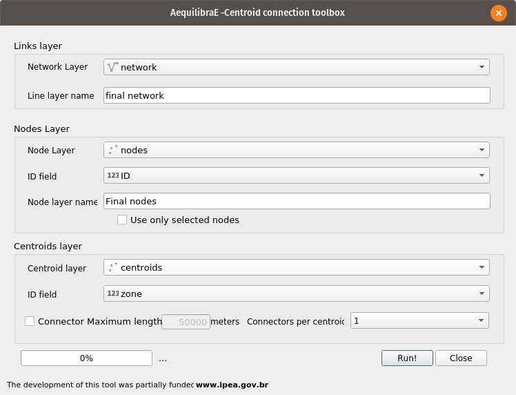

Network Manipulation
====================

.. toctree::
   :maxdepth: 2

The network manipulation tool is designed to allow the user to go from a generic line layer all the way to a network
with centroids and centroid connectors and that can be easily edited in any QGIS package that supports spatialite.

There are three individual tools in this submenu.

Network basics
--------------

AequilibraE is built upon a few basic concepts that need to be clear before you do any modelling with it. They are
the following:

* Links can be bi-directional: This varies from platform to platform, but in **AequilibraE** we do not distinguish
  between the network file and the graph, which gets built from the network on demand. Therefore all **AequilibraE**
  networks have a field for direction with values in the set [-1, 0, 1], which indicate BA only flow, bi-directional,
  and AB only flow respectively.

* AequilibraE has a few reserved fields for the network, which are "link_id", "a_node", "b_node", "direction", "id"

* AequilibraE can deal with an arbitrary set of IDs for links and nodes, but we vectorize a lot of operations for
  faster performance, which means that you will be using a LOT more memory you would if you use large IDs for nodes
  and links without actually needing it.  You may also explode memory or the Numpy Numerical types. A good practice is
  to keep IDs as low as possible, but in general, if you get too close to 922,337,203,685,4775,807, you will certainly
  break things, regardless of your system capabilities.

Network preparation
-------------------

This is the first and only fundamental tool in the AequilibraE network manipulation arsenal. This tool is used to create
graphs that can be ingested by path computation algorithms and covers two situations:

**User has only the network links**

This is the case when one exports only links from a transportation package or downloads a link layer from Open Street
Maps or a government open data portal and want to use such network for path computation. This tool then does the
following:

* Duplicates the pre-existing network in order to edit it without risk of data corruption
* Creates nodes at the extremities of all links in the network (no duplicate nodes at the same lat/long)
* Adds the fields *A_Node* and *B_Node* to the new link layer, and populate them with the *IDs* generated for the nodes
  layer

**User has the network links and nodes but no database field linking them**

In case one has both the complete sets of nodes and links and nodes for a certain network (commercial packages would
allow you to export them separately), you can use this tool to associate those links and nodes (if that information was
not exported from the package).  In that case, the steps would be the following:

* Duplicates the pre-existing network in order to edit it without risk of data corruption
* Checks if the nodes provided cover noth extremities of all links from the layer provided. Node IDs are also checked
  for uniqueness
* Adds the fields *A_Node* and *B_Node* to the new link layer, and populate them with the *IDs* chosen among the fields
  from the nodes layer

**GUI**

The tool can be accessed in the AequilibraE menu *AequilibraE > Network Manipulation > Network Preparation* , and it
looks like this:

.. image:: images/network_edit_network_preparation.png
    :width: 800
    :align: center
    :alt: Network preparation

It is important to note that AequilibraE understands A_Node as being the topologically first point of the line, and
B_node the last.  Topology in GIS involves a LOT of stuff, but you can look at an
`intro <https://www.gaia-gis.it/fossil/libspatialite/wiki?name=topo-intro>`_

If you prefer a video tutorial, you can access

.. raw:: html

    <iframe width="560" height="315" src="https://www.youtube.com/embed/oFi02QWYwn8" frameborder="0" allow="accelerometer;
    autoplay; encrypted-media; gyroscope; picture-in-picture" allowfullscreen></iframe>

Adding Connectors
-----------------

Before we describe what this tool can do for you, let's just remember that there is a virtually unlimited number of
things that can go awfully wrong when we edit netwokrs with automated procedures, and we highly recommend that you
inspect the results of this tool **CAREFULLY**.

This tool is meant to be ran AFTER the network has been prepared, as it will augment the node layer with the centroids
and create a new link network with the centroid connectors added.

**GUI**

This is what i looks like

Creating TranspoNet
-------------------
pass

