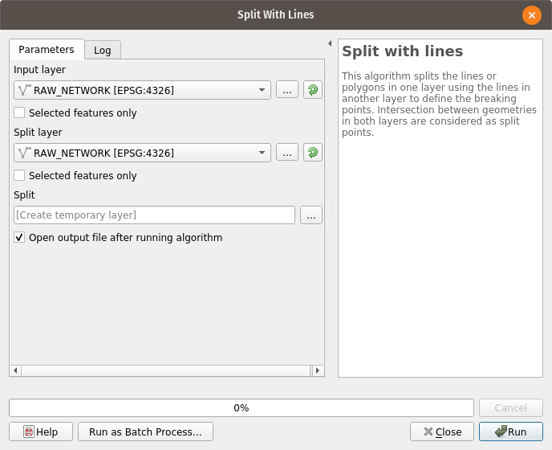
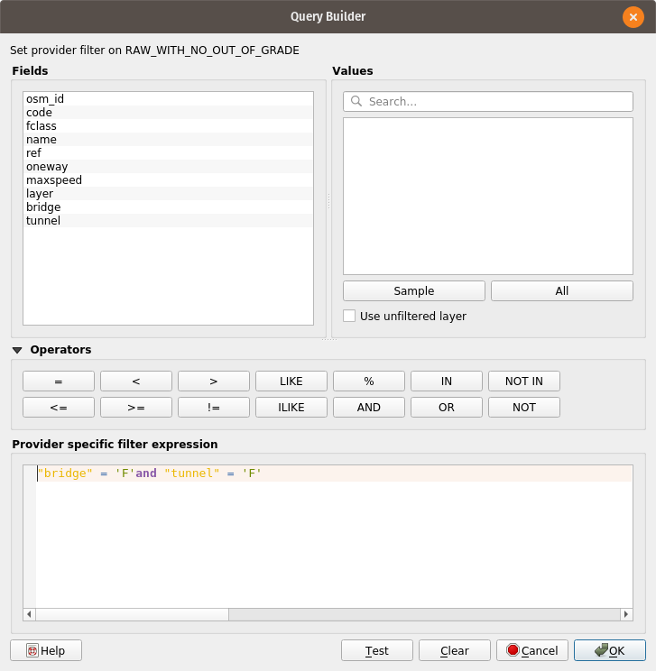

Building networks from scratch
==============================

.. toctree::
   :maxdepth: 1

.. _tutorial:

We have chosen `Alice Springs <https://en.wikipedia.org/wiki/Alice_Springs>`_ as subject for this example, as that is a
small and isolated city for which quite a bit of data is available and that lacks a transportation model, so actual
practical use might be made of this in the future.

As this tutorial is developed, software other than AequilibraE and QGIS will be used, most notably for the demand
modelling portion of the model.

The files used in this example are available in a separate
`GitHub repository <https://github.com/AequilibraE/AliceSprings>`_

* Reading about the `basic concepts <networkmanipulation.html>`__ behind AequilibraE's networks is probably a good idea

Sourcing the data
-----------------

* Road Network

For this example we will use Open-Street Maps data, which is the most widely available data out there.
There is an `online tool <http://osm-traffic.com/>`_ that is pretty good to download very target data (such as that for
Alice Springs), you can also download the entire thing from `Geofabrik <http://download.geofabrik.de/>`_

* Zoning System:

In this example the zoning system is derived from SA1s, which is the smallest unit in the spatial aggregation made
available by the Australian Bureau of Statistics (ABS). One could decide to go down to meshblocks, but the added
complexity that arise from the lack of full demographic data from the ABS is not justifiable for the development of
this example.

Building the network
--------------------

When using Spatial OSM data

Dealing with intersection when working with OSM networks is not trivial, as different people code their networks
differently. The main issue here is that there are two possible cases where links intersect on the map:

1. There is an actual intersection there that would need to be represented as a node in the network and the original
   links would need to be split in that point

2. There is NO intersection there, and links are actually on different levels (e.g. tunnel, surface, elevated)

QGIS provides several tools for editing the network, but dealing with the consequences of poorly coded network in QGIS
is just as painful as doing it in any other package.

For this reason we recommend download from geofabrik, as there are clearly labeled fields for tunnels and bridges.

Pre-processing
~~~~~~~~~~~~~~

Let's first split all links in the network at all points they cross.

.. image:: images/network_edit_processing_menu.png
    :width: 800
    :align: center
    :alt: Menu access

Here you can if the links to be split are the same set used to split them or not, but that is up to your judgement.

In the case of Alice Springs, all road crossings are at grade, so we split links in all cases where they cross, even
though **many links were tagged as being bridges**, so we used all links for both inputs.

If you want to experiment with spliting only links that are not tagged as bridges or tunnels, you can load the same
layer twice and filter one of them no everything except tunnels and bridges.

After spliting the links, we ended up with a link layer with MultiLineString features (where lines are not necessarily
continuous).  As this does not make sense in a transportation network, we used another QGIS feature to obtain only
single part links (non-continuous links are separated in multiple continuous links).

That cool can be accessed in this menu:  **Vector > Geometry Tools > Multipart to Singleparts**, and running it looks
like this:

.. image:: images/network_edit_multipart_to_singlepart.png
    :width: 800
    :align: center
    :alt: Multipart to Singleparts

Network preparation
~~~~~~~~~~~~~~~~~~~

We now have a network that is ready to have its nodes and the articulation between links (A_Node and B_Node) created,
which is an AequilibraE tool.

**AequilibraE > Network Manipulation > Network Preparation**

.. image:: images/network_edit_network_preparation.png
    :width: 800
    :align: center
    :alt: Network preparation

In this case we chose to add nodes with IDs starting in 1,001, as we will reserve all nodes from 1 to 1,000 for centroid
connectors, external stations and other special uses (we are not planning to use all that range and that is not
necessary, but the numbering gets quite neat that way).

Adding Connectors
~~~~~~~~~~~~~~~~~

Before adding connectors to the network, however, we need to create the set of centroids we want to add to the network.
It turns our that the SA1 layer provided by the ABS has two multipart SA1s, so we had use the same
Multipart-to-singleparts used to sanitize the network layer.

After this step, creating a centroids layer was a matter of following a few steps.

1. Add a data field with the zone number to the zoning system

2. Extract centroids from the zoning system.  Menu accessible on **Vector > Geometry Tools > Centroids**

.. image:: images/network_edit_centroids_menu.png
    :width: 800
    :align: center
    :alt: Zones to centroids

3. Visually inspect centroids looking for those that were placed in awkward places and move them to more appropriate
   positions

4. Manually adding centroids for external stations (external flows) and special generators (i.e. correctional facility
   and military base)

With the centroids layer created, it was time to create the final link and node layers by adding the centroids to the
node layer and creating centroid connectors from the centroids to their closest nodes.

AequilibraE has a tool specifically for that, which takes three layers (links, nodes and centroids) and allows the user
to specify maximum length of the connectors and a number of connectors per zone.  In our case we will leave the
maximum distance unresstricted and add a single connector per zone.

.. image:: images/network_edit_adding_connectors.png
    :width: 800
    :align: center
    :alt: Adding connectors

Creating a consistent network
~~~~~~~~~~~~~~~~~~~~~~~~~~~~~

A Transponet is a network scheme that allows the user to edit it while enforcing consistency between nodes and links.
This consistency is enforced by database triggers in the SpatiaLite backend and allows the layers to be allowed in any
minimaly capable QGIS (i.e. one that supports SpatiaLite layers).

A few fields are required for the conversion:

* Link ID
* Link directionality
* Length
* Speed
* Capacity

These requirements created quite a bit of manual work, as the OSM data downloaded does not have complete (or reliable)
information. The changes necessary were to dill the field for posted speed with values similar to those for the same
link types, manually input unidirectionality for the links for roads with dual carriage way and for a few roundabouts.
Further work would be needed in this network in those aspects, but the work done is both reasonable and representative
to what is needed.

Link IDs were created automatically in QGIS using the field calculator, capacities were ignored and length was also
computed in QGIS after re-projecting the network.

With all the preparation work done, one can create the final network using the last tool in the network manipulation
menu in AequilibraE.

Accessing **AequilibraE > Network Manipulation > Create Transponet**, the user is presented with the following screen.

.. image:: images/network_edit_creating_transponet.png
    :width: 800
    :align: center
    :alt: Creates Transponet

After running this tool a sqlite file (spatialite enabled) will be created and you can edit the network (create, move
or delete links and nodes) and both layers (including node *ID* and *A_Node*/*B_Node* fields) will remain consistent
with each other.

Other resources
~~~~~~~~~~~~~~~

There is an excellent tutorial from Roberta Maletta using AequilibraE 0.4 that is still very much current

.. raw:: html

    <iframe width="560" height="315" src="https://www.youtube.com/embed/mHeCfNuuTkQ" frameborder="0"
    allow="accelerometer; autoplay; encrypted-media; gyroscope; picture-in-picture" allowfullscreen></iframe>
