Processing Tools
================

AequilibraE's plugin functionalities are also available in a processing plugin.
The processing plugin is automatically installed with QAequilibraE and allows you to perform
several tasks, such as creating project from links, exporting matrices, and much more.

To find AequilibraE's processing plugin, click on the **Processing** panel and select **Toolbox**.
You can also use the available QGIS shortcut to open the Toolbox window.

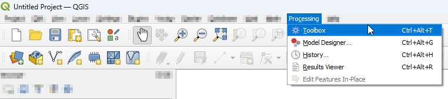

At the bottom of the window, you'll find the AequilibraE logo and the available functions.
The functions are divided into groups, following the same logic as the AequilibraE widget
menu. Notice that all AequilibraE functionalities are available for processing, but not
all processing tools exist at the main AequilibraE menu.

.. subfigure:: AB
    :align: center

    .. image:: images/processing_provider_toolbox-1.png
        :alt: Toolbox General

    .. image:: images/processing_provider_toolbox-2.png
        :alt: Toolbox Detailed

In the following subsections, we'll go over all functionalities.

Project
-------

.. TODO: 

.. _create_example:

Create example
~~~~~~~~~~~~~~

AequilibraE has three different example sets one can use as learning tool, and they were all
made available within the QGIS ecosystem.

Within **Project > Create example**, select one of the available models, the desired
location of the output folder, and just press *Create*. The window will close automatically
and you can open the project folder in the Project tab.

.. image:: ../images/project_create_example.png
    :align: center
    :alt: utils create example

.. _parameters_file:

Parameters
~~~~~~~~~~

The parameters file is part of the AequilibraE package for Python, so all the
reference documentation for this section can be found in its
`documentation page <https://aequilibrae.com/latest/python/modeling_with_aequilibrae/parameter_file.html>`_.

The QGIS plugin, however, has a nice interface to view and edit the parameters
file, which can be accessed through **Project > Parameters**. This
interface, depicted below, allows one to edit and validate parameters before
submitting them as the new parameter file for all AequilibraE procedures.

.. image:: ../images/parameters_menu.png
    :width: 704
    :align: center
    :alt: parameters menu

.. _logfile:

Log file
~~~~~~~~

The log file contains information about which actions took place and when they happened.
For example, after you :ref:`create a project from OSM  <create-proj-from-osm>`,
if you access the log file, you are going to see something like the figure below,
containing the sequence of steps followed to import the OSM network. If you wish to
access this file later on, it is also possible to save this log file locally in your machine,
using the **save to disk** button in the lower left corner of the log file box.

.. image:: ../images/project-logfile.png
    :width: 704
    :align: center
    :alt: proj logfile

Model Building
--------------
Add centroid connectors
~~~~~~~~~~~~~~~~~~~~~~~
AequilibraE's processing tool can add centroid connectors to a project's network. All you
need to do is specify the number of centroids and the project folder. You can also choose
the modes and the link types you want to connect, otherwise the default configuration uses
all modes and link types.

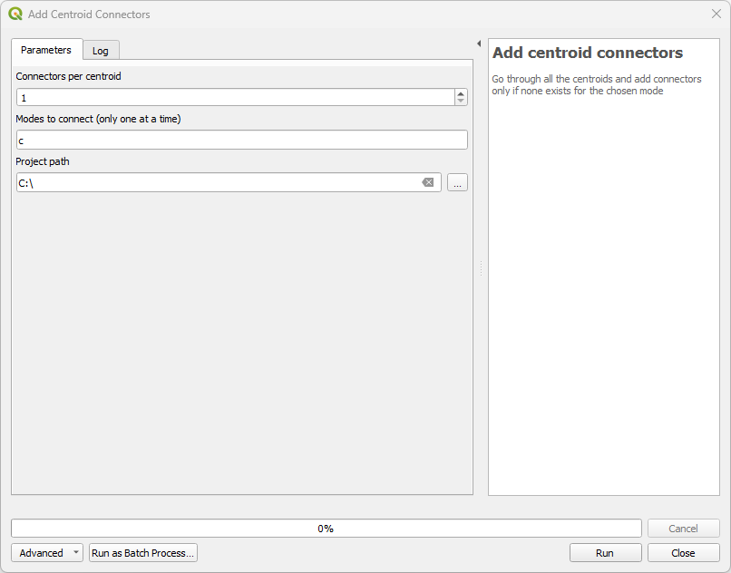

Add links from layer to project
~~~~~~~~~~~~~~~~~~~~~~~~~~~~~~~
This tool allows you to add links from a vector layer to your existing project network.
The fields usage is straightforward: in *Project path*, you add the project's path in your
machine, then select a vector layer that corresponds to the new links you want to add to
your project, and indicate the layer fields that correspond to the link type, direction, and
modes. Notice that this tool doesn't require a node layer, nor does it require fields such
as ``a_node`` or ``b_node``, as it will use the existing numbering in the project.

.. image:: images/processing_provider_new_links_to_project.png
    :align: center
    :alt: Processing provider add new links from layer to project

Add/Renumber nodes from layer
~~~~~~~~~~~~~~~~~~~~~~~~~~~~~
You can also add or renumber nodes in an AequilibraE project to match a layer of centroids.
Just select or import the centroids layer, specify the node ID you want to match, and the output
folder.

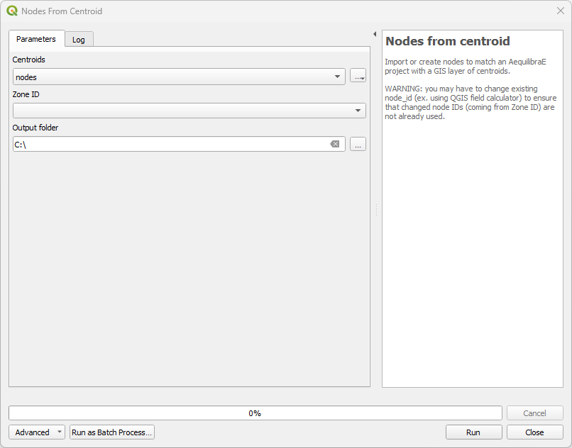

Create project from link layer
~~~~~~~~~~~~~~~~~~~~~~~~~~~~~~
*Create project from link layer* is similar to the widget menu 
:ref:`Create project from layers <project_from_layers>`, and allows you to create an AequilibraE 
project directly from a link layer, without requiring a node layer. With a geometric layer loaded 
into QGIS, select it in the *Links* button, and add the required data in the subsequent menus. 
Choose the project's name and specify the location where you want to save it on your machine.

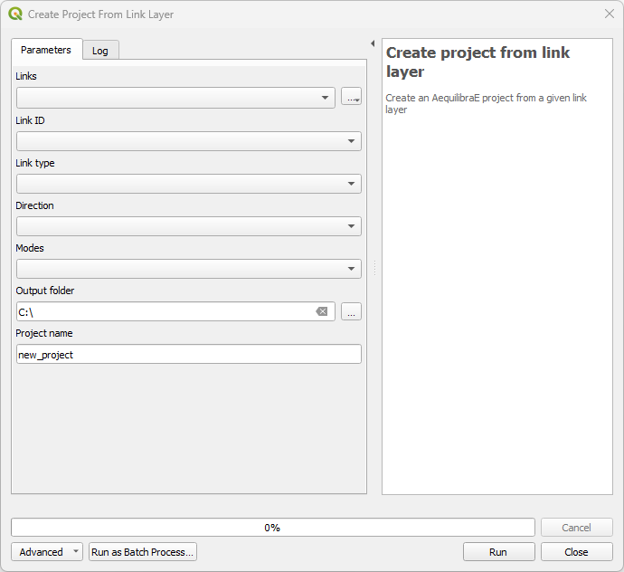

Create project from OSM
~~~~~~~~~~~~~~~~~~~~~~~
This tool is similar to the homonymous widget menu 
:ref:`Create project from OSM <create-proj-from-osm>`, and allows you to create an AequilibraE
project only specifying the place name and the folder path and name you want to save the project.

.. image:: images/processing_provider_project_from_osm.png
    :align: center
    :alt: Processing provider create project from osm

Run procedures
~~~~~~~~~~~~~~~
This tool is similar to the widget menu :ref:`Run procedures <run-procedures>`, and allows you to 
use defined entry points and arguments, and run models to the model itself. To use this tool,
just select one of the available functions, and once the algorithm is finished, go to the log
file to check the outputs.

.. important::

    An open AequilibraE project is required for this tool to work.

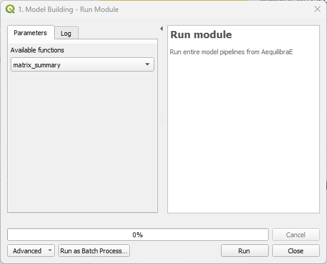

Data
----
Create AequilibraE Matrix from layer
~~~~~~~~~~~~~~~~~~~~~~~~~~~~~~~~~~~~
With *Import matrices*, you can save an open data layer directly as a \*.aem file.
This tool is analogous to the widget menu :ref:`importing_matrices`, but it does not
require an open AequilibraE project to work. To use the tool, you must have an open layer
loaded in QGIS, and the menus are the ones presented in the figure below.

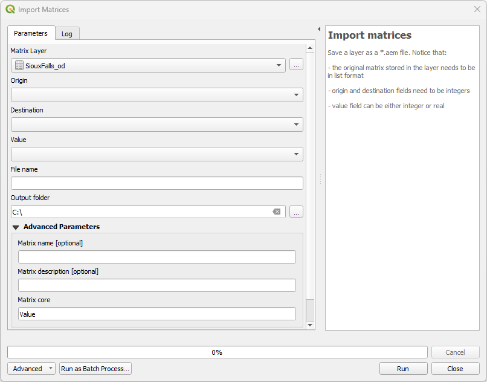

The upper fields are mandatory and are responsible for selecting the layer, indicating
which columns correspond to the origin, destination, and flow, creating a core name for your
matrix, and specifying the output file name and path. In the *Advanced Parameters*, you can add
extra information about your AequilibraE matrix using the fields ``Matrix name`` and 
``Matrix description``.

Export matrices
~~~~~~~~~~~~~~~
The *Export matrices* tool is analogous to the *Export* button in the matrix viewer 
(see: :ref:`this figure <fig_data_visualize_matrices>` for more details). 
Its usage is straightforward: select the matrix you want to export, specify the path
on your machine to store the file, and select its output format. Only \*.aem and \*.omx files can 
be used as input, and the output format can be either one of \*.aem, \*.omx, or \*.csv.

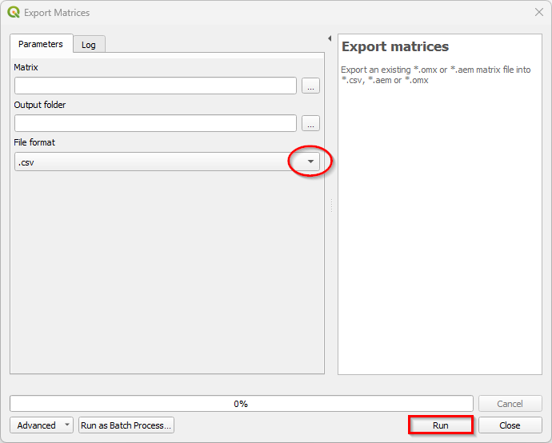

Matrix calculator
~~~~~~~~~~~~~~~~~
Under the hood, this tool performs several matrix calculations using NumPy. Its output is 
an AequilibraE matrix stored in the file path you provide. Notice that not all matrices
operations available in NumPy are also available here. We currently handle the following
operations.

* ``+``, ``-``, ``*``, ``/``
* ``min``, ``max``, ``abs``
* ``ln``, ``exp``, ``power``
* ``null_diag``, ``T``

To be more effective in your calculation, please use the brackets to separate the operations
in the desired order of execution.

.. image:: images/processing_provider_matrix_calc.png
    :align: center
    :alt: Processing provider matrix calculator

The following code blocks present, respectively, examples of a matrix input configuration for 
the YAML file and an expression that can be used for calculation. 

.. code-block:: yaml
    :caption: Matrix configuration

    # For each matrix used for calculation
    - matrix_name1:
        matrix_path: path to file
        matrix_core: specifiy the core name

.. code-block:: yaml
    :caption: Expression

    (matrix_name1 - matrix_name2).T

Save matrix from layer in existing file
~~~~~~~~~~~~~~~~~~~~~~~~~~~~~~~~~~~~~~~
This tools allows you to export the data from an open layer to an existing \*.omx file.

.. important::

    Currently, we cannot add new cores to an existing AequilibraE matrix. For this reason
    the only output file format available is \*.omx. 

.. image:: images/processing_provider_save_matrix_in_existing_file.png
    :align: center
    :alt: Processing provider save matrix in existing file

Trip length distribution
~~~~~~~~~~~~~~~~~~~~~~~~
This tool generates a Trip Length Distribution (TLD) plot for a pair of demand and skim
matrices and their selected cores.

.. important::

    An open AequilibraE project is required for this tool to work.

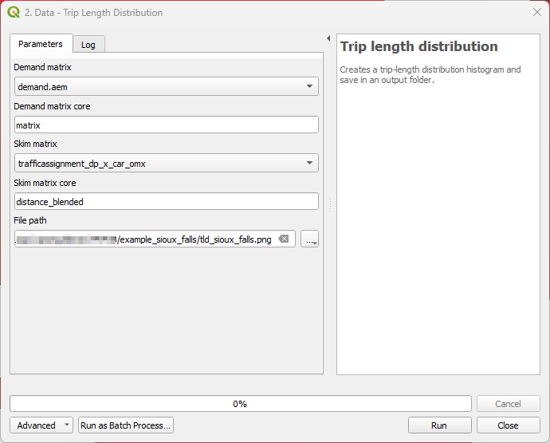

Paths and assignment
--------------------
Traffic assignment from file
~~~~~~~~~~~~~~~~~~~~~~~~~~~~
AequilibraE traffic assignment can now be performed using a YAML file that contains the model input
information. The process is straightforward: create a valid YAML file with your project path,
required matrices, and valid parameters, and load it into AequilibraE. 

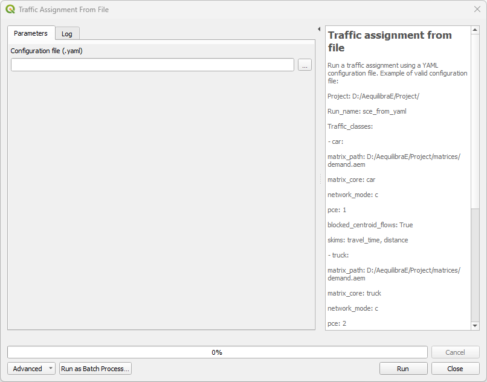

The code block below contains an example of a valid YAML configuration.

.. code-block:: yaml
    :caption: Traffic assignment configuration

    project: path_to_project
    result_name: test_from_yaml
    traffic_classes:
        - car:
            matrix_path: path_to_project/matrices/demand.aem
            matrix_core: matrix
            network_mode: c
            pce: 1
            blocked_centroid_flows: True
            skims: free_flow_time, distance
    assignment:
        algorithm: bfw
        vdf: BPR2
        alpha: 0.15
        beta: 4.0
        capacity_field: capacity
        time_field: free_flow_time
        max_iter: 10
        rgap: 0.001
    select_links: # optional, name with a list of lists as [[link_id, link_direction]]
        - from_node_1: [[1, 1], [2, 1]]
        - random_nodes: [[3, 1], [5, 1]]

Routing
-------

AequilibraE's routing allows the user to run a Travelling Salesman Problem (TSP),
using a selected set of nodes or the centroids of a network. 

Its usage is straightforward. For Sioux Falls, for example, we would select the
centroids of the network, and minimize the distance travelled by car. It is also
possible to choose the start node of our TSP (we'll let node_id 1 to be the starting
node, but it could be any available node), and indicate we want to see the result in
a new layer.

Our prompt box would look like this:

.. image:: ../images/tsp-prompt-box.png
    :align: center
    :alt: TSP prompt box

When AequilibraE is done solving the TSP, it provides a procedure report, like the
one in the figure below. You can export the procedure report in a .txt file if you 
wish, by clicking on the lower right button in the window. Otherwise, you can just
close this window (the TSP sequence can be found in the TSP stops layer).

.. image:: ../images/tsp-procedure-report.png
    :align: center
    :alt: TSP procedure report

And as we chose to display the result in a new layer, it would look like the figure below. 
Please note that the TSP stops are labeled according their sequence.

.. image:: ../images/tsp-solution.png
    :align: center
    :alt: TSP solution

.. note::

    TSP is a well-known optimization problem and it has already been implemented in several
    different software and programming languages. However, the main problem related to
    TSP is related to its size (hence its complexity). This means that as we increase the 
    number of stops we want to travel to, the software will take much longer to provide you
    with an answer, and in some cases, it might also crash.

Public Transport
----------------
Create transit graph
~~~~~~~~~~~~~~~~~~~~
Benefiting from new AequilibraE features, this processing tool allows you to create and
save a transit graph to use in the transit assignment. Figure below presents an screenshot
of the create transit graph processing interface.

.. image:: images/processing_provider_create_transit_graph.png
    :align: center
    :alt: Processing provider create transit graph

Notice that you will have to input data such as the project path, the desired mode, and the
period ID for which you want to create your graph. Other graph configuration, such
as ``Block flows through centroids`` and ``Project with walking edges`` are boolean, 
and can be selected as necessary. You can read more about these configuration 
`here <https://www.aequilibrae.com/python/develop/modeling_with_aequilibrae/transit_assignment/transit_graph.html#transit-graph-specificities-in-aequilibrae>`_.

.. note::
    
    Currently only a single transit graph can be saved and reloaded.

Create GTFS
~~~~~~~~~~~
This tool allows you to import a GTFS feed to your project. Just point to the
GTFS zip and project paths in your machine, select the date for which you want to
import the transit routes, and if you want to map-match the routes or not. Remember
that depending on the GTFS size, the map-matching procedure can be really time-consuming.
Unlike the GTFS importer in the widget menu, to use this processing tool you must
know which calendar date you are going to use. 

.. image:: images/processing_provider_import_gtfs.png
    :align: center
    :alt: Processing provider import GTFS

.. tip::
    
    Mobility Data is a non-profit organization that provides a 
    `GTFS validator tool <https://gtfs-validator.mobilitydata.org/>`_. 
    If you want to use QAequilibraE processing processing provider tool to import a GTFS 
    feed, you can load your GTFS file at their validator and it will provide you useful 
    information, including calendar date ranges.

Transit assignment
~~~~~~~~~~~~~~~~~~
Transit assignment from file is quite similar to the traffic assignment presented above,
with the remarkable differences related to the transit graph and assignment, as shown in
AequilibraE. The YAML file setup includes the project location in your machine, as well as
information on matrix and assignment. To use this tool, you must have a transit graph, 
either created by the processing tool above or using AequilibraE code.

.. image:: images/processing_provider_transit_assignment.png
    :align: center
    :alt: Processing provider transit assignment from file

The code block below contains an example of a valid YAML configuration.

.. code-block:: yaml
    :caption: Transit assignment configuration

    project_path: path_to_project
    result_name: transit_from_yaml
    matrix_path: path_to_project/matrices/demand.aem
    matrix_core: workers  
    assignment:
        time_field: trav_time
        frequency: freq
        algorithm: os
    graph:
        period_id: 1
        with_outer_stop_transfers: False 
        with_walking_edges: False
        blocking_centroid_flows: False
        connector_method: overlapping_regions

Network
-------
Collapse links
~~~~~~~~~~~~~~
This tool allows you to collapse one or more links into nodes, adjusting the network in
the neighborhood if necessary.

The input for the tool consists in a folder containing an AequilibraE project and a
the link IDs of the links you want to collapse separated by a comma.

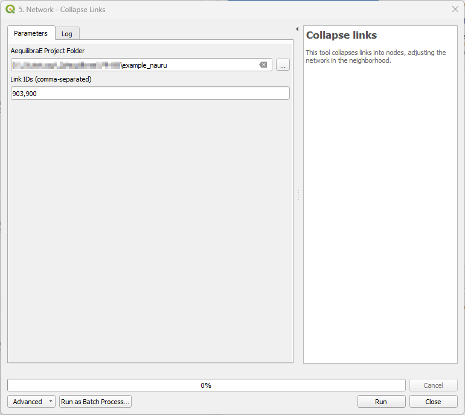

Network simplifier
~~~~~~~~~~~~~~~~~~
This tool allows you to simplify the network, merging short links into larger ones or
turning links into nodes, and save these changes into the project.

The input for the tool consists in a folder containing an AequilibraE project.

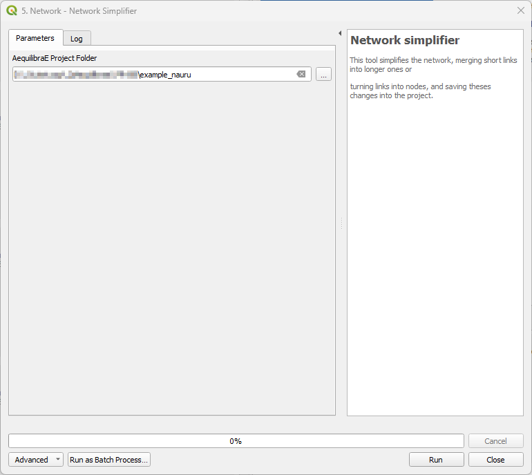
