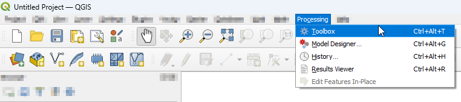
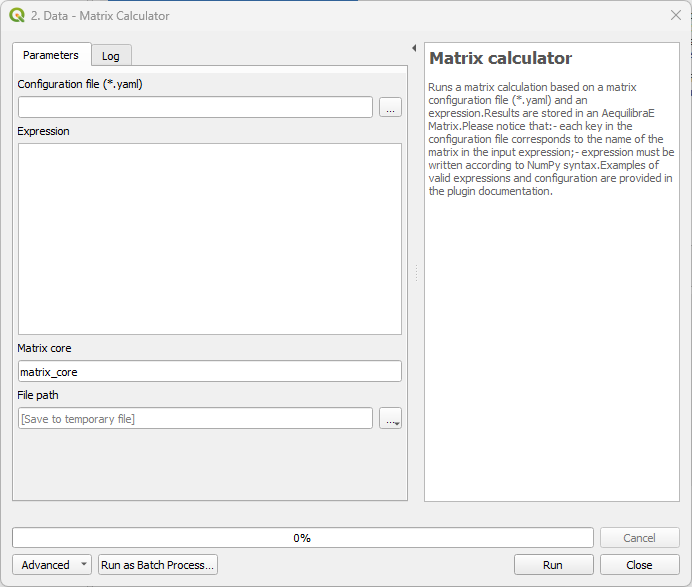
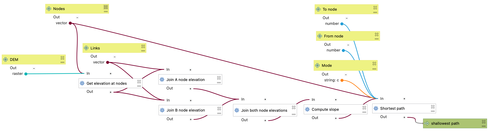
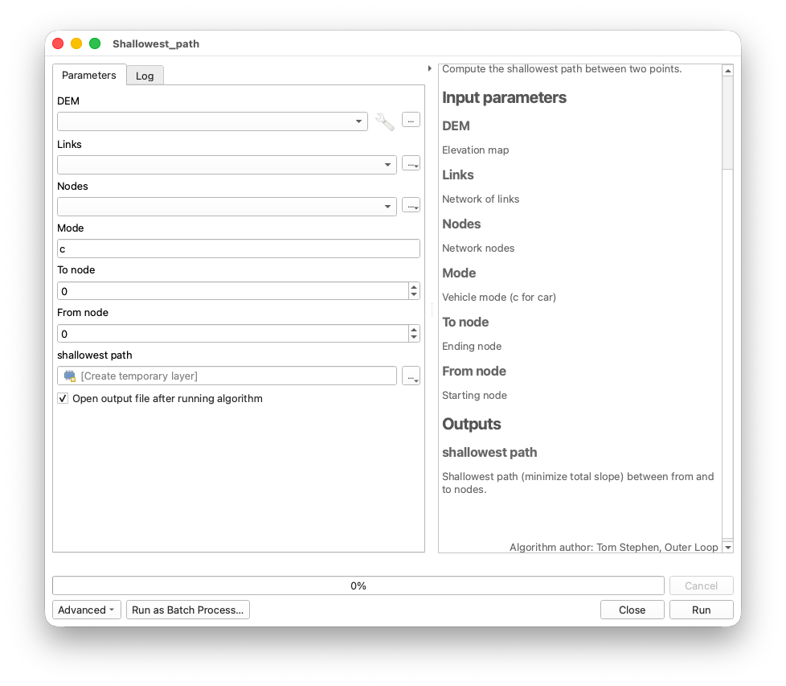

Processing Tools
================

Processing Algorithms
---------------------

QGIS Processing Algorithms, available from the Processing Toolbox, expose much
of the functionality of QGIS and its plugins with a consistent interface.
QAequilibraE similarly adds its own set of algorithms to the Processing Toolbox,
allowing users to integrate the underlying functionality with other tools and
workflows within QGIS. Generally, the design is such that most modellers will
prefer instead to use the tools under the "AequilibraE" menu itself, where we
provide convenient interfaces and project-aware workflows, but the algorithms
that underpin these workflows are made available.

.. subfigure:: AB
    :align: center

    .. image:: images/processing_provider/processing_provider_toolbox-1.png
        :alt: Toolbox General

    .. image:: images/processing_provider/processing_provider_toolbox-2.png
        :alt: Toolbox Detailed

Common uses for using the processing algorithms directly include batch
processing, automating repetitive tasks, and building out "Models" in the QGIS
Model Designer.

For interactive plugin dialogs, see :doc:`Menus in Detail <menus_in_detail>`.

Model building
--------------
The Processing **Model building** group creates projects and changes their networks.
For the interactive project creation, network preparation, and zoning dialogs, see the :ref:`Model building menu <model_building>`.

A link layer is enough to create a project with Processing.
You can then add zones, create centroids, and connect them to the network in separate steps.
This approach is useful when the same preparation steps must work for several input networks.

.. list-table:: Project creation and centroid algorithms
   :header-rows: 1

   * - Algorithm ID
     - Operation
     - Output
   * - ``qaequilibrae:create_empty_project``
     - Create an empty project
     - ``Output``: project folder
   * - ``qaequilibrae:projectfromlayer``
     - Create a project from a link layer
     - ``OUTPUT``: project folder
   * - ``qaequilibrae:projectfromosm``
     - Create a project from OSM
     - ``OUTPUT``: project folder
   * - ``qaequilibrae:add_centroids_from_zones``
     - Create missing zone centroids
     - ``ADDED``: centroid count
   * - ``qaequilibrae:renumbernodes``
     - Add or renumber centroids from a point layer
     - ``ADDED``, ``RENUMBERED``, ``MATCHED``: node counts
   * - ``qaequilibrae:addcentroidconnector``
     - Generate centroid connectors
     - ``ADDED``: link count

Create a project from a link layer with Processing
~~~~~~~~~~~~~~~~~~~~~~~~~~~~~~~~~~~~~~~~~~~~~~~~~~
Select the links layer and its direction, modes, and link-type fields.
Direction values must be ``-1``, ``0``, or ``1``.
Modes use one-letter IDs. Link-type names use letters and underscores.
The algorithm creates missing modes and link types.

Select an optional source ID field to preserve its values in ``source_id``.
The project assigns its own ``link_id`` values.
*Import additional link fields* copies other attributes and creates missing fields.
New field names use lowercase input names.
Generated fields, such as endpoint IDs and distance, come from the project.
The algorithm transforms input geometry to EPSG:4326.

Select a project folder that does not exist.
The algorithm generates regular nodes from link endpoints, with IDs starting at 10000.
Use *Add or renumber centroids from layer* to assign centroid IDs afterward.
The interactive *Create project from layers* dialog also accepts a node layer and field mappings.

Create a project from OSM with Processing
~~~~~~~~~~~~~~~~~~~~~~~~~~~~~~~~~~~~~~~~~
Supply either a place name or a download extent.
Select the OSM mode names, such as ``car`` or ``walk``.
These names differ from the one-letter network mode IDs.
Select a project folder that does not exist.
The algorithm transforms the extent to EPSG:4326 before the download.

OSM import requires internet access.
Cancellation cannot interrupt the library download and network build.
A failed import can leave a partial project folder.

Create centroids with Processing
~~~~~~~~~~~~~~~~~~~~~~~~~~~~~~~~
*Add centroids from zones* creates a centroid for each project zone without one.
It retains existing centroids and rejects zone IDs occupied by regular nodes.

*Add or renumber centroids from layer* accepts a point layer and an ID field.
IDs must be positive integers. IDs and point locations must be unique.
The algorithm transforms points to EPSG:4326 and rounds coordinates to eight decimal places for matching.
Matched nodes become centroids with the requested IDs.
Unmatched points create new centroids.
Node renumbering also updates the connected link endpoints.

The algorithm checks all ID conflicts before it changes nodes.
It supports ID swaps between matched nodes.
It rejects multiple matching nodes and IDs occupied by unrelated nodes.
Cancellation takes effect before changes begin.
Once changes begin, the algorithm completes the ID changes.

Generate connectors with Processing
~~~~~~~~~~~~~~~~~~~~~~~~~~~~~~~~~~~
*Add centroid connectors* connects project centroids to eligible network nodes.
Select the mode IDs, link-type IDs, and number of connectors per centroid and mode.
Empty mode and link-type inputs select all available IDs.
The initial search radius uses meters.
If that area contains no eligible node, the library expands it.

Select *Create missing centroids from project zones* to create zone centroids first.
For centroid positions from another layer, run *Add or renumber centroids from layer* first.
The output counts new links, rather than new mode permissions on existing links.

Network changes save during the operation.
Cancellation or an error can leave partial additions.
The same applies to project creation from a link layer.

Editing an existing network
~~~~~~~~~~~~~~~~~~~~~~~~~~~

*Add links from layer to project* appends links and maps their direction, modes, and link-type fields.
The project generates endpoint nodes as needed.
The input does not need ``a_node`` or ``b_node`` fields.

*Collapse links* takes a comma-separated list of link IDs and collapses them into nodes, updating the surrounding network.
*Network simplifier* merges links and removes intermediate nodes.
These tools change the selected project, so inspect the network after each operation.

Data
----

The Data group provides tools for matrix files and project mode or link-type records.
Use *Add mode* and *Add link type* with a project folder to create records without opening the plugin dialogs.
For the interactive forms and matrix import, see the :ref:`Data menu <data_menu>`.

Matrices use OpenMatrix (``.omx``).
AequilibraE Matrix (AEM) files are no longer supported.
An OMX file can contain several matrices, called *cores*, with a common zone index.
The core identifies the values to use; the index identifies which zone each row and column represents.

Export matrices
~~~~~~~~~~~~~~~
The Processing **Export matrices** algorithm is similar to the *Export* button in the
matrix viewer (see :ref:`this figure <fig_data_visualize_matrices>`). Enter an OMX input
file, an output folder, and the output format. The output format can be OMX or CSV.

OMX and QGIS OD tables
~~~~~~~~~~~~~~~~~~~~~~
**OMX to QGIS OD table** reads all cores from an OMX file.
The result is a non-spatial QGIS table with ``origin``, ``destination``, ``core``, and ``value`` fields.
Each row contains one matrix cell. Select a zone mapping when the OMX file has more than one mapping.

**QGIS OD table to OMX** writes this table format to a new OMX file.
The table must contain one row for each origin-destination pair in each core.
Zone IDs must be nonnegative integers. The output mapping is named ``zone_id`` and uses sorted zone IDs.
This table format lets you inspect or edit matrix cells in QGIS before you write an OMX file.

For a map of one origin or destination, use *OMX origin or destination to zone table*.
This tool reads only one row or column and writes one table row per zone.
Join the result's ``zone_id`` field to the zone layer's ``zone_id`` field.
You can also select a row or column in the *Visualize data* dialog.
The full OD table has one row per matrix cell and can be too large for mapping.

Matrix calculator
~~~~~~~~~~~~~~~~~

The matrix calculator combines named matrices using a restricted set of NumPy operations.
For example, multiplying demand by a distance skim gives the distance-weighted demand for each origin-destination pair.
Use matrices with the same zone index and ordering so the cells refer to the same trips.

Provide a YAML file with names, paths, and cores for the input matrices:

.. code-block:: yaml

    - demand:
        matrix_path: /path/to/demand.omx
        matrix_core: trips
    - skim:
        matrix_path: /path/to/skim.omx
        matrix_core: distance

Use those names in an expression, such as ``demand * skim`` or ``(demand + demand).T``.
Use parentheses to control the order of operations.
Available operations include:

* Arithmetic: ``+``, ``-``, ``*``, ``/``, and ``**``.
* Functions: ``min``, ``max``, ``abs``, ``ln``, ``exp``, and ``power``.
* Matrix operations: ``null_diag`` to clear the diagonal, and ``.T`` to transpose.

``min`` and ``max`` return reductions, so an expression using them must still produce a matrix.
The result must be a matrix with the input dimensions and is saved as an OMX file.

Trip length distribution
~~~~~~~~~~~~~~~~~~~~~~~~

A trip length distribution shows how demand spreads across travel distances or times.
Select the demand and skim matrices and their cores from the project, then choose an output folder and plot name.
For a distance distribution, use a distance skim; for a travel-time distribution, use a time skim.
The plot helps you inspect an observed matrix or compare the shape of a modeled distribution.

Distribution
------------
The Distribution group applies gravity models, calibrates them, and balances trip
matrices. These tools use project matrices and vector layers.
Use *Apply gravity model* to create demand, *Calibrate gravity model* to fit deterrence parameters, or *Iterative proportional fitting* to balance demand.
For illustrated examples, see the :ref:`Trip distribution menu <trip_distribution>`.

Apply gravity model
~~~~~~~~~~~~~~~~~~~
**Apply gravity model** produces a trip matrix by applying a synthetic
gravity model to an impedance matrix.

* *Impedance matrix name* and *Impedance matrix core* identify the skim matrix and core.
* *Trip-end vector layer*, *Index field*, *Production field* and *Attraction field*
  provide the row and column totals. The index field holds the zone IDs.
* *Deterrence function* is one of ``GAMMA``, ``EXPO`` or ``POWER``. ``GAMMA`` takes both
  *alpha* and *beta*. ``EXPO`` takes only *beta* and ``POWER`` only *alpha*.
* The result is written to an OpenMatrix (\*.omx) file.

Vector zone IDs must match the matrix index in the same order.
Production and attraction totals must balance.

Calibrate gravity model
~~~~~~~~~~~~~~~~~~~~~~~
**Calibrate gravity model** fits a synthetic gravity model to an observed
trip matrix and an impedance matrix, and saves the calibrated model as a \*.mod file.

* *Observed matrix name* and *Observed matrix core* identify the observed demand matrix.
* *Impedance matrix name* and *Impedance matrix core* identify the skim matrix.
* *Deterrence function* is either ``EXPO`` or ``POWER``.

Both matrices must use the same zone IDs in the same order.

Iterative proportional fitting
~~~~~~~~~~~~~~~~~~~~~~~~~~~~~~
**Iterative proportional fitting** balances a seed trip matrix so that its
row and column totals match the production and attraction vectors. It is also known as
Fratar or Furness.

* *Seed matrix name* and *Seed matrix core* identify the matrix to balance.
* *Trip-end vector layer*, *Index field*, *Production field* and *Attraction field*
  provide the row and column totals.
* The balanced matrix is written to an OpenMatrix (\*.omx) file.

Vector zone IDs must match the matrix index in the same order.
Production and attraction totals must balance.

The *Treat NaN values as zero* option is available on all three tools.

Geometry IO
-----------

The Geometry IO tools move network and zoning data between an AequilibraE project and QGIS layers.
For example, extract links to inspect their attributes, edit a copy, then apply those changes with *Modify links*.

**Extract links**, **Extract nodes**, and **Extract zones** write project tables to QGIS layers.
The corresponding **Add** algorithms append features, and **Modify** algorithms update records matched by their IDs.
Add and modify tools copy matching project fields and geometry from the input layer.
**Add nodes** requires a ``node_id`` field, and **Add zones** requires a ``zone_id`` field.
**Add links** assigns link IDs and computes endpoint IDs from geometry.
Modify inputs require ``link_id``, ``node_id``, or ``zone_id`` to identify existing records.
Modify tools cannot change record IDs.
Input geometry is transformed to EPSG:4326.
Modify tools copy null attribute values too, so a null input can clear an existing value.

Adding or modifying features changes the project database; extracting features produces a separate layer.

Mapping
-------

Mapping algorithms turn model data into layers that you can style and inspect in QGIS.
For interactive visualization and spatial tagging, see the :ref:`Mapping menu <mapping_tools>`.

Simple tag
~~~~~~~~~~

Suppose your nodes have no zone names, but your zone polygons contain a ``name`` field.
*Simple tag* can copy those names into a new nodes layer using spatial matches.
Select the zone layer and its source field, the nodes as the target, and the target field name.
The algorithm creates the target field if it does not exist.

The Processing algorithm writes a new output layer. It copies the target layer's
fields and geometry, then writes the matched value to the named target field. It
creates that field when it does not exist. Features without a match receive a
null value. For *Closest*, the algorithm checks the five nearest indexed source
features. For *Touching*, it selects the feature with the greatest shared
length, or area when both layers are polygons. Optional match fields must be
selected on both layers or left empty on both.

The :ref:`menu dialog <mapping_simple_tag>` edits the existing target layer and retains unmatched values.

Desire lines
~~~~~~~~~~~~
**Desire lines** builds one line for each pair of zones that
carries flow. It uses a zone or centroid layer and an OpenMatrix (\*.omx) file.
The integer zone ID field must match the matrix index. Select matrix cores as a
comma-separated list, or leave the field empty to use all cores. Intrazonal
flows are omitted. Each matrix core becomes AB and BA flow fields on the output
line layer. AB runs from the higher zone ID to the lower ID. BA runs in reverse.
Lines use the input layer's CRS.

Delaunay network
~~~~~~~~~~~~~~~~
**Delaunay network** builds a line layer from the centroids of an input
node or zone layer. The input must contain at least three nodes with integer IDs.
Geometry and distance use the input layer CRS.

Select the input layer and its ID field. If you supply an OMX matrix, select its
cores as a comma-separated list.

An empty core list selects all cores. Matrix IDs must match node IDs. The
algorithm assigns demand with an all-or-nothing assignment and adds AB, BA, and
total flow fields to the output.

Path computation
----------------
The menu dialogs are documented in the :ref:`Path computation module <paths_procedures>`
section. The toolbox provides shortest-path and network-skimming algorithms. Network
skimming saves results in the AequilibraE project folder.

Shortest path
~~~~~~~~~~~~~
``qaequilibrae:shortest_path`` finds the lowest-cost path between two nodes in a link
layer. The link layer must contain ``link_id``, ``a_node``, ``b_node``, ``direction``,
``modes``, and the selected numeric cost field. Enter a mode and the start and end node IDs.

*Block flows through centroids* requires a node layer with ``node_id`` and ``is_centroid`` fields.
The algorithm also accepts a comma-separated list of excluded link IDs.
It writes one output feature for each directed link in the path.

Outputs are the path layer, ordered link IDs, and total cost.
Use the total cost to compare alternatives, or display the path layer to inspect the selected route.

Network skimming
~~~~~~~~~~~~~~~~
``qaequilibrae:network_skimming`` computes a skim matrix for one mode and saves it in the
project.

For example, minimize ``travel_time`` while skimming both ``travel_time`` and ``distance``.
The resulting cores describe the time and distance of the fastest paths, rather than the shortest-distance paths.

Inputs:

* AequilibraE project folder: the project whose network is skimmed.
* Network mode and cost field: the mode to skim and the field used to minimize path cost.
* Skim fields: the network fields written to the matrix, comma-separated.
* Trace between all nodes: skim every node instead of only the network's centroids. This
  cannot be combined with blocking flows through centroids.
* Block flows through centroids: keep centroid-to-centroid paths from passing through
  another centroid.
* Excluded link IDs (optional): links left out of the graph, comma-separated.
* Output matrix name: the name of the OMX matrix and its project record.

.. list-table:: Network skimming outputs
   :header-rows: 1

   * - Output
     - Value
   * - ``OUTPUT_MATRIX_NAME``
     - Matrix record name
   * - ``OUTPUT_MATRIX_PATH``
     - Matrix OMX file path
   * - ``OUTPUT_MATRIX_FOLDER``
     - Project matrix folder

The algorithm checks the matrix name before computation and does not overwrite an
existing matrix.

Route choice
------------
``qaequilibrae:route_choice`` assigns demand or builds choice sets.
A choice set contains candidate routes for an origin-destination pair.
Use ``build`` to save route sets for later inspection, or ``assign`` to load demand across them.
For single-OD visualization, use the :ref:`Route choice menu <route_choice>`.

Inputs include the AequilibraE project folder, network mode, and utility terms.
Each utility term has a numeric coefficient and network field. Select a demand
matrix and its cores, then choose ``assign`` or ``build``. Configure the choice-set
algorithm, maximum routes or depth, penalty, probability cutoff, and PSL beta.

Optional inputs support blocked centroid flows, excluded links, select-link queries,
and sub-area polygons. Select-link query rows use a name and a comma-separated set
of ``link_id:direction`` items, for example ``12:AB,14:Both``. Repeated names
represent alternative link sets.

Assignment saves link-load results to the project results database.
Choice-set building saves routes in the project's ``route_choice`` folder.
Assignment also saves routes when *Save choice sets* is selected.
Select-link analysis writes a result table and an OMX matrix.
Sub-area analysis also writes its external-demand table as a Parquet file.

.. list-table:: Route-choice outputs
   :header-rows: 1

   * - Output
     - Value
   * - ``OUTPUT_RESULT_NAME``
     - Link-load result table name, or empty for choice-set building
   * - ``OUTPUT_ROUTES_FOLDER``
     - Folder containing saved choice sets, or empty when not saved
   * - ``OUTPUT_SUB_AREA_MATRIX``
     - Sub-area demand Parquet path, or empty when not used
   * - ``OUTPUT_SELECT_LINK_FLOWS``
     - Select-link result table name, or empty when not requested
   * - ``OUTPUT_SELECT_LINK_MATRIX``
     - Select-link OMX path, or empty when not requested

The algorithm does not overwrite existing results or matrices.

Traffic assignment
------------------
``qaequilibrae:traffic_assignment`` assigns demand and saves results in the project folder.
The :ref:`Traffic assignment menu <traffic_assignment_procedures>` provides the same operation.

A traffic class combines a demand matrix with a network mode and its assignment settings.
For example, cars and trucks can use separate classes with different PCE values and permitted links.

The traffic-class table contains one row per class, with these columns:

* Class name, matrix record name, and matrix cores (comma-separated).
* Network mode, PCE, and the switch to block flows through centroids.
* Optional fixed-cost field, value of time, and skim fields (comma-separated).

A skim field produces final and blended cores by default.
``free_flow_time:final,distance:blended`` produces only the specified cores.
Each class with skim fields has an OMX file named ``<result_name>_<class_name>.omx``.
VDF parameters accept either numbers or network field names.
The optional excluded-links table contains a class name and link IDs (comma-separated).

The select-link table contains a query name, link IDs (comma-separated), and a direction: ``AB``, ``BA``, or ``Both``.
Rows with the same query name form one query, including rows with different directions.
The switches for select-link matrices and flows default to true.
The default output name is ``<result_name>_sl``.

.. list-table:: Assignment outputs
   :header-rows: 1

   * - Output
     - Value
   * - ``OUTPUT_DATABASE``
     - Results database path
   * - ``OUTPUT_RESULT_NAME``
     - Assignment results table name
   * - ``OUTPUT_MATRIX_FOLDER``
     - Project matrix folder
   * - ``OUTPUT_SKIMS``
     - JSON array of skim OMX paths, or ``[]`` without skims
   * - ``OUTPUT_SELECT_LINK_MATRIX``
     - Select-link OMX path, or an empty string without this output
   * - ``OUTPUT_SELECT_LINK_FLOWS``
     - Select-link flows table name, or an empty string without this output
   * - ``OUTPUT_FLOWS``
     - Optional layer with link geometry and assigned flows

The output database path and table name identify each flow table.
In a Model Designer expression, ``array_get(from_json(...), 0)`` selects the first skim path.
The expression argument is the ``OUTPUT_SKIMS`` value from the assignment step.

The algorithm checks existing output names before computation and does not overwrite results.
Cancellation takes effect before computation or after computation, before any output saves.
A failure during output saves can leave some results in the project.

Transit
-------

Start with *Add GTFS feed* to bring scheduled services into the project.
You can then calculate supply metrics or build a transit graph for assignment and skimming.

**Add GTFS feed** imports one GTFS ZIP file into an AequilibraE project. Select a service date,
agency, description, and transit import option. Optional settings enable map matching and
provide vehicle capacities as a JSON object. Each capacity value is a ``[seated, total]`` pair.

**Transit assignment and skimming** builds or reuses a transit graph. Select *Assign demand*
to load a project matrix and save transit assignment results. Select *Create skim matrix* to
create and save a skim matrix. The algorithm accepts a period ID, graph-building options, and
comma-separated skim fields for skimming.

**Transit supply metrics** writes route, pattern, stop, or zone metrics to a non-spatial table.
Optional filters can limit the time range and route, pattern, or stop IDs.

For the menu dialogs, see :ref:`Transit <transit_procedures>`.

Project operations
------------------

Project opening, closing, examples, scenarios, logs, and parameters are available from the :ref:`Project menu <aequilibrae_project>`.
The traveling salesman dialog is documented under :ref:`Routing <routing_menu>`.

.. _processing_model_designer:

QGIS Model Designer
--------------

The `QGIS Model Designer
<https://docs.qgis.org/3.44/en/docs/user_manual/processing/modeler.html>`_ is a
graphical interface for building new processing algorithms as compositions of
existing ones. One defines the input parameters, connects them to each
intermediate algorithms, and specifies the outputs. This is particularly useful
for creating reusable workflows to automate complex tasks, particularly when
combining AequilibraE algorithms with other QGIS algorithms (say,
geoprocessing).

Shallowest Path Example
~~~~~~~~~~~~~~~~~~~~~~~

As a toy example, let us consider using AequilibraE's shortest path algorithm to
compute the "shallowest" path between two points in a network, minimising the
sum of the slopes along each link. To do so manually would involve loading the
AequilibraE project and a digital elevation model, sampling the elevation at the
nodes, joining the nodes data to the links network, computing slope, then
configuring and running shortest path. Doing this once is feasible, but doing it
many times becomes tedious.

We may instead build our own algorithm to do this. Open the QGIS Model Designer with **Processing > Model Designer**. See the `QGIS Model Designer documentation <https://docs.qgis.org/3.44/en/docs/user_manual/processing/modeler.html>`_ for complete instructions on use. For our example, we will add inputs for 

* Nodes
* Links
* Digital Elevation Model (DEM)
* Origin Node
* Destination Node
* Vehicle Mode

We then use **Raster Analysis > Sample Raster Values**, with the nodes and DEM as inputs, to obtain the elevations. Next, **Vector General > Join Attributes by Field Value** to join the A- and B-node elevations to the links. Then **Modeller Tools > Calculate expression** to compute the slope, and finally **AequilibraE > Path computation > Shortest Path** to find the shallowest path, configuring the cost field to be the previously computed slope.

One can then adjust the defaults for parameters, add documentation to the model, save as a `.model3` file, and add to the project. The algorithm will then be available as any other processing algorithm within QGIS, in the **Project models** section.

