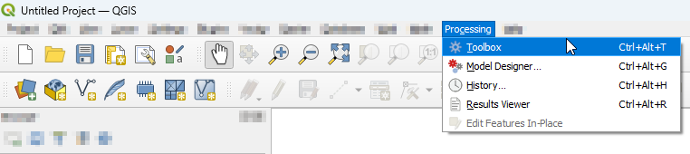
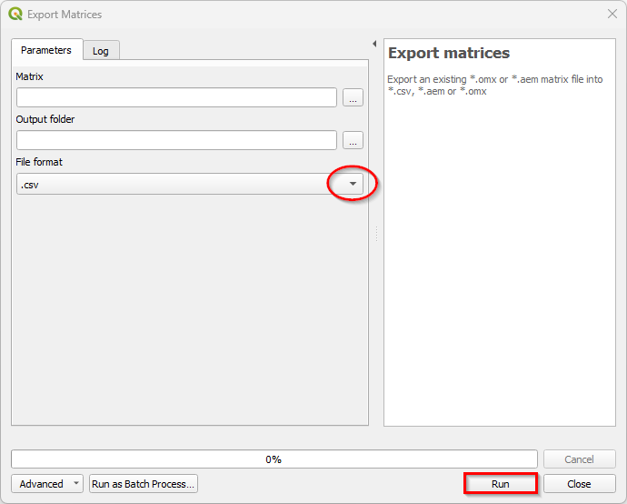
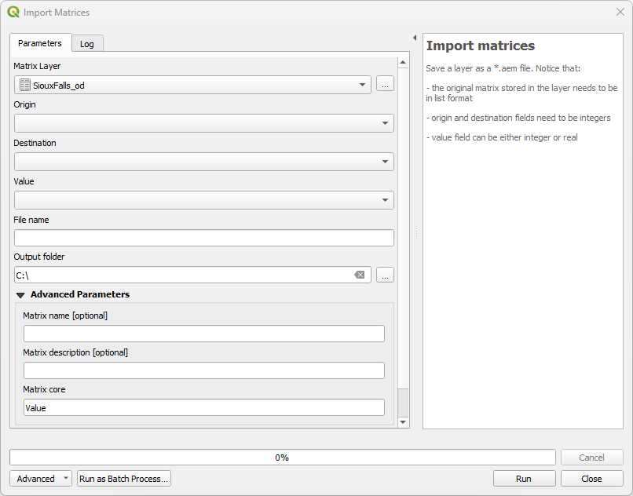
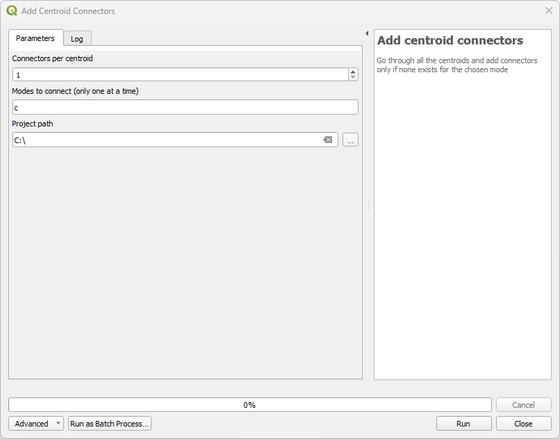
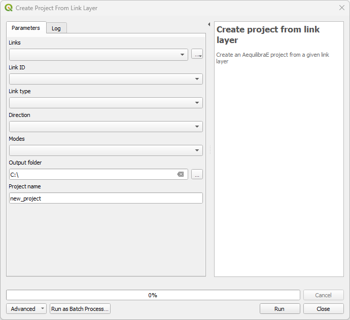
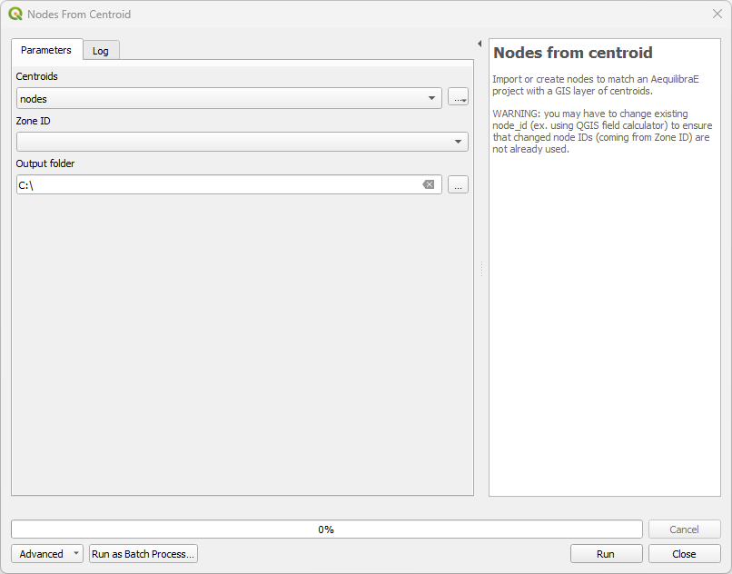
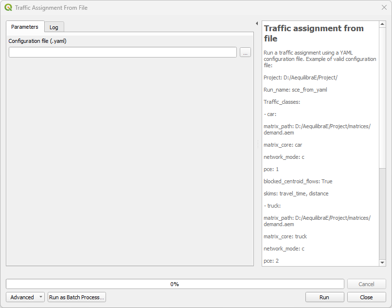

Processing Tools
================

Some of AequilibraE's plugin functionalities are now available in a Processing plugin.
The processing plugin is automatically installed with AequilibraE and allows the user to 
create projects from links, export matrices, and much more. The processing plugin usage
does not require open AequilibraE projects, although it is mandatory to have AequilibraE
installed.

To find AequilibraE's processing plugin, click on the **Processing** panel and select **Toolbox**.
You can also use the available QGIS shortcut to open the Toolbox window.

At the bottom of the window, you'll find the AequilibraE logo and the available functions.
The functions are divided into three groups, following the same logic as the AequilibraE Widget
menu. Notice that not all AequilibraE functionalities are available for processing.

.. subfigure:: AB
    :align: center

    .. image:: ../images/processing_provider_toolbox-1.png
        :alt: Toolbox General

    .. image:: ../images/processing_provider_toolbox-2.png
        :alt: Toolbox Detailed

In the following subsections, we'll go over all functionalities.

Data
----
Export matrices
~~~~~~~~~~~~~~~
The *Export matrices* tool is analogous to the *Export* button in the matrix viewer 
(see: :ref:`this figure <fig_data_visualize_matrices>` for more details). 
Its usage is straightforward: select the matrix you want to export, specify the path
on your machine to store the file, and select its output format. Only \*.aem and \*.omx files can 
be used as input, and the output format can be either one of \*.aem, \*.omx, or \*.csv.

Import matrices
~~~~~~~~~~~~~~~
With *Import matrices*, the user can save an open data layer directly as a \*.aem file.
This tool is analogous to the widget menu :ref:`importing_matrices`, but it does not
require an open AequilibraE project to work. To use the tool, the user must have an open layer
loaded in QGIS, and the menus are the ones presented in the figure below.

The upper fields are mandatory and are responsible for selecting the layer, indicating
which columns correspond to the origin, destination, and flow, creating a file name, and
specifying the destination folder. In the *Advanced Parameters*, the user will find fields to add
extra information to the AequilibraE matrix they are about to create.

Model Building
--------------
Add centroid connectors
~~~~~~~~~~~~~~~~~~~~~~~
AequilibraE's processing tool can also add centroid connectors to a project's network. The user
needs to specify the number of centroids, the modes to be connected, and the project folder.
The default connection mode is **c** (car).

Create project from link layer
~~~~~~~~~~~~~~~~~~~~~~~~~~~~~~
*Create project from link layer* is similar to the widget menu 
:ref:`Create project from layers <project_from_layers>`, and allows the user to create an AequilibraE 
project directly from a link layer, without requiring a node layer. With a geometric layer loaded into
QGIS, select it in the *Links* button, and add the required data in the subsequent menus. Choose the project's
name and specify the location where you want to save it on your machine.

Add/Renumber nodes from layer
~~~~~~~~~~~~~~~~~~~~~~~~~~~~~
One can also add or renumber nodes in an AequilibraE project to match a layer of centroids.
Just select or import the centroids layer, specify the node ID you want to match, and the output
folder.

Paths and assignment
--------------------
Traffic assignment from file
~~~~~~~~~~~~~~~~~~~~~~~~~~~~
AequilibraE traffic assignment can now be performed using a YAML file that contains the model input
information. The process is straightforward: create a valid YAML file with your project path,
required matrices, and valid parameters, and load it into AequilibraE. The code block below contains
an example of a valid YAML configuration.

.. code-block:: yaml
    :caption: YAML configuration example

    project: path_to_aequilibrae_project
    result_name: name_of_result_file_to_save
    traffic_classes:
        - car:
            matrix_path: path_to_aequilibrae_project/matrices/demand.aem
            matrix_core: matrix
            network_mode: c
            pce: 1
            blocked_centroid_flows: True
            skims: free_flow_time, distance
    assignment:
        algorithm: bfw
        vdf: BPR2
        alpha: 0.15
        beta: 4.0
        capacity_field: capacity
        time_field: free_flow_time
        max_iter: 10
        rgap: 0.001
