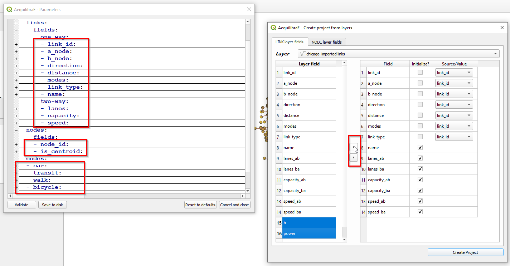

AequilibraE Project
===================

.. toctree::
   :maxdepth: 2

The AequilibraE project is one of the newest portions of the
`aequilibrae API <www.aequilibrae.com/python>`_, and therefore not very mature.

The API will soon bring much more sophisticated features, but the initial
capability inside QGIS is probably the most relevant for the majority of users
right now.

Transponet
~~~~~~~~~~

A Transponet is a network scheme that allows the user to edit it while enforcing
consistency between nodes and links. This consistency is enforced by a series of
database triggers in the SpatiaLite backend and allows the layers to be edited
in any minimaly capable GIS (i.e. one that supports SpatiaLite layers) or even
programatically.

Create project from OSM
~~~~~~~~~~~~~~~~~~~~~~~
However, its first feature is the capability of importing networks directly from
`Open Street Maps <www.openstreetmap.org>`_ into AequilibraE's efficient
TranspoNet format. This is also time to give a HUGE shout out to
`Geoff Boeing <http://www.geoffboeing.com/>`_, creator of the widely used Python
package `OSMNx <https://github.com/gboeing/osmnx>`_ . For several weeks I
worked with Geoff in reformatting OSMNx in order to be able to include it as a
submodule or dependency for AequilibraE, but its deep integration with
`GeoPandas <www.geopandas.org>`_ and all the packages it depends on (Pandas,
Shapely, Fiona, RTree, etc.), means that we would have to rebuild OSMNx from the
ground up in order to use it with AequilibraE within QGIS, since its Windows
distribution does not include all those dependencies.

For this reason, I have ported some of Geoff's code into AequilibraE
(modifications were quite heavy, however), and was ultimately able to bring this
feature to life.

Project from layers
~~~~~~~~~~~~~~~~~~~

The AequilibraE project can also be bootstrapped from existing line and node
layers obtained from any other source, as long as they contain the following
required field for the conversion:

* Link ID
* a_node
* b_node
* Link direction
* Length
* Speed
* Allowed modes
* Link Type

These requirements often create quite a bit of manual work, as most networks
available do not have complete (or reliable) information. Manually editing the
networks might be necessary, which is common practice in transport modelling .

Before creating a project from the layer, you can understand how to prepare the
layers for this task in the documentation page for :ref:`network_preparation`.

After all field preparation is done, one can import those layers into an
AequilibraE project using a dedicated tool in the **Project** menu in
AequilibraE.

Accessing **AequilibraE > Project > Create Project from Layers**, the user is
presented with the following screen.

After running this tool a sqlite file (spatialite enabled) will be created and
you can edit the network (create, move or delete links and nodes) and both
layers (including node *ID* and *A_Node*/*B_Node* fields) will remain
consistent with each other.
